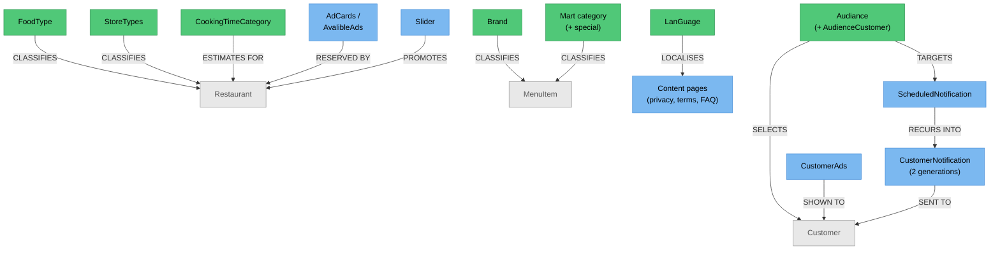

# Catalog & Content Administration — Knowledge Graph

> **Context:** Admin
> **Source Project:** `AdminUi` (22 controllers — the largest Admin feature)
> **Entities:** [[Mart-and-Reference-Entities|Mart & reference entities]],
> [[Audiance|Audiance]], [[StoreTypes.technical|StoreTypes]], plus content and notification entities
> **Register findings open here:** #439, #567, #437, #560, #422, #423

Everything a customer sees that is not a restaurant's own menu: the reference data that classifies the
catalogue (brands, food types, store types, Mart categories, cooking-time categories, languages, sliders),
the content pages (privacy policy, terms, FAQ), and the **outbound messaging** — ads, ad cards, in-app
messages, notifications, scheduled campaigns and the audiences they target.

It is the largest Admin feature by controller count and the one where **permission coverage varies most
within a single feature**, which is the fact worth carrying into any work here.

## Permission coverage inside one feature — measured

| Controller | `[Permission]` attributes | `[Authorize]` | Verdict |
|---|---|---|---|
| `AdCardsController` | **8** | yes | ✅ fully gated |
| `AdController` | **5** | yes | ✅ gated |
| `AudianceController` | 0 | yes | ⚠️ any signed-in user (386 lines) |
| `NotificationsController` | 0 | yes | ⚠️ any signed-in user |
| `BrandController` | 0 | yes | ⚠️ any signed-in user |
| `MartCategoryController` | 0 | **no** | 🔴 `_conflicts.md` **#567** / #439 — no attributes at all |
| `ScheduledNotificationController` | 0 | **no** | 🔴 `_conflicts.md` **#439** — anonymous CRUD over scheduled push campaigns |

Two controllers in this feature are reachable **with no token at all**, and both are messaging-adjacent.
`_conflicts.md` #439 makes the consequence explicit: anonymous CRUD over scheduled campaigns means an
unauthenticated party could create or alter notifications delivered to the entire customer base — a spam
or phishing channel carrying 8Orders' own branding.

`#439` also records the routing insight that makes `MartCategoryController` reachable despite having no
`[Route]`: `AdminUi/Startup.cs` registers conventional routing, so **any attribute-less public controller
action is addressable**. That means the attack surface of this host is larger than an enumeration of
`[Route]` attributes would suggest — worth remembering when auditing the other 22 controllers here.

## Outbound messaging — four overlapping mechanisms

The feature's most confusing area, because four things all "send something to customers":

| Mechanism | Entity | Immediate or scheduled | Notes |
|---|---|---|---|
| Ads | `CustomerAds` | date + hour window | Bilingual, city-scoped, per-language images; documented in [[Customer.technical\|Customer]]'s folded-entity table |
| Ad cards | `AdCards`, `AvalibleAds` | reserved slots | Merchants reserve slots; 🔴 `_conflicts.md` **#437** — the merchant-facing query can return literal `null` array entries |
| Notifications | `CustomerNotification` / `CustomerNotificationNewVersion` | immediate | **Two generations coexist** — see [[Customer.technical\|Customer]] |
| Scheduled notifications | `ScheduledNotification` | recurring | 🔴 `_conflicts.md` **#422** — a discriminator enum is used as a numeric interval, so monthly fires every second month and yearly every third year |

Targeting is by **audience** (`Audiance`), and its filter builder has its own bug: `_conflicts.md`
**#423** — the `"="` operator is a copy-paste of the `"<"` case, so "exactly N days" silently means
"N days or fewer". A campaign aimed at customers who ordered exactly 7 days ago therefore reaches
everyone who ordered within 7 days.

Taken together, three of the four messaging mechanisms have a recorded defect, and two of the
controllers are unauthenticated. Anyone planning campaign work should treat this area as unreliable
until those are addressed.

## Endpoint index (by group)

| Group | Controllers | Notes |
|---|---|---|
| Catalogue reference data | `BrandController`, `FoodTypeController`, `FoodTypesController`, `StoreTypeController`, `StoreTypesController`, `CookingTimeCategoryController`, `LangaugeController`, `ItemController` | Note the singular/plural pairs — `FoodType`/`FoodTypes` and `StoreType`/`StoreTypes` are **different controllers**, which is exactly the collision hazard #618 describes for name-based permission lookup |
| Mart taxonomy | `MartCategoryController`, `SpecialMartCategoryController` | The first has no attributes at all (#567) |
| Content pages | `PrivacyPolicyController`, `TermsAndConditions`, `FAQItemsController` | Customer-facing legal and help text |
| Presentation | `Slider` (a controller despite the name), `AdCardsController`, `AdController` | `Slider.cs` declares `class Slider : BaseController` |
| Messaging | `NotificationsController`, `ScheduledNotificationController`, `CustomerNotificationsController`, `InAppMessagingController`, `AudianceController` | The four mechanisms above |

## Entity Relationship Diagram



## Status / State

Mostly reference data with an active/inactive flag. The two stateful areas:

| What | State | Notes |
|---|---|---|
| Ads and ad cards | date range **plus** hour-of-day window; reserved vs available | An ad can be within its dates and still not showing, because of the hour window |
| Notifications | `CustomerNotificationNewVersion` has an explicit `Processing` → `Sent` progression; the older `CustomerNotification` has read/sent flags on the row | Two generations, documented on [[Customer.technical\|Customer]] |
| Scheduled notifications | recurrence type + interval | 🔴 #422 — the interval is read from a discriminator enum |

## Entity Index

| Entity | Layer | Type | Responsibility |
|---|---|---|---|
| `Brand`, `FoodType`, `StoreTypes`, Mart categories, `CookingTimeCategory`, `LanGuage`, `ImageBank` | Domain — legacy POCO | Master/lookup | Catalogue classification; folded into [[Mart-and-Reference-Entities\|Mart & reference entities]] |
| `Audiance`, `AudienceCustomer`, `AudienceCustomerAds` | Domain — legacy POCO | Master + join | Campaign targeting; [[Audiance\|Audiance]] |
| `CustomerAds` | Domain — legacy POCO with `Result` guards | Transactional | The ad itself; folded into [[Customer.technical\|Customer]] |
| `CustomerNotification`, `…NewVersion`, `…CustomersData` | Domain — legacy POCO | Transactional + child | Two notification generations |
| `ScheduledNotification` | Domain — legacy POCO | Transactional | Recurring campaigns |
| Content pages | Domain — legacy POCO | Master | Privacy policy, terms, FAQ |

## Feature Flow (Business Narrative)

```
1. CLASSIFY
   └── brands, food types, store types, Mart categories, cooking times, languages
2. PRESENT
   └── sliders, ads and ad cards decide what a customer sees on the home screen
3. TARGET
   └── an audience selects customers by behaviour  (filter bug — #423)
4. SEND
   ├── immediately (notifications — two coexisting models), or
   └── on a schedule (recurring campaigns — interval bug #422)
5. INFORM
   └── privacy policy, terms and FAQ are maintained as content pages
```

## Key Cross-Cutting Relationships

| From | To | Relationship | Notes |
|---|---|---|---|
| This feature | [[Customer Ordering/Restaurant & Menu Discovery/_knowledge-graph\|Restaurant & Menu Discovery]] | classification drives browsing and search | Brands, food types, Mart categories |
| This feature | [[Customer Ordering/Marketing & Content/_knowledge-graph\|Marketing & Content]] | the customer-facing half of the same ads and notifications | |
| This feature | Firebase Cloud Messaging | notification delivery | `_integrations.md` row 22 |
| Ad cards | [[Restaurant Portal/Merchant Finance & Reporting/_knowledge-graph\|Merchant Finance & Reporting]] | merchants reserve slots | 🔴 #437, #603 |
| This feature | [[Admin/ERP & Integrations/_knowledge-graph\|ERP & Integrations]] | Mart taxonomy meets the stock sync | `_integrations.md` row 19 |

## Change Surface

| Signal | Value | Notes |
|---|---|---|
| Direct dependents (Ring 1) | 22 controllers, the customer app's home screen, search, the notification pipeline | |
| Sides touched | 4/5 | Domain · Application · Data · API host |
| Cross-context integrations | 2 | FCM push; Mart stock taxonomy |
| Register findings open | 6 | #439, #567, #437, #560, #422, #423 |
| Hub? | no — but its reference data classifies both hubs | |
| Risk flags | two unauthenticated controllers, one of them over mass messaging; singular/plural controller pairs; three of four messaging mechanisms carry a recorded defect |

<!-- BEGIN generated: endpoint index (insert-endpoints.js) -->

## Endpoint index — generated from the controllers

> Generated by `_system/insert-endpoints.js` from `_feature-map.tsv`; do not edit between the
> sentinels. Every row is anchored to a line, so `verify-citations.js` checks all of it and a
> controller that moves is caught on the next run. "Action gate" lists only attributes on the action
> itself — the class gate above each table still applies unless an action opts out of it.

**22 controller(s), 130 action(s)**; 96 have no action-level gate and rely entirely on the class attribute.

#### `AdminUi/Controllers/Ad/AdController.cs`

Class gate: roleless `[Authorize]` — `AdminUi/Controllers/Ad/AdController.cs:21`

| Route | Verb | Action gate | Anchor |
|---|---|---|---|
| `Add` | POST | `Permission(Ad.Ads)` | `AdminUi/Controllers/Ad/AdController.cs:39` |
| `Delete` | POST | `Permission(Ad.Ads)` | `AdminUi/Controllers/Ad/AdController.cs:56` |
| `Edit` | POST | `Permission(Ad.Ads)` | `AdminUi/Controllers/Ad/AdController.cs:77` |
| `All` | GET | `Permission(Ad.Ads)` | `AdminUi/Controllers/Ad/AdController.cs:94` |
| `Details` | GET | `Permission(Ad.Ads)` | `AdminUi/Controllers/Ad/AdController.cs:112` |

#### `AdminUi/Controllers/AdCards/AdCardsController.cs`

Class gate: roleless `[Authorize]` — `AdminUi/Controllers/AdCards/AdCardsController.cs:24`

| Route | Verb | Action gate | Anchor |
|---|---|---|---|
| `GetAdCards` | GET | `Permission(Ad.Ads)` | `AdminUi/Controllers/AdCards/AdCardsController.cs:40` |
| `GetAdCardById` | GET | `Permission(Ad.Ads)` | `AdminUi/Controllers/AdCards/AdCardsController.cs:54` |
| `Add` | POST | `Permission(Ad.Ads)` | `AdminUi/Controllers/AdCards/AdCardsController.cs:74` |
| `Update` | POST | `Permission(Ad.Ads)` | `AdminUi/Controllers/AdCards/AdCardsController.cs:91` |
| `Delete` | POST | `Permission(Ad.Ads)` | `AdminUi/Controllers/AdCards/AdCardsController.cs:109` |
| `GetReservedAds` | GET | `Permission(Ad.AdReservations)` | `AdminUi/Controllers/AdCards/AdCardsController.cs:130` |
| `ChangeAdReservationsActivation` | POST | `Permission(Ad.AdReservations)` | `AdminUi/Controllers/AdCards/AdCardsController.cs:152` |
| `DeleteAdReservations` | POST | `Permission(Ad.AdReservations)` | `AdminUi/Controllers/AdCards/AdCardsController.cs:169` |

#### `AdminUi/Controllers/Announcement/AnnouncementController.cs`

Class gate: roleless `[Authorize]` — `AdminUi/Controllers/Announcement/AnnouncementController.cs:20`

| Route | Verb | Action gate | Anchor |
|---|---|---|---|
| `GetallAnnouncements` | GET | — | `AdminUi/Controllers/Announcement/AnnouncementController.cs:38` |
| `GetAnnouncementEditById` | GET | — | `AdminUi/Controllers/Announcement/AnnouncementController.cs:55` |
| `AddAnnouncement` | POST | — | `AdminUi/Controllers/Announcement/AnnouncementController.cs:72` |
| `DeActivateAnnouncement` | POST | — | `AdminUi/Controllers/Announcement/AnnouncementController.cs:90` |
| `UpdateAnnouncement` | POST | — | `AdminUi/Controllers/Announcement/AnnouncementController.cs:109` |
| `CheckIfExistingActiveAnnouncementWithArea` | GET | — | `AdminUi/Controllers/Announcement/AnnouncementController.cs:126` |

#### `AdminUi/Controllers/AudianceController/AudianceController.cs`

Class gate: roleless `[Authorize]` — `AdminUi/Controllers/AudianceController/AudianceController.cs:37`

| Route | Verb | Action gate | Anchor |
|---|---|---|---|
| `GetAudiances` | GET | — | `AdminUi/Controllers/AudianceController/AudianceController.cs:52` |
| `export` | GET | — | `AdminUi/Controllers/AudianceController/AudianceController.cs:78` |
| `GetAudiancesForLookup` | GET | — | `AdminUi/Controllers/AudianceController/AudianceController.cs:97` |
| `GetAudianceDetails` | GET | — | `AdminUi/Controllers/AudianceController/AudianceController.cs:117` |
| `CreateAudiance` | POST | — | `AdminUi/Controllers/AudianceController/AudianceController.cs:135` |
| `UpdateAudiance` | POST | — | `AdminUi/Controllers/AudianceController/AudianceController.cs:158` |
| `UpdateCustomerActivation` | POST | — | `AdminUi/Controllers/AudianceController/AudianceController.cs:180` |
| `DeleteAudiance` | POST | — | `AdminUi/Controllers/AudianceController/AudianceController.cs:197` |
| `GetFilterFieldsAsync` | GET | — | `AdminUi/Controllers/AudianceController/AudianceController.cs:216` |

#### `AdminUi/Controllers/Brand/BrandController.cs`

Class gate: roleless `[Authorize]` — `AdminUi/Controllers/Brand/BrandController.cs:21`

| Route | Verb | Action gate | Anchor |
|---|---|---|---|
| `Add` | POST | — | `AdminUi/Controllers/Brand/BrandController.cs:40` |
| `Delete` | POST | — | `AdminUi/Controllers/Brand/BrandController.cs:56` |
| `MangeActivationStatus` | POST | — | `AdminUi/Controllers/Brand/BrandController.cs:72` |
| `List` | GET | — | `AdminUi/Controllers/Brand/BrandController.cs:89` |
| `Details` | GET | — | `AdminUi/Controllers/Brand/BrandController.cs:105` |
| `Update` | POST | — | `AdminUi/Controllers/Brand/BrandController.cs:125` |

#### `AdminUi/Controllers/CookingTimeCategoryController/CookingTimeCategoryController.cs`

Class gate: roleless `[Authorize]` — `AdminUi/Controllers/CookingTimeCategoryController/CookingTimeCategoryController.cs:20`

| Route | Verb | Action gate | Anchor |
|---|---|---|---|
| `Add` | POST | — | `AdminUi/Controllers/CookingTimeCategoryController/CookingTimeCategoryController.cs:37` |
| `Delete` | POST | — | `AdminUi/Controllers/CookingTimeCategoryController/CookingTimeCategoryController.cs:53` |
| `Update` | POST | — | `AdminUi/Controllers/CookingTimeCategoryController/CookingTimeCategoryController.cs:68` |
| `All` | GET | — | `AdminUi/Controllers/CookingTimeCategoryController/CookingTimeCategoryController.cs:83` |
| `Details` | GET | — | `AdminUi/Controllers/CookingTimeCategoryController/CookingTimeCategoryController.cs:98` |

#### `AdminUi/Controllers/CustomerAds/InAppMessagingController.cs`

Class gate: roleless `[Authorize]` — `AdminUi/Controllers/CustomerAds/InAppMessagingController.cs:26`

| Route | Verb | Action gate | Anchor |
|---|---|---|---|
| `Add` | POST | — | `AdminUi/Controllers/CustomerAds/InAppMessagingController.cs:45` |
| `Delete` | POST | — | `AdminUi/Controllers/CustomerAds/InAppMessagingController.cs:61` |
| `Update` | POST | — | `AdminUi/Controllers/CustomerAds/InAppMessagingController.cs:77` |
| `Types` | GET | — | `AdminUi/Controllers/CustomerAds/InAppMessagingController.cs:94` |
| `Cities` | GET | — | `AdminUi/Controllers/CustomerAds/InAppMessagingController.cs:111` |
| `Details` | GET | — | `AdminUi/Controllers/CustomerAds/InAppMessagingController.cs:128` |
| `List` | GET | — | `AdminUi/Controllers/CustomerAds/InAppMessagingController.cs:149` |
| `Restaurants` | GET | — | `AdminUi/Controllers/CustomerAds/InAppMessagingController.cs:173` |
| `RestaurantCategories` | GET | — | `AdminUi/Controllers/CustomerAds/InAppMessagingController.cs:190` |
| `CategoryItems` | GET | — | `AdminUi/Controllers/CustomerAds/InAppMessagingController.cs:208` |

#### `AdminUi/Controllers/CustomerNotifications/CustomerNotificationsController.cs`

Class gate: roleless `[Authorize]` — `AdminUi/Controllers/CustomerNotifications/CustomerNotificationsController.cs:29`

| Route | Verb | Action gate | Anchor |
|---|---|---|---|
| `Types` | GET | — | `AdminUi/Controllers/CustomerNotifications/CustomerNotificationsController.cs:49` |
| `CustomerNotificationGroupType` | GET | — | `AdminUi/Controllers/CustomerNotifications/CustomerNotificationsController.cs:67` |
| `AddNeewNotification` | POST | `Permission(Customers.CustomerNotifications)` | `AdminUi/Controllers/CustomerNotifications/CustomerNotificationsController.cs:88` |
| `AddNewNotificationByDeviceId` | POST | `Permission(Customers.CustomerNotifications)` | `AdminUi/Controllers/CustomerNotifications/CustomerNotificationsController.cs:112` |
| `GetNotificationById/{customerNotificationId}` | GET | `Permission(Customers.CustomerNotifications)` | `AdminUi/Controllers/CustomerNotifications/CustomerNotificationsController.cs:142` |
| `GetAllCustomerNotifications` | GET | `Permission(Customers.CustomerNotifications)` | `AdminUi/Controllers/CustomerNotifications/CustomerNotificationsController.cs:165` |
| `UpdateCustomerNotification` | POST | `Permission(Customers.CustomerNotifications)` | `AdminUi/Controllers/CustomerNotifications/CustomerNotificationsController.cs:177` |
| `DeleteCustomerNotification` | POST | `Permission(Customers.CustomerNotifications)` | `AdminUi/Controllers/CustomerNotifications/CustomerNotificationsController.cs:197` |
| `CancelCustomerNotificationJob` | POST | `Permission(Customers.CustomerNotifications)` | `AdminUi/Controllers/CustomerNotifications/CustomerNotificationsController.cs:217` |

#### `AdminUi/Controllers/FAQController/FAQItemsController.cs`

Class gate: roleless `[Authorize]` — `AdminUi/Controllers/FAQController/FAQItemsController.cs:19`

| Route | Verb | Action gate | Anchor |
|---|---|---|---|
| `getAllFqaItems` | GET | — | `AdminUi/Controllers/FAQController/FAQItemsController.cs:34` |
| `createFAQItem` | POST | — | `AdminUi/Controllers/FAQController/FAQItemsController.cs:45` |
| `updateFAQItem` | PUT | — | `AdminUi/Controllers/FAQController/FAQItemsController.cs:61` |
| `updateFqaItemOrder` | PUT | — | `AdminUi/Controllers/FAQController/FAQItemsController.cs:78` |
| `deleteFqaItem/{id}` | DELETE | — | `AdminUi/Controllers/FAQController/FAQItemsController.cs:94` |

#### `AdminUi/Controllers/FoodTypeController.cs`

Class gate: roleless `[Authorize]` — `AdminUi/Controllers/FoodTypeController.cs:21`

| Route | Verb | Action gate | Anchor |
|---|---|---|---|
| `GetFoodTypeForLookUp` | GET | — | `AdminUi/Controllers/FoodTypeController.cs:37` |
| `GetAllFoodTypes` | GET | — | `AdminUi/Controllers/FoodTypeController.cs:56` |
| `AddFoodType` | POST | `Permission(Restaurant.FoodTypes)` | `AdminUi/Controllers/FoodTypeController.cs:75` |
| `GetFoodTypeById` | GET | — | `AdminUi/Controllers/FoodTypeController.cs:97` |
| `SaveEditFoodType` | POST | `Permission(Restaurant.FoodTypes)` | `AdminUi/Controllers/FoodTypeController.cs:123` |
| `DeleteFoodType` | PUT | `Permission(Restaurant.FoodTypes)` | `AdminUi/Controllers/FoodTypeController.cs:145` |

#### `AdminUi/Controllers/FoodTypesController/FoodTypesController.cs`

Class gate: roleless `[Authorize]` — `AdminUi/Controllers/FoodTypesController/FoodTypesController.cs:14`

| Route | Verb | Action gate | Anchor |
|---|---|---|---|
| `GetStoreTypes` | GET | — | `AdminUi/Controllers/FoodTypesController/FoodTypesController.cs:29` |

#### `AdminUi/Controllers/ItemController/ItemController.cs`

Class gate: roleless `[Authorize]` — `AdminUi/Controllers/ItemController/ItemController.cs:23`

| Route | Verb | Action gate | Anchor |
|---|---|---|---|
| `Details` | GET | — | `AdminUi/Controllers/ItemController/ItemController.cs:40` |
| `AllMenuItems` | GET | — | `AdminUi/Controllers/ItemController/ItemController.cs:64` |
| `GetRestaurantCategories` | GET | — | `AdminUi/Controllers/ItemController/ItemController.cs:88` |
| `GetMenuItems` | GET | — | `AdminUi/Controllers/ItemController/ItemController.cs:113` |
| `CategoryNames` | GET | — | `AdminUi/Controllers/ItemController/ItemController.cs:138` |
| `GetMenuItemsOptions` | GET | — | `AdminUi/Controllers/ItemController/ItemController.cs:160` |

#### `AdminUi/Controllers/Langauge/LangaugeController.cs`

Class gate: roleless `[Authorize]` — `AdminUi/Controllers/Langauge/LangaugeController.cs:17`

| Route | Verb | Action gate | Anchor |
|---|---|---|---|
| `GetAllLangauges` | GET | — | `AdminUi/Controllers/Langauge/LangaugeController.cs:37` |

#### `AdminUi/Controllers/MartCategory/MartCategoryController.cs`

Class gate: **no auth attribute on the class** — `AdminUi/Controllers/MartCategory/MartCategoryController.cs:20`

| Route | Verb | Action gate | Anchor |
|---|---|---|---|
| `List` | GET | — | `AdminUi/Controllers/MartCategory/MartCategoryController.cs:38` |
| `GetMartCategoriesForMerchant` | GET | — | `AdminUi/Controllers/MartCategory/MartCategoryController.cs:53` |
| `Add` | POST | — | `AdminUi/Controllers/MartCategory/MartCategoryController.cs:70` |
| `Update` | POST | — | `AdminUi/Controllers/MartCategory/MartCategoryController.cs:87` |
| `Delete` | POST | — | `AdminUi/Controllers/MartCategory/MartCategoryController.cs:103` |
| `MangeActiveStatus` | POST | — | `AdminUi/Controllers/MartCategory/MartCategoryController.cs:119` |

#### `AdminUi/Controllers/MartCategory/SpecialMartCategoryController.cs`

Class gate: roleless `[Authorize]` — `AdminUi/Controllers/MartCategory/SpecialMartCategoryController.cs:17`

| Route | Verb | Action gate | Anchor |
|---|---|---|---|
| `List` | GET | — | `AdminUi/Controllers/MartCategory/SpecialMartCategoryController.cs:35` |
| `Update` | POST | — | `AdminUi/Controllers/MartCategory/SpecialMartCategoryController.cs:51` |

#### `AdminUi/Controllers/NotificationsController/NotificationsController.cs`

Class gate: roleless `[Authorize]` — `AdminUi/Controllers/NotificationsController/NotificationsController.cs:17`

| Route | Verb | Action gate | Anchor |
|---|---|---|---|
| `NewOrderReceived` | — | — | `AdminUi/Controllers/NotificationsController/NotificationsController.cs:35` |
| `OrderExpedited` | — | — | `AdminUi/Controllers/NotificationsController/NotificationsController.cs:49` |
| `NewTimeOutRequest` | — | — | `AdminUi/Controllers/NotificationsController/NotificationsController.cs:64` |
| `AutoBusyResturants` | POST | — | `AdminUi/Controllers/NotificationsController/NotificationsController.cs:81` |
| `ReassignOrderToAdmin` | — | — | `AdminUi/Controllers/NotificationsController/NotificationsController.cs:92` |
| `TakeOrderAndAssigendToAnother` | — | — | `AdminUi/Controllers/NotificationsController/NotificationsController.cs:101` |
| `UpdateNewAdminOrderStatus` | — | — | `AdminUi/Controllers/NotificationsController/NotificationsController.cs:110` |
| `NewRequestReceived` | — | — | `AdminUi/Controllers/NotificationsController/NotificationsController.cs:127` |
| `OrderReassigned` | — | — | `AdminUi/Controllers/NotificationsController/NotificationsController.cs:144` |
| `DeliveryActivationChange` | — | — | `AdminUi/Controllers/NotificationsController/NotificationsController.cs:161` |

#### `AdminUi/Controllers/PrivacyPolicyController/PrivacyPolicyController.cs`

Class gate: roleless `[Authorize]` — `AdminUi/Controllers/PrivacyPolicyController/PrivacyPolicyController.cs:19`

| Route | Verb | Action gate | Anchor |
|---|---|---|---|
| `getAllPolicies` | GET | — | `AdminUi/Controllers/PrivacyPolicyController/PrivacyPolicyController.cs:35` |
| `createPolicy` | POST | — | `AdminUi/Controllers/PrivacyPolicyController/PrivacyPolicyController.cs:47` |
| `updatePolicy` | PUT | — | `AdminUi/Controllers/PrivacyPolicyController/PrivacyPolicyController.cs:65` |

#### `AdminUi/Controllers/ScheduledNotificationController/ScheduledNotificationController.cs`

Class gate: **no auth attribute on the class** — `AdminUi/Controllers/ScheduledNotificationController/ScheduledNotificationController.cs:23`

| Route | Verb | Action gate | Anchor |
|---|---|---|---|
| `All` | GET | — | `AdminUi/Controllers/ScheduledNotificationController/ScheduledNotificationController.cs:40` |
| `GetById` | GET | — | `AdminUi/Controllers/ScheduledNotificationController/ScheduledNotificationController.cs:58` |
| `Add` | POST | — | `AdminUi/Controllers/ScheduledNotificationController/ScheduledNotificationController.cs:76` |
| `Delete` | POST | — | `AdminUi/Controllers/ScheduledNotificationController/ScheduledNotificationController.cs:94` |
| `Edit` | POST | — | `AdminUi/Controllers/ScheduledNotificationController/ScheduledNotificationController.cs:112` |
| `CustomerNotificationReccuranceTypes` | GET | — | `AdminUi/Controllers/ScheduledNotificationController/ScheduledNotificationController.cs:129` |

#### `AdminUi/Controllers/Slider/Slider.cs`

Class gate: roleless `[Authorize]` — `AdminUi/Controllers/Slider/Slider.cs:28`

| Route | Verb | Action gate | Anchor |
|---|---|---|---|
| `GetAllSliderHome` | GET | `Permission("SliderHome")` | `AdminUi/Controllers/Slider/Slider.cs:48` |
| `GetSliderHomeById` | GET | `Permission("SliderHome")` | `AdminUi/Controllers/Slider/Slider.cs:69` |
| `GetRestaurantName` | GET | — | `AdminUi/Controllers/Slider/Slider.cs:92` |
| `GetCategoryName` | GET | — | `AdminUi/Controllers/Slider/Slider.cs:112` |
| `GetStoreTypeName` | GET | — | `AdminUi/Controllers/Slider/Slider.cs:135` |
| `GetItemName` | GET | — | `AdminUi/Controllers/Slider/Slider.cs:154` |
| `GetItemNamePaged` | GET | — | `AdminUi/Controllers/Slider/Slider.cs:178` |
| `GetItemNameByItemId` | GET | — | `AdminUi/Controllers/Slider/Slider.cs:200` |
| `GetSliderType` | GET | — | `AdminUi/Controllers/Slider/Slider.cs:213` |
| `GetCitiesHasSliderHome` | GET | — | `AdminUi/Controllers/Slider/Slider.cs:233` |
| `AddSliderHome` | POST | `Permission("SliderHome")` | `AdminUi/Controllers/Slider/Slider.cs:246` |
| `DeleteSliderHome` | POST | `Permission("SliderHome")` | `AdminUi/Controllers/Slider/Slider.cs:283` |
| `EditSliderHome` | POST | `Permission("SliderHome")` | `AdminUi/Controllers/Slider/Slider.cs:306` |

#### `AdminUi/Controllers/StoreType/StoreTypeController.cs`

Class gate: roleless `[Authorize]` — `AdminUi/Controllers/StoreType/StoreTypeController.cs:20`

| Route | Verb | Action gate | Anchor |
|---|---|---|---|
| `StoreTypeLookUp` | GET | — | `AdminUi/Controllers/StoreType/StoreTypeController.cs:38` |
| `GetAllStoresType` | GET | — | `AdminUi/Controllers/StoreType/StoreTypeController.cs:57` |
| `GetStoreTpesByCityId` | GET | — | `AdminUi/Controllers/StoreType/StoreTypeController.cs:69` |

#### `AdminUi/Controllers/StoreTypesController.cs`

Class gate: roleless `[Authorize]` — `AdminUi/Controllers/StoreTypesController.cs:23`

| Route | Verb | Action gate | Anchor |
|---|---|---|---|
| `GetStoreTypes` | GET | — | `AdminUi/Controllers/StoreTypesController.cs:41` |
| `GetStoreTypeForLookUp` | GET | — | `AdminUi/Controllers/StoreTypesController.cs:60` |
| `EditStoreType` | GET | — | `AdminUi/Controllers/StoreTypesController.cs:80` |
| `SaveEditStoreType` | POST | `Permission(Restaurant.StoreType)` | `AdminUi/Controllers/StoreTypesController.cs:105` |
| `AddStoreType` | POST | `Permission(Restaurant.StoreType)` | `AdminUi/Controllers/StoreTypesController.cs:128` |
| `GetStoresUrl` | GET | — | `AdminUi/Controllers/StoreTypesController.cs:149` |

#### `AdminUi/Controllers/TermsAndConditions/TermsAndConditionsController.cs`

Class gate: roleless `[Authorize]` — `AdminUi/Controllers/TermsAndConditions/TermsAndConditionsController.cs:20`

| Route | Verb | Action gate | Anchor |
|---|---|---|---|
| `GetTermsAndConditions` | GET | `Permission(General.TermsAndConditions)` | `AdminUi/Controllers/TermsAndConditions/TermsAndConditionsController.cs:42` |
| `GetTermsAndConditionsById` | GET | `Permission(General.TermsAndConditions)` | `AdminUi/Controllers/TermsAndConditions/TermsAndConditionsController.cs:62` |
| `AddTermsAndConditions` | POST | `Permission(General.TermsAndConditions)` | `AdminUi/Controllers/TermsAndConditions/TermsAndConditionsController.cs:84` |
| `EditTermsAndConditions` | POST | `Permission(General.TermsAndConditions)` | `AdminUi/Controllers/TermsAndConditions/TermsAndConditionsController.cs:108` |

<!-- END generated: endpoint index -->

## Open Questions

- [ ] Are `FoodType`/`FoodTypes` and `StoreType`/`StoreTypes` both live, or is one dead? Given #618's
      name-based permission lookup, near-identical names are actively hazardous here.
- [ ] Which notification generation should new work target?
- [ ] How many scheduled campaigns are currently affected by #422's interval bug?
- [ ] Does anything audit who created or altered a scheduled campaign, given #439 allows anonymous CRUD?
- [ ] Is `InAppMessagingController` a third messaging mechanism or a view over one of the others?
- [ ] Do content pages support more than two languages, and how are they versioned?
