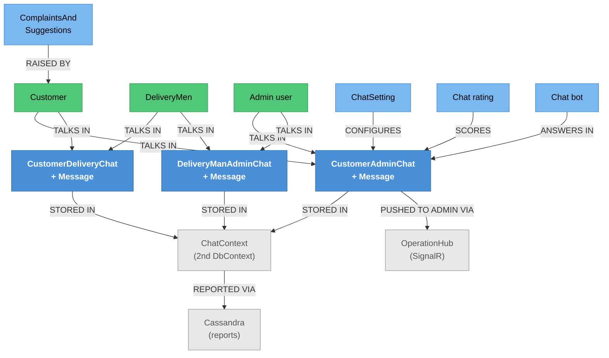

# Chat Administration — Knowledge Graph

> **Context:** Admin
> **Source Project:** `AdminUi` (7 controllers), `Shared/TalabatkData/ChatContext`,
> `Shared/TalabatkData/Cassandra`
> **Entities:** the admin side of the three chat pairs — canonical notes are
> [[Support-and-Chat.technical|Support & Chat]] (customer side) and
> [[Driver-Operations.technical|Driver Operations]] (driver side)
> **Register findings open here:** #421 (chat session hijack), #616 (unauthenticated message injection),
> plus the three-way duplication below

The 8Orders side of every conversation in the platform: live dashboards, history, settings, ratings, the
chat bot's performance, and inbound "contact us" messages. It is also the only feature that spans **three
storage technologies**.

## Three parallel chat aggregates — the same mechanics, written three times

The single most important structural fact, recorded in
`_inbox/pathA-A-models-batch04-final.md` and confirmed against
`_system/_entity-classes.tsv`:

| Pair | Between | Canonical note |
|---|---|---|
| `CustomerAdminChat` / `CustomerAdminChatMessage` | customer ↔ 8Orders support | [[Support-and-Chat.technical\|Support & Chat]] |
| `CustomerDeliveryChat` / `CustomerDeliveryChatMessage` | customer ↔ driver | [[Support-and-Chat.technical\|Support & Chat]] |
| `DeliveryManAdminChat` / `DeliveryManAdminChatMessage` | driver ↔ 8Orders support | [[Driver-Operations.technical\|Driver Operations]] |

All three have near-identical members and the same `AddNewMessage` shape. So **a change to how chat
works is three changes**, and a fix applied to one pair silently leaves the other two behind. This is the
same copy-paste theme as the four duplicated JWT validators (`_conflicts.md` #3) and the six feature-flag
controllers (#39/#48) — it recurs often enough in this codebase to be treated as a pattern rather than an
accident.

`ChatSetting` and `ComplaintsAndSuggestions` sit alongside them, and `OrderChat` is a fourth,
order-scoped variant folded into [[Order-Lifecycle.technical|Order Lifecycle]].

## Three storage technologies in one feature

```
SQL Server — TalabatkContext        the main domain tables
SQL Server — ChatContext            a SECOND DbContext for chat/notification tables
        └── mappings in Shared/TalabatkData/ChatDataBasemaping/
        └── migrations under Migrations/Chat/  (a separate migration tree)
Cassandra                           chat reports and bot-performance rows
        └── Shared/TalabatkData/Cassandra/: connection service, initializer,
            ChatReportRepository, BotPerformanceReportRepository, Mappers, Migrations
```

`ChatContext` (`Shared/TalabatkData/ChatContext/ChatContext.cs`) is a genuinely separate `DbContext`, so
a change touching both chat and orders spans **two contexts and two migration trees** — and a transaction
cannot span them.

What lands in Cassandra rather than SQL Server is **reporting**, not conversations:
`ChatReportRepository` and `BotPerformanceReportRepository` are the two repositories, and
`ChatReportRow` / `BotPerformanceReportRow` are classified `projection` in the entity denominator
precisely because they are report shapes. Live conversations remain in `ChatContext`. Migration of
historical chat data into Cassandra is triggered from
[[Identity & Access/Ops & Infra/_knowledge-graph|Ops & Infra]] — and, per `_conflicts.md` #615, by any
authenticated principal.

## Endpoint index

| Controller | Purpose | Notes |
|---|---|---|
| `ChatDashboardController` | Live view of open conversations | `AdminUi/Controllers/ChatDashboard/ChatDashboardController.cs` |
| `ChatHistoryController` | Past conversations | |
| `ChatReportsController` | Reporting over chat activity | `AdminUi/Controllers/ChatReports/ChatReportsController.cs`; reads the Cassandra side |
| `ChatSettingsController` | Chat configuration | `AdminUi/Controllers/ChatSettings/ChatSettingsController.cs` |
| `ChatRateController` | Customer ratings of a conversation | |
| `CustomerAdminChatController` | Admin's side of the customer conversation | |
| `DeliveryManChatController` | Admin's side of the driver conversation | |
| `ContactUsController` | Inbound "contact us" messages | Mapped here because it is inbound correspondence, not a catalogue |

Realtime delivery to the Admin SPA is **SignalR** (`OperationHub` at `/AdminHub`, mapped in
`AdminUi/Startup.cs`) — while the driver side uses **Centrifugo**. Two realtime technologies for one
conversation, one per participant.

## Entity Relationship Diagram



## Status / State

Each chat pair is a session with messages; the session carries the open/closed state and the messages
carry read/sent flags. `ChatErrorKeys` (`Shared/TalabatkApplication/ChatErrorKeys.cs`) is one of only
**two** literal error-key classes in the whole codebase — chat is the one area with a localised error
vocabulary rather than inline messages, which is worth knowing before adding an error path here.

## Entity Index

| Entity | Layer | Type | Responsibility |
|---|---|---|---|
| `CustomerAdminChat` (+ Message) | Domain (Chat context) | Session + child | Customer ↔ support |
| `CustomerDeliveryChat` (+ Message) | Domain (Chat context) | Session + child | Customer ↔ driver |
| `DeliveryManAdminChat` (+ Message) | Domain (Chat context) | Session + child | Driver ↔ support |
| `ChatSetting` | Domain | Config | Chat behaviour configuration |
| `ComplaintsAndSuggestions` | Domain | Transactional | Inbound contact-us correspondence |
| `ChatMessage` | Domain | Child | Generic message shape |
| `ChatReportRow`, `BotPerformanceReportRow` | Data — Cassandra projection | **Excluded** from entity notes | Report shapes, classified `projection` with that reason |

## Feature Flow (Business Narrative)

```
1. A CONVERSATION STARTS
   └── customer<->support, customer<->driver, or driver<->support (three separate models)
2. MESSAGES FLOW
   ├── to the Admin SPA over SignalR (OperationHub / AdminHub)
   └── to the driver app over Centrifugo
3. THE BOT MAY ANSWER
   └── bot performance is recorded for reporting
4. STAFF WORK THE DASHBOARD
   └── open conversations, history, ratings
5. REPORTING
   └── chat and bot reports read from Cassandra, not from the operational tables
6. ARCHIVE
   └── historical chat is migrated to Cassandra by a job triggerable from Ops & Infra (#615)
```

## Key Cross-Cutting Relationships

| From | To | Relationship | Notes |
|---|---|---|---|
| This feature | [[Customer Ordering/Support & Chat/_knowledge-graph\|Support & Chat]] | the customer's side | Canonical entity notes live there |
| This feature | [[Delivery/Delivery Support & Chat/_knowledge-graph\|Delivery Support & Chat]] | the driver's side | #616's injection lands in these tables |
| This feature | Cassandra | reporting store | Two repositories, own migrations |
| This feature | `OperationHub` (SignalR) | realtime to the Admin SPA | `_integrations.md` row 2 |
| This feature | [[Identity & Access/Ops & Infra/_knowledge-graph\|Ops & Infra]] | archive migration trigger | #615 |

## Change Surface

| Signal | Value | Notes |
|---|---|---|
| Direct dependents (Ring 1) | 7 controllers, the Admin SPA, the driver app, the customer app | |
| Sides touched | 4/5 | Domain · Application · Data (two contexts + Cassandra) · API host |
| Cross-context integrations | 3 | SignalR to Admin, Centrifugo to drivers, Cassandra |
| Register findings open | 2 inherited (#421, #616) + the three-way duplication | |
| Hub? | no | |
| Risk flags | **three** duplicated chat models; **two** realtime technologies; **three** storage technologies; a transaction cannot span `TalabatkContext` and `ChatContext` |

<!-- BEGIN generated: endpoint index (insert-endpoints.js) -->

## Endpoint index — generated from the controllers

> Generated by `_system/insert-endpoints.js` from `_feature-map.tsv`; do not edit between the
> sentinels. Every row is anchored to a line, so `verify-citations.js` checks all of it and a
> controller that moves is caught on the next run. "Action gate" lists only attributes on the action
> itself — the class gate above each table still applies unless an action opts out of it.

**8 controller(s), 45 action(s)** — 8 carry `[AllowAnonymous]`; 35 have no action-level gate and rely entirely on the class attribute.

#### `AdminUi/Controllers/ChatDashboard/ChatDashboardController.cs`

Class gate: roleless `[Authorize]` — `AdminUi/Controllers/ChatDashboard/ChatDashboardController.cs:15`

| Route | Verb | Action gate | Anchor |
|---|---|---|---|
| `GetDashboardStats` | GET | — | `AdminUi/Controllers/ChatDashboard/ChatDashboardController.cs:30` |

#### `AdminUi/Controllers/ChatHistory/ChatHistoryController.cs`

Class gate: roleless `[Authorize]` — `AdminUi/Controllers/ChatHistory/ChatHistoryController.cs:22`

| Route | Verb | Action gate | Anchor |
|---|---|---|---|
| `GetAllChats` | GET | — | `AdminUi/Controllers/ChatHistory/ChatHistoryController.cs:38` |
| `GetChatBySessionId` | GET | — | `AdminUi/Controllers/ChatHistory/ChatHistoryController.cs:77` |
| `SearchInChat` | GET | — | `AdminUi/Controllers/ChatHistory/ChatHistoryController.cs:98` |
| `GetAllAgents` | GET | — | `AdminUi/Controllers/ChatHistory/ChatHistoryController.cs:119` |

#### `AdminUi/Controllers/ChatRateController/ChatRateController.cs`

Class gate: roleless `[Authorize]` — `AdminUi/Controllers/ChatRateController/ChatRateController.cs:19`

| Route | Verb | Action gate | Anchor |
|---|---|---|---|
| `GetAllChatRates` | GET | — | `AdminUi/Controllers/ChatRateController/ChatRateController.cs:39` |

#### `AdminUi/Controllers/ChatReports/ChatReportsController.cs`

Class gate: roleless `[Authorize]` — `AdminUi/Controllers/ChatReports/ChatReportsController.cs:17`

| Route | Verb | Action gate | Anchor |
|---|---|---|---|
| `ChatVolume` | GET | — | `AdminUi/Controllers/ChatReports/ChatReportsController.cs:30` |
| `ChatDuration` | GET | — | `AdminUi/Controllers/ChatReports/ChatReportsController.cs:37` |
| `UserSatisfaction` | GET | — | `AdminUi/Controllers/ChatReports/ChatReportsController.cs:44` |
| `FirstResponseTime` | GET | — | `AdminUi/Controllers/ChatReports/ChatReportsController.cs:51` |
| `BotPerformance/ContainmentRate` | GET | — | `AdminUi/Controllers/ChatReports/ChatReportsController.cs:58` |
| `BotPerformance/FaqUsage` | GET | — | `AdminUi/Controllers/ChatReports/ChatReportsController.cs:81` |
| `BotPerformance/RoboCallEffectiveness` | GET | — | `AdminUi/Controllers/ChatReports/ChatReportsController.cs:102` |
| `Export` | GET | — | `AdminUi/Controllers/ChatReports/ChatReportsController.cs:123` |

#### `AdminUi/Controllers/ChatSettings/ChatSettingsController.cs`

Class gate: roleless `[Authorize]` — `AdminUi/Controllers/ChatSettings/ChatSettingsController.cs:17`

| Route | Verb | Action gate | Anchor |
|---|---|---|---|
| `GetChatSettings` | GET | — | `AdminUi/Controllers/ChatSettings/ChatSettingsController.cs:33` |
| `UpdateChatSettings` | POST | — | `AdminUi/Controllers/ChatSettings/ChatSettingsController.cs:46` |

#### `AdminUi/Controllers/ContactUsAdmin/ContactUsController.cs`

Class gate: roleless `[Authorize]` — `AdminUi/Controllers/ContactUsAdmin/ContactUsController.cs:19`

| Route | Verb | Action gate | Anchor |
|---|---|---|---|
| `GetAllResturant` | GET | `Permission(Restaurant.WorkWithUsRestaurant)` | `AdminUi/Controllers/ContactUsAdmin/ContactUsController.cs:39` |
| `GetAllDelivery` | GET | `Permission(Delivery.WorkWithUsDelivery)` | `AdminUi/Controllers/ContactUsAdmin/ContactUsController.cs:58` |
| `GetComplaintsAndSuggestions` | GET | — | `AdminUi/Controllers/ContactUsAdmin/ContactUsController.cs:76` |

#### `AdminUi/Controllers/CustomerAdminChat/CustomerAdminChatController.cs`

Class gate: roleless `[Authorize]` — `AdminUi/Controllers/CustomerAdminChat/CustomerAdminChatController.cs:37`

| Route | Verb | Action gate | Anchor |
|---|---|---|---|
| `GetActiveChats` | GET | — | `AdminUi/Controllers/CustomerAdminChat/CustomerAdminChatController.cs:65` |
| `GenerateToken` | POST | — | `AdminUi/Controllers/CustomerAdminChat/CustomerAdminChatController.cs:83` |
| `SubscribeToken` | POST | — | `AdminUi/Controllers/CustomerAdminChat/CustomerAdminChatController.cs:102` |
| `SaveImage` | POST | — | `AdminUi/Controllers/CustomerAdminChat/CustomerAdminChatController.cs:128` |
| `EndChat` | POST | — | `AdminUi/Controllers/CustomerAdminChat/CustomerAdminChatController.cs:147` |
| `GetChatOwnerProfile` | GET | — | `AdminUi/Controllers/CustomerAdminChat/CustomerAdminChatController.cs:167` |
| `GetUnreadCount` | GET | — | `AdminUi/Controllers/CustomerAdminChat/CustomerAdminChatController.cs:186` |
| `MarkAsRead` | POST | — | `AdminUi/Controllers/CustomerAdminChat/CustomerAdminChatController.cs:203` |
| `ChangeOnlineStatus` | POST | — | `AdminUi/Controllers/CustomerAdminChat/CustomerAdminChatController.cs:221` |
| `NotifyAdminNewMessage` | POST | 🔓 **AllowAnonymous** | `AdminUi/Controllers/CustomerAdminChat/CustomerAdminChatController.cs:240` |
| `NotifyChatEnded` | POST | 🔓 **AllowAnonymous** | `AdminUi/Controllers/CustomerAdminChat/CustomerAdminChatController.cs:254` |
| `NotifyNewChat` | POST | 🔓 **AllowAnonymous** | `AdminUi/Controllers/CustomerAdminChat/CustomerAdminChatController.cs:268` |
| `NotifyChatUnassigned` | POST | 🔓 **AllowAnonymous** | `AdminUi/Controllers/CustomerAdminChat/CustomerAdminChatController.cs:282` |

#### `AdminUi/Controllers/DeliveryManChat/DeliveryManChatController.cs`

Class gate: roleless `[Authorize]` — `AdminUi/Controllers/DeliveryManChat/DeliveryManChatController.cs:34`

| Route | Verb | Action gate | Anchor |
|---|---|---|---|
| `GetActiveChats` | GET | — | `AdminUi/Controllers/DeliveryManChat/DeliveryManChatController.cs:59` |
| `GenerateToken` | POST | — | `AdminUi/Controllers/DeliveryManChat/DeliveryManChatController.cs:84` |
| `SubscribeToken` | POST | — | `AdminUi/Controllers/DeliveryManChat/DeliveryManChatController.cs:109` |
| `SaveImage` | POST | — | `AdminUi/Controllers/DeliveryManChat/DeliveryManChatController.cs:137` |
| `EndChat` | POST | — | `AdminUi/Controllers/DeliveryManChat/DeliveryManChatController.cs:157` |
| `GetChatOwnerProfile` | GET | — | `AdminUi/Controllers/DeliveryManChat/DeliveryManChatController.cs:177` |
| `GetUnreadCount` | GET | — | `AdminUi/Controllers/DeliveryManChat/DeliveryManChatController.cs:201` |
| `MarkAsRead` | POST | — | `AdminUi/Controllers/DeliveryManChat/DeliveryManChatController.cs:224` |
| `ChangeOnlineStatus` | POST | — | `AdminUi/Controllers/DeliveryManChat/DeliveryManChatController.cs:249` |
| `NotifyAdminNewMessage` | POST | 🔓 **AllowAnonymous** | `AdminUi/Controllers/DeliveryManChat/DeliveryManChatController.cs:274` |
| `NotifyChatEnded` | POST | 🔓 **AllowAnonymous** | `AdminUi/Controllers/DeliveryManChat/DeliveryManChatController.cs:288` |
| `NotifyNewChat` | POST | 🔓 **AllowAnonymous** | `AdminUi/Controllers/DeliveryManChat/DeliveryManChatController.cs:302` |
| `NotifyChatUnassigned` | POST | 🔓 **AllowAnonymous** | `AdminUi/Controllers/DeliveryManChat/DeliveryManChatController.cs:316` |

<!-- END generated: endpoint index -->

## Open Questions

- [ ] What exactly lives in Cassandra versus `ChatContext`? The repositories say reports; whether any
      message body is duplicated there was not established.
- [ ] Is the archive migration reversible, and what happens to a conversation mid-migration?
- [ ] Do all three chat pairs share the bot, or only the customer↔support one?
- [ ] Are chat ratings tied to an agent, a conversation, or an order?
- [ ] Which of the three pairs does `ChatSetting` configure — one, or all?
- [ ] Is there a retention policy for chat content? Two stores and a migration path imply one exists in
      intent, but none was found in code.
