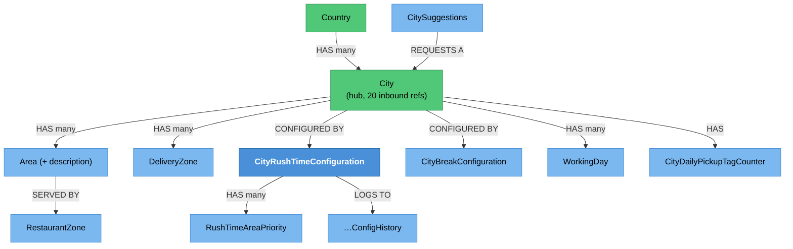

# City & Geography Administration — Knowledge Graph

> **Context:** Admin
> **Source Project:** `AdminUi` (8 controllers)
> **Entities:** [[City.technical|City]] (hub, 20 inbound references),
> [[CityRushTimeConfiguration.technical|CityRushTimeConfiguration]],
> [[CityBreakConfiguration|CityBreakConfiguration]], and 9 folded into
> [[Area-and-Country|Area & Country]]
> **Register findings open here:** none of its own; `City`'s create/update asymmetry is documented on
> the entity note

Where the platform's geography and its time-based behaviour are configured: countries, cities, areas,
delivery zones, restaurant zones, city suggestions, break windows, and **rush mode** — the mechanism
that changes how the whole delivery operation behaves when a city is overloaded.

`City` is one of the most connected entities in the system (20 inbound references), so this feature is
upstream of delivery pricing, driver scoring, pickup-tag numbering and store availability.

## Rush mode — the feature's real machinery

`CityRushTimeConfiguration` is a legacy POCO that behaves like an aggregate: a static `Instance`
factory with `Result` guards, private setters, and behaviour methods.

| Rule | Guard | Source |
|---|---|---|
| Busy threshold must be positive | `Result.Failure("busy threshold must be greater than zero")` | `Shared/TalabatkLogic/TalabatkModels/CityRushTimeConfiguration.cs:67` |
| Reopen-below must be **less than** the busy threshold | `Result.Failure("reopen below must be less than busy threshold")` | `Shared/TalabatkLogic/TalabatkModels/CityRushTimeConfiguration.cs:72` |
| Threshold-checker interval must be positive | `Result.Failure("threshold checker in munites must be greater than zero")` | `Shared/TalabatkLogic/TalabatkModels/CityRushTimeConfiguration.cs:76` |
| At least one area priority is required | `Result.Failure("rush time area priorities can not be null or empty")` | `Shared/TalabatkLogic/TalabatkModels/CityRushTimeConfiguration.cs:80` |
| A new configuration starts **out** of rush mode | `RushMode = false` | `Shared/TalabatkLogic/TalabatkModels/CityRushTimeConfiguration.cs:89` |
| Rush mode cannot be force-ended while the timeout count is still above the busy threshold | `Result.Failure("Can not end rush mode because current timeout requests greater than busy threshold")` | `Shared/TalabatkLogic/TalabatkModels/CityRushTimeConfiguration.cs:106` |
| **`Update` only validates the thresholds while NOT in rush mode** | the two guards are wrapped in `if (!this.RushMode && …)` | `Shared/TalabatkLogic/TalabatkModels/CityRushTimeConfiguration.cs:121-130` |

That last row is the one to carry into any change: **while a city is in rush mode, its thresholds can
be edited past their own invariants**, because both validity checks are conditioned on `!RushMode`
(`Shared/TalabatkLogic/TalabatkModels/CityRushTimeConfiguration.cs:121-130`). The window in which the
configuration matters most is the window in which it is least validated.

### The rush-mode lifecycle spans three components

```
timed-out deliveries counted per city (shared cache)
        │
        ├── MangeRushTimeEvnetHandler: EvaluateRushMode(count, now)
        │       └── entering rush mode schedules RushModeEndCheckerService after
        │           ThresholdCheckerInMunites minutes
        │
        ├── RushModeEndCheckerService: CanEndRushMode(currentTimeoutRequests)?
        │       ├── no  -> RE-SCHEDULES ITSELF  (a self-perpetuating job chain)
        │       └── yes -> DisableRushMode(now, orderCount)
        │
        └── ForceEndRushMode(...) — an operator override, refused while still above threshold
```

Both jobs are registered in `_integrations.md` rows 23 and 24; the counter they read is seeded at host
boot by a job on the Admin host, which is why a cold start matters to rush-mode accuracy.
`CityRushTimeConfigHistory` records the transitions.

## Endpoint index

| Controller | Actions | What it administers |
|---|---|---|
| `CityController` | city CRUD and lookups | Cities, including the delivery-man scoring weights and price tiers |
| `CityRushTimeConfigurationController` | rush configuration | Thresholds, checker interval, area priorities; `AdminUi/Controllers/CityRushTimeConfigurationController/CityRushTimeConfigurationController.cs` |
| `CityBreakConfigurationController` | break windows | When a city pauses operations |
| `CitySuggestionsController` | suggestions | Cities customers asked for but 8Orders does not serve |
| `AreaController`, `CountryController` | area and country CRUD | The geography hierarchy above and below a city |
| `DeliveryZoneController` | delivery zones | Driver assignment geography |
| `RestaurantZoneController` | restaurant zones | Which stores serve which areas |

## Entity Relationship Diagram



## Status / State

| What | Values | Notes |
|---|---|---|
| `CityRushTimeConfiguration.RushMode` | `false` / `true` | Entered by evaluation, left by the self-rescheduling checker or an operator override; transitions logged to `CityRushTimeConfigHistory` |
| `CityDailyPickupTagCounter` | a per-city, per-working-day sequence | The source of the "Daily Pickup Tag" business term in [[_glossary\|the glossary]] |
| City break window | configured, not a status | A city pauses on a schedule rather than by a flag |

## Entity Index

| Entity | Layer | Type | Responsibility |
|---|---|---|---|
| `City` | Domain — legacy entity | **Master, Hub** | 20 inbound references; scoring weights, price tiers, cash limits |
| `CityRushTimeConfiguration` | Domain — legacy POCO with factory + guards | Transactional config | Rush-mode thresholds and area priorities |
| `CityRushTimeConfigHistory` | Domain — legacy POCO | Child | Rush-mode transition log |
| `RushTimeAreaPriority` | Domain — legacy POCO | Child | Which areas are prioritised during rush mode |
| `CityBreakConfiguration` | Domain — legacy POCO | Config | Scheduled operational pause |
| `Country`, `Area`, `AreaDecription`, `CityDescription` | Domain — legacy POCO | Master/child | The geography hierarchy; folded into [[Area-and-Country\|Area & Country]] |
| `WorkingDay` | Domain — legacy POCO | Child | Per-city working days, used by the pickup-tag counter |
| `CityDailyPickupTagCounter` | Domain — legacy POCO | Transactional | The daily sequence behind a pickup tag |
| `CitySuggestions` | Domain — legacy POCO | Transactional | Unserved cities customers asked for |

## Feature Flow (Business Narrative)

```
1. EXPAND
   └── country -> city -> areas -> delivery zones -> restaurant zones
2. CONFIGURE THE CITY
   ├── scoring weights and driver price tiers (see City's own note)
   ├── rush-mode thresholds and area priorities
   ├── break windows
   └── working days (which feed the daily pickup-tag sequence)
3. OPERATE
   ├── timed-out deliveries push a city into rush mode
   ├── a self-rescheduling job checks whether it can end
   └── an operator can force-end it, but only once the count has fallen
4. LISTEN
   └── city suggestions record demand for places 8Orders does not serve
```

## Key Cross-Cutting Relationships

| From | To | Relationship | Notes |
|---|---|---|---|
| `City` | almost everything | 20 inbound references | Delivery pricing, driver scoring, cash limits, pickup tags, store availability |
| Rush mode | [[Delivery/Delivery Man Operations/_knowledge-graph\|Delivery Man Operations]] | changes assignment behaviour | `_integrations.md` rows 23–24 |
| Rush mode | [[Identity & Access/Ops & Infra/_knowledge-graph\|Ops & Infra]] | the counter is seeded at host boot | `_integrations.md` row 24 |
| `CityDailyPickupTagCounter` | [[Customer Ordering/Order & Fulfilment/_knowledge-graph\|Order & Fulfilment]] | pickup tag numbering | Glossary term "Daily Pickup Tag" |
| Zones | [[Restaurant Portal/Menu & Order Management/_knowledge-graph\|Menu & Order Management]] | which stores serve which areas | |

## Change Surface

| Signal | Value | Notes |
|---|---|---|
| Direct dependents (Ring 1) | 8 controllers; `City` is read by 20 model types | |
| Sides touched | 4/5 | Domain · Application · Data · API host |
| Cross-context integrations | 2 | Rush-mode job chain; boot-time counter seeding |
| Register findings open | 0 of its own | `City`'s `Result` vs `throw` asymmetry is on the entity note |
| Hub? | **yes** — `City` is a top-three hub entity | |
| Risk flags | rush-mode thresholds are unvalidated *while in rush mode*; a self-rescheduling job chain has no visible upper bound |

## Open Questions

- [ ] Why are the `Update` threshold guards conditioned on `!RushMode`
      (`Shared/TalabatkLogic/TalabatkModels/CityRushTimeConfiguration.cs:121-130`)? It permits invalid
      thresholds precisely while they are in force.
- [ ] Does the self-rescheduling end-checker have any maximum retry count or backoff? Nothing observed.
- [ ] What happens to rush mode if the boot-time counter seeding never runs (host restarted without
      it)? Rush decisions read that cache.
- [ ] Are city suggestions ever acted on, or only collected?
- [ ] Is the pickup-tag counter reset per working day, and what happens across a day boundary mid-shift?
