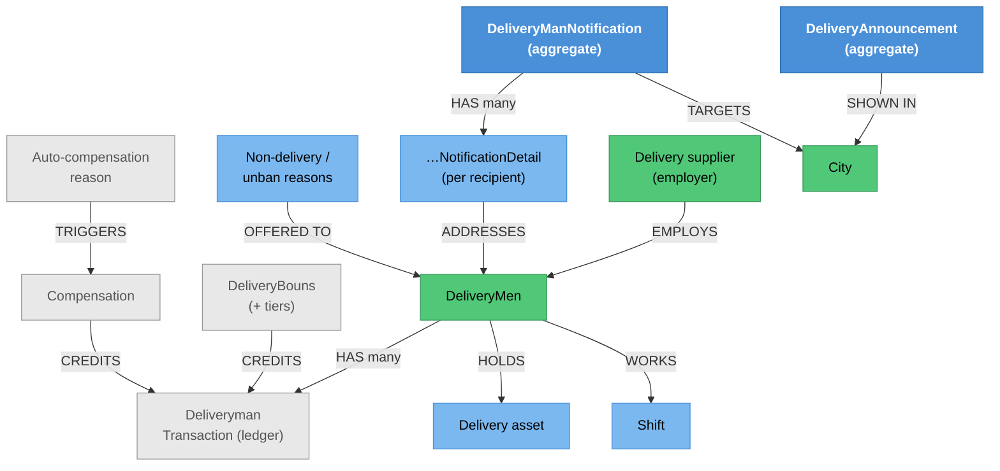

# Delivery Administration — Knowledge Graph

> **Context:** Admin
> **Source Project:** `AdminUi` (14 controllers)
> **Entities:** [[DeliveryAnnouncement.technical|DeliveryAnnouncement]] and
> [[DeliveryManNotification.technical|DeliveryManNotification]] (the two aggregates authored here),
> [[DeliveryMen.technical|DeliveryMen]], [[DeliveryBouns.technical|DeliveryBouns]],
> [[Compensation|Compensation]], [[DeliverymanTransaction.technical|DeliverymanTransaction]]
> **Register findings open here:** #375 (re-attributed to this feature), #568, #569

The 8Orders side of everything to do with drivers: their records and assets, their money (wallet,
bonuses, compensation), the messages sent to them, the suppliers who employ them, their shifts, and the
reason lists the driver app offers. Where [[Delivery/Delivery Man Operations/_knowledge-graph|Delivery
Man Operations]] is what a driver *does*, this is what 8Orders *does to and for* drivers.

## The authorisation split — the same context, two standards

This feature is the clearest place in the codebase to see the Admin permission story, because two of
its controllers sit at opposite ends of it:

| Controller | Class attribute | Per-action `[Permission]` | Verdict |
|---|---|---|---|
| `DeliveryAnnouncementController` | `[Authorize]` (`AdminUi/Controllers/DeliveryAnnouncementController/DeliveryAnnouncementController.cs:20`) | **Yes, on every action** — `[Permission(Permissions.DeliveryAnnouncements)]` at `:38`, `:51`, `:71`, and on the rest | ✅ the pattern to copy |
| `DeliverymanWalletController` | `[Authorize]`, no roles (`AdminUi/Controllers/DeliverymanWallet/DeliverymanWalletController.cs:19`) | **None on any action** — including `Add`, which **writes a wallet transaction** (`:55-58`) | 🔴 `_conflicts.md` #568 (read), #569 (write) |

Both are in the same feature, written against the same mechanism. The newer aggregate-backed controller
uses the permission system properly; the wallet controller relies on "any signed-in user". That is the
whole of #568/#569 in one comparison, and it is why the Admin-wide count matters: roughly two-thirds of
`AdminUi/Controllers/` files carry no `[Permission]` at all.

> ⚠️ **CONFIRMED — an unauthenticated caller can trigger a financial batch (re-attributed here)**
> `POST api/DeliveryMen/DailyRefundableDeposit` is `[AllowAnonymous]`
> (`AdminUi/Controllers/DeliveryMenController.cs:198`) on a controller whose class attribute is
> `[Authorize]` (`AdminUi/Controllers/DeliveryMenController.cs:32`), takes **no parameters**, and
> dispatches the daily insurance-deduction batch across delivery men. `_conflicts.md` **#375** —
> whose citation previously named the identity host; both projects contain a `DeliveryMenController.cs`
> with a line 198, so the wrong-file citation looked plausible. Corrected 2026-08-23.

## Endpoint index (by area)

| Area | Controllers | Notable |
|---|---|---|
| Driver records & assets | `DeliveryMenController` (16 actions) | Balance, in-shift lists, lookups by city/order, delivery-asset CRUD, and the anonymous batch above |
| Driver money | `DeliverymanWalletController` (3), `DeliveryBounsController` (7), `CompensationController` (9), `AutoCompensationSettingsController` (3) | Wallet transactions, bonus schemes by city and shift, compensation lifecycle with its own status enum, and the reason list that drives automatic compensation |
| Messages to drivers | `DeliveryAnnouncementController` (5), `DeliveryManNotificationController` (5) | The two DDD aggregates; both fully `[Permission]`-gated |
| Org & rules | `DeliverySupplierController` (5), `DeliveryInstructionsController` (5), `NonDeliveryReasonsController`, `UnbanReasonsController`, `UserShiftController`, `WorkUsDeliveryController`, `RoboCallController` | Suppliers who employ drivers, standing delivery instructions, the reason catalogues the driver app shows, shifts, driver applications, and the automated voice-call service |

Compensation is the richest of these: alongside CRUD it exposes `GetCompensationStatusEnum` and
`GetCompensationToTypeEnum` to the front end and a separate `UpdateCompensationState` action
(`AdminUi/Controllers/Compensation/CompensationController.cs`), so its state machine is driven from the
Admin UI rather than by domain events.

## Entity Relationship Diagram



## Status / State

Three state machines meet in this feature, and only one of them lives in a domain aggregate:

| What | Where the state lives | Values |
|---|---|---|
| Notification send state | `DeliveryManNotification` aggregate | `Pending`(1) → `Sent`(2), terminal — see [[DeliveryManNotification.technical\|its note]] |
| Compensation state | driven from the Admin UI via `UpdateCompensationState`, with the enum exposed to the front end | enumerated by `GetCompensationStatusEnum` (`AdminUi/Controllers/Compensation/CompensationController.cs`) |
| Announcement liveness | **derived**, not stored — `StartDate`/`EndDate` only | no activation flag exists; see [[DeliveryAnnouncement.technical\|its note]] |

## Entity Index

| Entity | Layer | Type | Responsibility |
|---|---|---|---|
| `DeliveryAnnouncement` | Domain — **aggregate root** | Transactional | City-scoped driver message; documented in [[DeliveryAnnouncement.technical\|DeliveryAnnouncement]] |
| `DeliveryManNotification` (+ `Detail`) | Domain — **aggregate root** + child | Transactional | Targeted push with per-recipient tracking; [[DeliveryManNotification.technical\|DeliveryManNotification]] |
| `DeliveryMen` | Domain — legacy entity | **Hub** | The driver record; [[DeliveryMen.technical\|DeliveryMen]] |
| `DeliveryBouns` | Domain — legacy entity | Transactional | Bonus schemes; [[DeliveryBouns.technical\|DeliveryBouns]] |
| `Compensation` | Domain — legacy entity, event-raising | Transactional | [[Compensation\|Compensation]] |
| `DeliverymanTransaction` | Domain — legacy entity | Ledger | Written by the wallet controller; [[DeliverymanTransaction.technical\|DeliverymanTransaction]] |
| Suppliers, assets, instructions, reasons, shifts | Domain — legacy POCO / lookup | Master | Documented in [[DeliveryAnnouncement-and-Notification\|Delivery Announcement & Notification]] and [[Delivery/Delivery Man Operations/_knowledge-graph\|Delivery Man Operations]] |

## Feature Flow (Business Narrative)

```
1. ONBOARD
   └── driver application (WorkUsDelivery) -> driver record -> supplier -> assets issued
2. OPERATE
   ├── shifts assigned; non-delivery and unban reason lists maintained
   └── announcements and notifications authored and sent
3. PAY
   ├── bonuses configured per city and shift
   ├── compensation raised, state advanced from the Admin UI
   └── wallet transactions posted directly  (no [Permission] — #568/#569)
4. DAILY
   └── the insurance-deduction batch runs — and can also be triggered anonymously (#375)
5. ESCALATE
   └── RoboCall for restaurants that ignore orders (see _integrations.md row 17)
```

## Key Cross-Cutting Relationships

| From | To | Relationship | Notes |
|---|---|---|---|
| This feature | [[Delivery/Delivery Man Operations/_knowledge-graph\|Delivery Man Operations]] | administers what drivers use | Reason lists, shifts and announcements are consumed there |
| This feature | [[Delivery/Driver Cash & Compensation/_knowledge-graph\|Driver Cash & Compensation]] | writes to the same ledger | The wallet controller is the third of that feature's four triggers |
| This feature | [[Identity & Access/Delivery Man Identity/_knowledge-graph\|Delivery Man Identity]] | account vs. administration | Dismissal, bans and credentials live there |
| This feature | Firebase Cloud Messaging | driver pushes | `_integrations.md` rows 21, 23 |
| This feature | AccFlex ERP | wallet and compensation movements | `_integrations.md` row 20 |

## Change Surface

| Signal | Value | Notes |
|---|---|---|
| Direct dependents (Ring 1) | 14 controllers, the driver app, the ledger | |
| Sides touched | 4/5 | Domain (2 aggregates) · Application · Data · API host |
| Cross-context integrations | 3 | FCM, ERP, RoboCall |
| Register findings open | 3 (#375, #568, #569) | plus the Admin-wide #617/#618 mechanism |
| Hub? | writes to the `DeliveryMen` hub and the driver ledger | |
| Risk flags | money-writing actions with no permission attribute; an anonymous financial batch; two aggregates whose invariants are enforced per method rather than at the boundary |

<!-- BEGIN generated: endpoint index (insert-endpoints.js) -->

## Endpoint index — generated from the controllers

> Generated by `_system/insert-endpoints.js` from `_feature-map.tsv`; do not edit between the
> sentinels. Every row is anchored to a line, so `verify-citations.js` checks all of it and a
> controller that moves is caught on the next run. "Action gate" lists only attributes on the action
> itself — the class gate above each table still applies unless an action opts out of it.

**14 controller(s), 82 action(s)** — 1 carry `[AllowAnonymous]`; 58 have no action-level gate and rely entirely on the class attribute.

#### `AdminUi/Controllers/AutoCompensationSettings/AutoCompensationSettingsController.cs`

Class gate: roleless `[Authorize]` — `AdminUi/Controllers/AutoCompensationSettings/AutoCompensationSettingsController.cs:20`

| Route | Verb | Action gate | Anchor |
|---|---|---|---|
| `reasons` | GET | `Permission(General.AutoCompensationSettings)` | `AdminUi/Controllers/AutoCompensationSettings/AutoCompensationSettingsController.cs:37` |
| `reasons/{id}` | GET | `Permission(General.AutoCompensationSettings)` | `AdminUi/Controllers/AutoCompensationSettings/AutoCompensationSettingsController.cs:48` |
| `reasons` | POST | `Permission(General.AutoCompensationSettings)` | `AdminUi/Controllers/AutoCompensationSettings/AutoCompensationSettingsController.cs:62` |

#### `AdminUi/Controllers/Compensation/CompensationController.cs`

Class gate: roleless `[Authorize]` — `AdminUi/Controllers/Compensation/CompensationController.cs:25`

| Route | Verb | Action gate | Anchor |
|---|---|---|---|
| `AddNewCompensation` | POST | — | `AdminUi/Controllers/Compensation/CompensationController.cs:44` |
| `UpdateCompensation` | POST | — | `AdminUi/Controllers/Compensation/CompensationController.cs:64` |
| `DeleteCompensation` | POST | — | `AdminUi/Controllers/Compensation/CompensationController.cs:83` |
| `GetOrderCompensations` | GET | — | `AdminUi/Controllers/Compensation/CompensationController.cs:102` |
| `GetallCompensationsList` | POST | — | `AdminUi/Controllers/Compensation/CompensationController.cs:121` |
| `GetCompensationStatusEnum` | GET | — | `AdminUi/Controllers/Compensation/CompensationController.cs:159` |
| `UpdateCompensationState` | POST | — | `AdminUi/Controllers/Compensation/CompensationController.cs:176` |
| `GetCompensationToTypeEnum` | GET | — | `AdminUi/Controllers/Compensation/CompensationController.cs:199` |
| `SalesDailyCompensations` | GET | — | `AdminUi/Controllers/Compensation/CompensationController.cs:218` |

#### `AdminUi/Controllers/DeliveryAnnouncementController/DeliveryAnnouncementController.cs`

Class gate: roleless `[Authorize]` — `AdminUi/Controllers/DeliveryAnnouncementController/DeliveryAnnouncementController.cs:20`

| Route | Verb | Action gate | Anchor |
|---|---|---|---|
| `GetDeliveryAnnouncements` | GET | `Permission(DeliveryAnnouncements)` | `AdminUi/Controllers/DeliveryAnnouncementController/DeliveryAnnouncementController.cs:39` |
| `GetDeliveryAnnouncementById` | GET | `Permission(DeliveryAnnouncements)` | `AdminUi/Controllers/DeliveryAnnouncementController/DeliveryAnnouncementController.cs:52` |
| `AddDeliveryAnnouncement` | POST | `Permission(DeliveryAnnouncements)` | `AdminUi/Controllers/DeliveryAnnouncementController/DeliveryAnnouncementController.cs:72` |
| `EditDeliveryAnnouncement` | POST | `Permission(DeliveryAnnouncements)` | `AdminUi/Controllers/DeliveryAnnouncementController/DeliveryAnnouncementController.cs:93` |
| `DeleteDeliveryAnnouncement` | POST | `Permission(DeliveryAnnouncements)` | `AdminUi/Controllers/DeliveryAnnouncementController/DeliveryAnnouncementController.cs:114` |

#### `AdminUi/Controllers/DeliveryBouns/DeliveryBounsController.cs`

Class gate: roleless `[Authorize]` — `AdminUi/Controllers/DeliveryBouns/DeliveryBounsController.cs:23`

| Route | Verb | Action gate | Anchor |
|---|---|---|---|
| `Cities` | GET | — | `AdminUi/Controllers/DeliveryBouns/DeliveryBounsController.cs:40` |
| `Shifts` | GET | — | `AdminUi/Controllers/DeliveryBouns/DeliveryBounsController.cs:57` |
| `Details` | GET | — | `AdminUi/Controllers/DeliveryBouns/DeliveryBounsController.cs:78` |
| `List` | GET | — | `AdminUi/Controllers/DeliveryBouns/DeliveryBounsController.cs:100` |
| `Add` | POST | — | `AdminUi/Controllers/DeliveryBouns/DeliveryBounsController.cs:118` |
| `Delete` | POST | — | `AdminUi/Controllers/DeliveryBouns/DeliveryBounsController.cs:137` |
| `Update` | POST | — | `AdminUi/Controllers/DeliveryBouns/DeliveryBounsController.cs:156` |

#### `AdminUi/Controllers/DeliveryInstructionsController/DeliveryInstructionsController.cs`

Class gate: roleless `[Authorize]` — `AdminUi/Controllers/DeliveryInstructionsController/DeliveryInstructionsController.cs:21`

| Route | Verb | Action gate | Anchor |
|---|---|---|---|
| `GetAll` | GET | — | `AdminUi/Controllers/DeliveryInstructionsController/DeliveryInstructionsController.cs:38` |
| `GetById` | GET | — | `AdminUi/Controllers/DeliveryInstructionsController/DeliveryInstructionsController.cs:53` |
| `Add` | POST | — | `AdminUi/Controllers/DeliveryInstructionsController/DeliveryInstructionsController.cs:68` |
| `Edit` | POST | — | `AdminUi/Controllers/DeliveryInstructionsController/DeliveryInstructionsController.cs:83` |
| `Delete` | POST | — | `AdminUi/Controllers/DeliveryInstructionsController/DeliveryInstructionsController.cs:98` |

#### `AdminUi/Controllers/DeliveryManNotificationController/DeliveryManNotificationController.cs`

Class gate: roleless `[Authorize]` — `AdminUi/Controllers/DeliveryManNotificationController/DeliveryManNotificationController.cs:20`

| Route | Verb | Action gate | Anchor |
|---|---|---|---|
| `GetDeliveryManNotifications` | GET | `Permission(DeliveryManNotifications)` | `AdminUi/Controllers/DeliveryManNotificationController/DeliveryManNotificationController.cs:38` |
| `GetDeliveryManNotificationById` | GET | `Permission(DeliveryManNotifications)` | `AdminUi/Controllers/DeliveryManNotificationController/DeliveryManNotificationController.cs:50` |
| `AddDeliveryManNotification` | POST | `Permission(DeliveryManNotifications)` | `AdminUi/Controllers/DeliveryManNotificationController/DeliveryManNotificationController.cs:69` |
| `EditDeliveryManNotification` | POST | `Permission(DeliveryManNotifications)` | `AdminUi/Controllers/DeliveryManNotificationController/DeliveryManNotificationController.cs:89` |
| `DeleteDeliveryManNotification` | POST | `Permission(DeliveryManNotifications)` | `AdminUi/Controllers/DeliveryManNotificationController/DeliveryManNotificationController.cs:109` |

#### `AdminUi/Controllers/DeliveryMenController.cs`

Class gate: roleless `[Authorize]` — `AdminUi/Controllers/DeliveryMenController.cs:32`

| Route | Verb | Action gate | Anchor |
|---|---|---|---|
| `All` | GET | — | `AdminUi/Controllers/DeliveryMenController.cs:49` |
| `Balance` | GET | — | `AdminUi/Controllers/DeliveryMenController.cs:71` |
| `DeliveryMenInShift` | GET | — | `AdminUi/Controllers/DeliveryMenController.cs:90` |
| `GetAllDeliveryMen` | GET | — | `AdminUi/Controllers/DeliveryMenController.cs:108` |
| `GetAllDeliveryMenByCityId` | GET | — | `AdminUi/Controllers/DeliveryMenController.cs:129` |
| `GetAllDeliveryMenByListOfCitiesIds` | POST | — | `AdminUi/Controllers/DeliveryMenController.cs:146` |
| `GetAllDeliveryMenByCityIdIfExists` | GET | — | `AdminUi/Controllers/DeliveryMenController.cs:162` |
| `GetAllDeliveryMenByOrderId` | GET | — | `AdminUi/Controllers/DeliveryMenController.cs:178` |
| `DailyRefundableDeposit` | POST | 🔓 **AllowAnonymous** | `AdminUi/Controllers/DeliveryMenController.cs:199` |
| `DeliveryAssets/Add` | POST | — | `AdminUi/Controllers/DeliveryMenController.cs:216` |
| `DeliveryAssets/Update` | POST | — | `AdminUi/Controllers/DeliveryMenController.cs:232` |
| `DeliveryAssets/Delete` | POST | — | `AdminUi/Controllers/DeliveryMenController.cs:248` |
| `DeliveryAssets/GetAll` | GET | — | `AdminUi/Controllers/DeliveryMenController.cs:264` |
| `DeliveryAssets/GetById` | GET | — | `AdminUi/Controllers/DeliveryMenController.cs:280` |
| `GetNonDeliveredReasonsForAdmin` | GET | — | `AdminUi/Controllers/DeliveryMenController.cs:300` |
| `GetAllDeliveryMenLookupByCity` | GET | — | `AdminUi/Controllers/DeliveryMenController.cs:318` |

#### `AdminUi/Controllers/DeliverySupplier/DeliverySupplierController.cs`

Class gate: roleless `[Authorize]` — `AdminUi/Controllers/DeliverySupplier/DeliverySupplierController.cs:21`

| Route | Verb | Action gate | Anchor |
|---|---|---|---|
| `AddDeliverySupplier` | POST | `Permission(DeliverySupplier.DeliverySupplierOperations)` | `AdminUi/Controllers/DeliverySupplier/DeliverySupplierController.cs:40` |
| `UpdateDeliverySupplierById` | POST | `Permission(DeliverySupplier.DeliverySupplierOperations)` | `AdminUi/Controllers/DeliverySupplier/DeliverySupplierController.cs:63` |
| `DeleteDeliverySupplierById` | POST | `Permission(DeliverySupplier.DeliverySupplierOperations)` | `AdminUi/Controllers/DeliverySupplier/DeliverySupplierController.cs:88` |
| `GetAllDeliverySuppliers` | GET | `Permission(DeliverySupplier.DeliverySupplierOperations)` | `AdminUi/Controllers/DeliverySupplier/DeliverySupplierController.cs:109` |
| `GetDeliverySupplierById` | GET | `Permission(DeliverySupplier.DeliverySupplierOperations)` | `AdminUi/Controllers/DeliverySupplier/DeliverySupplierController.cs:138` |

#### `AdminUi/Controllers/DeliverymanWallet/DeliverymanWalletController.cs`

Class gate: roleless `[Authorize]` — `AdminUi/Controllers/DeliverymanWallet/DeliverymanWalletController.cs:19`

| Route | Verb | Action gate | Anchor |
|---|---|---|---|
| `GetTransactions` | GET | — | `AdminUi/Controllers/DeliverymanWallet/DeliverymanWalletController.cs:35` |
| `GetTotalDeliveryMenStatement` | POST | — | `AdminUi/Controllers/DeliverymanWallet/DeliverymanWalletController.cs:45` |
| `Add` | POST | — | `AdminUi/Controllers/DeliverymanWallet/DeliverymanWalletController.cs:58` |

#### `AdminUi/Controllers/NonDeliveryReasonsController.cs`

Class gate: roleless `[Authorize]` — `AdminUi/Controllers/NonDeliveryReasonsController.cs:22`

| Route | Verb | Action gate | Anchor |
|---|---|---|---|
| `getAllReasons` | GET | — | `AdminUi/Controllers/NonDeliveryReasonsController.cs:38` |
| `createReason` | POST | — | `AdminUi/Controllers/NonDeliveryReasonsController.cs:50` |
| `updateReason` | PUT | — | `AdminUi/Controllers/NonDeliveryReasonsController.cs:68` |
| `updateReasonStatus/{id}` | PUT | — | `AdminUi/Controllers/NonDeliveryReasonsController.cs:84` |
| `deleteReason/{id}` | DELETE | — | `AdminUi/Controllers/NonDeliveryReasonsController.cs:108` |

#### `AdminUi/Controllers/RoboCall/RoboCallController.cs`

Class gate: **no auth attribute on the class** — `AdminUi/Controllers/RoboCall/RoboCallController.cs:18`

| Route | Verb | Action gate | Anchor |
|---|---|---|---|
| `WebHook` | POST | — | `AdminUi/Controllers/RoboCall/RoboCallController.cs:36` |

#### `AdminUi/Controllers/UnbanReasonsController.cs`

Class gate: roleless `[Authorize]` — `AdminUi/Controllers/UnbanReasonsController.cs:18`

| Route | Verb | Action gate | Anchor |
|---|---|---|---|
| `getAllReasons` | GET | — | `AdminUi/Controllers/UnbanReasonsController.cs:32` |
| `createReason` | POST | — | `AdminUi/Controllers/UnbanReasonsController.cs:44` |
| `updateReason` | PUT | — | `AdminUi/Controllers/UnbanReasonsController.cs:62` |
| `deleteReason/{id}` | DELETE | — | `AdminUi/Controllers/UnbanReasonsController.cs:79` |

#### `AdminUi/Controllers/UserShiftController/UserShiftController.cs`

Class gate: roleless `[Authorize]` — `AdminUi/Controllers/UserShiftController/UserShiftController.cs:23`

| Route | Verb | Action gate | Anchor |
|---|---|---|---|
| `GetUserOfflineReasons` | GET | — | `AdminUi/Controllers/UserShiftController/UserShiftController.cs:38` |
| `StartUserShift` | POST | — | `AdminUi/Controllers/UserShiftController/UserShiftController.cs:54` |
| `EndUserShift` | POST | — | `AdminUi/Controllers/UserShiftController/UserShiftController.cs:70` |
| `GetUserActiveHours` | POST | — | `AdminUi/Controllers/UserShiftController/UserShiftController.cs:87` |
| `GetOfflineDetailsByShiftId` | GET | — | `AdminUi/Controllers/UserShiftController/UserShiftController.cs:120` |

#### `AdminUi/Controllers/WorkUsDeliveryController.cs`

Class gate: roleless `[Authorize]` — `AdminUi/Controllers/WorkUsDeliveryController.cs:24`

| Route | Verb | Action gate | Anchor |
|---|---|---|---|
| `kanban` | GET | — | `AdminUi/Controllers/WorkUsDeliveryController.cs:42` |
| `{id}/history` | GET | — | `AdminUi/Controllers/WorkUsDeliveryController.cs:61` |
| `{id}/detail` | GET | — | `AdminUi/Controllers/WorkUsDeliveryController.cs:80` |
| `{id}/status` | POST | `Permission("WorkUsDelivery.ChangeStatus")` | `AdminUi/Controllers/WorkUsDeliveryController.cs:100` |
| `{id}/comment` | POST | `Permission("WorkUsDelivery.AddComment")` | `AdminUi/Controllers/WorkUsDeliveryController.cs:127` |
| `statuses` | GET | — | `AdminUi/Controllers/WorkUsDeliveryController.cs:152` |
| `statuses` | POST | role `Admin` | `AdminUi/Controllers/WorkUsDeliveryController.cs:172` |
| `statuses/{id}` | PUT | role `Admin` | `AdminUi/Controllers/WorkUsDeliveryController.cs:199` |
| `statuses/{id}` | DELETE | role `Admin` | `AdminUi/Controllers/WorkUsDeliveryController.cs:228` |

<!-- END generated: endpoint index -->

## Open Questions

- [ ] Should `DeliverymanWalletController.Add` require a `[Permission]`? It writes money and today needs
      only a signed-in session (#569).
- [ ] Is `DailyRefundableDeposit` idempotent? #375 records that it has no date guard and no
      already-run check, so repeated calls repeat the deduction.
- [ ] Who may advance a compensation's state? `UpdateCompensationState` carries no permission attribute
      in the class-level-only pattern.
- [ ] Are announcement and notification authoring restricted to specific cities, or can any permitted
      admin target any city?
- [ ] `DeliveryMenController` mixes 15 authorised actions with 1 anonymous one — is the anonymous batch
      called by an internal scheduler that could use a secret instead?
