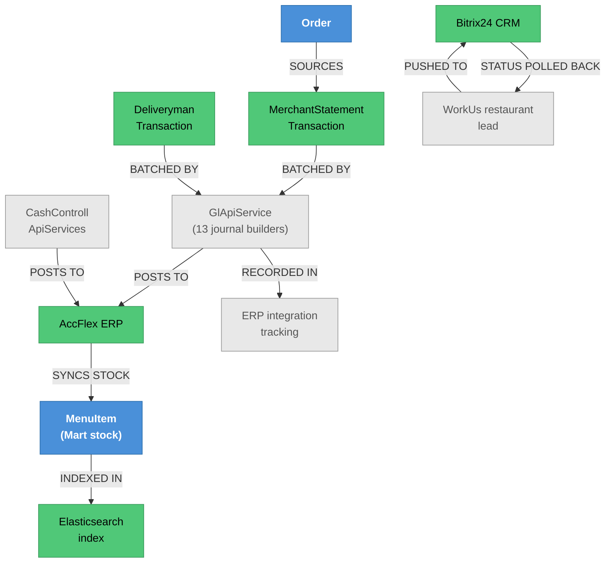

# ERP & Integrations — Knowledge Graph

> **Context:** Admin
> **Source Project:** `AdminUi` (7 controllers) + `AdminUi/Helper/ERPIntegration/**`
> **Entities:** none of its own except `BitirixLeadStatus` (folded into
> [[Configuration.technical|Configuration]]); it moves other features' data outward
> **Register findings open here:** #263, #272, #293–#296, #418, #418(a) — the largest single finding
> cluster in the register
> **The flow note:** [[Money-Path.technical|The Money Path]] — read that for how money reaches the
> ledger; this note owns the **outbound plumbing**

Everything that leaves 8Orders for another system: the accounting journals posted to **AccFlex ERP**,
the Mart stock quantities synchronised with the same ERP, restaurant-signup leads pushed to **Bitrix24
CRM**, the **Elasticsearch** index behind restaurant search, outbound **webhooks**, a **third-party AI**
endpoint, and the Tawk.to support widget.

## Two AccFlex integrations, two different feature flags — the trap

The single most important fact in this feature, because it has been conflated before (including in this
project's own planning documents):

| | Row 19 — **stock sync** | Row 20 — **GL journals** |
|---|---|---|
| What moves | Mart item stock quantities | Double-entry accounting journals |
| Direction | Inbound and outbound | Outbound only |
| Gated by | `Features.ValidateQuantitiesLocally` | `Features.ERPIntegration` |
| Converges on | `MenuItem.MaintainStock(...)` | `GlApiService.PostJournal` |
| Where | `_integrations.md` row 19 | `_integrations.md` row 20 |

Same external system, two independent integrations, **two differently-named flags** whose names both
sound like "is ERP on?". Turning one off does not turn the other off.

## The GL journal surface — thirteen builders, one poster

`GlApiService` is a partial class split across one file per journal type, all funnelling into a single
private `PostJournal` (`AdminUi/Helper/ERPIntegration/GlApiServices/GlApiService.cs:514`):

| Journal file | What it posts |
|---|---|
| `GlApiService.RestaurantsAccrualsJournal.cs` | What 8Orders owes restaurants |
| `GlApiService.RestaruantJournalsSub.cs` | Restaurant journal sub-entries |
| `GlApiService.DeliveryMenAccrualJournal.cs` | What 8Orders owes drivers |
| `GlApiService.DeliveryMenCashJournal.cs` | Driver cash movements |
| `GlApiService.DeliveryShiftBounsJournal.cs` | Shift bonuses |
| `GlApiService.SendDeliveryMenInsuranceJournal.cs` | Insurance deductions |
| `GlApiService.SendDeliveryMenAssetDeductionJournal.cs` | Asset deductions |
| `GlApiService.CompensationsJournal.cs` | Compensation payments |
| `GlApiService.FawryJournal.cs` | Fawry deposits |
| `GlApiService.OnlinePaymentsReceivement.cs` | Online payment receipts |
| `GlApiService.RefundedOnlinePayments.cs` | Refunds |
| `GlApiService.WalletAndPromoCodeJournal.cs` | Wallet and promo-code movements |
| `GlApiService.TotalIncomeJournal.cs` | Income totals |
| `GlApiService.SendManualMerchantsTranasctionsJournals.cs` · `…DeliverymenTranasctionsJournals.cs` | Manually posted transactions |

A CR that changes how money is recorded has to enumerate this list — that is the practical reason it is
written out here rather than summarised. `AccflexERPConfigurations.cs` holds the endpoints and account
mappings; `CashControllApiServices/` is a **separate** rail for cash receipts and treasury movements,
used both for the online-payment treasury receipt and for merchant/driver cash.

## The finding cluster, and what each one means for a change

| Finding | What it is | Why it matters here |
|---|---|---|
| **#263 / #272** | The stock-sync live-incident history: originally fail-**open** (a failed ERP check let the order through), since fixed to fail-closed. The still-open gap is that **nothing reserves stock at checkout** | Any change to stock sync must preserve fail-closed and must not be mistaken for fixing the reservation gap, which is a different problem |
| **#293–#296** | Thread-unsafe shared state in `GlApiService`/`CompensationJournalDtoBuilder`, an unguarded lookup that can roll back a whole day's batch, and a dead `MarkOrderAsPaid` method | The batch is all-or-nothing per run, so one bad row can cost a day of postings |
| **#418(a)** | GL entries posted against `AccountId = 0` when a restaurant has no configured account | Silent mis-posting rather than a refusal |

Together these say something a reader should carry into any ERP work: **the journal batch is fragile in
bulk and forgiving of bad data**, which is the opposite of what an accounting integration wants.

## Endpoint index

| Controller | Purpose | Notes |
|---|---|---|
| `ERPController` | Account, treasury and bank lookups | `AdminUi/Controllers/ErpController/ERPController.cs:45`, `:57`, `:70` |
| `ERPController.PayForMerchant` | Pays a merchant — **moves real money** | `AdminUi/Controllers/ErpController/ERPController.cs:86` |
| `ERPController.PayForDeliveryMen` | Pays a driver — **moves real money** | `AdminUi/Controllers/ErpController/ERPController.cs:103` |
| `ErpIntegrationTrackingController` | Visibility into sync/posting runs | `AdminUi/Controllers/ErpIntegrationTrackingController.cs` |
| `JournalSubscriptionController` | Which journals are subscribed/enabled | |
| `ElasticSerachController` | Search index management | `AdminUi/Controllers/ElasticSerach/ElasticSerachController.cs`; the index behind restaurant search |
| `WebhookController` | Outbound webhook configuration | |
| `AiThirdPartyController` | Third-party AI calls | |
| `TawkToController` | Support-widget links | Same shape as the other hosts' copies |

## Entity Relationship Diagram



## Status / State

No entity status of its own. What has state is **each integration run**: the tracking controller exists
precisely because a posting or sync either happened, partly happened, or failed, and the answer is not
otherwise visible. `BitirixLeadStatus` tracks a lead's status as Bitrix reports it back, polled by a
Hangfire job (`_integrations.md` row 18).

## Entity Index

| Entity | Layer | Type | Responsibility |
|---|---|---|---|
| `BitirixLeadStatus` | Domain — legacy POCO | Lookup | Bitrix lead status mirrored locally; folded into [[Configuration.technical\|Configuration]] |
| `MerchantStatementTransaction`, `DeliverymanTransaction` | Domain | Ledger/child | The movements this feature exports; canonical notes elsewhere |
| `MenuItem` | Domain | Aggregate-ish | Stock quantity is the field the ERP sync writes |

## Feature Flow (Business Narrative)

```
1. THE DAY HAPPENS
   └── orders, deliveries, deposits and compensations write ledger rows elsewhere
2. NIGHTLY / ON DEMAND
   └── 13 journal builders assemble double-entry batches -> PostJournal -> AccFlex GL
3. CASH
   └── a separate treasury rail posts receipts and payments (PayForMerchant, PayForDeliveryMen)
4. STOCK
   └── four paths keep Mart quantities in step with AccFlex (webhook, scheduled pull,
       manual sync, cart-time pull — the last dormant while ValidateQuantitiesLocally is true)
5. LEADS
   └── restaurant signups pushed to Bitrix24; a job polls status back
6. SEARCH
   └── restaurant/menu data indexed into Elasticsearch
7. VISIBILITY
   └── the tracking screen is how anyone knows whether 2-6 actually worked
```

## Key Cross-Cutting Relationships

| From | To | Relationship | Notes |
|---|---|---|---|
| [[Money-Path.technical\|The Money Path]] | this feature | steps 8–9 are this feature's inbound side | The money is already recorded; here it leaves |
| [[Delivery/Driver Cash & Compensation/_knowledge-graph\|Driver Cash & Compensation]] | this feature | driver movements batched out | `_integrations.md` row 20 |
| [[Restaurant Portal/Merchant Finance & Reporting/_knowledge-graph\|Merchant Finance & Reporting]] | this feature | merchant settlements batched out | Same batch |
| AccFlex ERP | [[Restaurant Portal/Menu & Order Management/_knowledge-graph\|Menu & Order Management]] | stock sync inbound | `_integrations.md` row 19 |
| This feature | [[Customer Ordering/Restaurant & Menu Discovery/_knowledge-graph\|Restaurant & Menu Discovery]] | Elasticsearch index | Search results depend on this indexing |
| This feature | [[Admin/Merchant Administration/_knowledge-graph\|Merchant Administration]] | Bitrix leads | `_integrations.md` row 18 |

## Change Surface

| Signal | Value | Notes |
|---|---|---|
| Direct dependents (Ring 1) | 7 controllers, 13 journal builders, 2 external systems, the search index | |
| Sides touched | 4/5 | Application · Data · API host · external |
| Cross-context integrations | 5 | AccFlex GL, AccFlex stock, Bitrix24, Elasticsearch, Tawk.to |
| Register findings open | 8 | #263, #272, #293, #294, #295, #296, #418, #418(a) |
| Hub? | no — but it is the system's only outbound accounting path | |
| Risk flags | two flags with confusable names; an all-or-nothing daily batch; thread-unsafe shared state; posting to account 0 rather than refusing |

<!-- BEGIN generated: endpoint index (insert-endpoints.js) -->

## Endpoint index — generated from the controllers

> Generated by `_system/insert-endpoints.js` from `_feature-map.tsv`; do not edit between the
> sentinels. Every row is anchored to a line, so `verify-citations.js` checks all of it and a
> controller that moves is caught on the next run. "Action gate" lists only attributes on the action
> itself — the class gate above each table still applies unless an action opts out of it.

**7 controller(s), 30 action(s)**; 21 have no action-level gate and rely entirely on the class attribute.

#### `AdminUi/Controllers/AiThirdPartyController/AiThirdPartyController.cs`

Class gate: **no auth attribute on the class** — `AdminUi/Controllers/AiThirdPartyController/AiThirdPartyController.cs:20`

| Route | Verb | Action gate | Anchor |
|---|---|---|---|
| `ReviewCommentCallBack` | POST | — | `AdminUi/Controllers/AiThirdPartyController/AiThirdPartyController.cs:37` |

#### `AdminUi/Controllers/ElasticSerach/ElasticSerachController.cs`

Class gate: **no auth attribute on the class** — `AdminUi/Controllers/ElasticSerach/ElasticSerachController.cs:16`

| Route | Verb | Action gate | Anchor |
|---|---|---|---|
| `CreateIndecies` | GET | — | `AdminUi/Controllers/ElasticSerach/ElasticSerachController.cs:32` |

#### `AdminUi/Controllers/ErpController/ERPController.cs`

Class gate: roleless `[Authorize]` — `AdminUi/Controllers/ErpController/ERPController.cs:22`

| Route | Verb | Action gate | Anchor |
|---|---|---|---|
| `GetAllActiveAccount` | GET | — | `AdminUi/Controllers/ErpController/ERPController.cs:45` |
| `GetAllActiveTreasuries` | GET | — | `AdminUi/Controllers/ErpController/ERPController.cs:57` |
| `GetAllBanks` | GET | — | `AdminUi/Controllers/ErpController/ERPController.cs:70` |
| `PayForMerchant` | POST | — | `AdminUi/Controllers/ErpController/ERPController.cs:86` |
| `PayForDeliveryMen` | POST | — | `AdminUi/Controllers/ErpController/ERPController.cs:103` |

#### `AdminUi/Controllers/ErpIntegrationTrackingController.cs`

Class gate: roleless `[Authorize]` — `AdminUi/Controllers/ErpIntegrationTrackingController.cs:23`

| Route | Verb | Action gate | Anchor |
|---|---|---|---|
| `daily-journals` | GET | — | `AdminUi/Controllers/ErpIntegrationTrackingController.cs:45` |
| `rush-orders` | GET | — | `AdminUi/Controllers/ErpIntegrationTrackingController.cs:90` |
| `failure-count` | GET | — | `AdminUi/Controllers/ErpIntegrationTrackingController.cs:133` |
| `rush-orders/{id}/retry` | POST | — | `AdminUi/Controllers/ErpIntegrationTrackingController.cs:148` |
| `rush-orders/{id}/dismiss` | POST | — | `AdminUi/Controllers/ErpIntegrationTrackingController.cs:161` |
| `rush-orders/backfill-confirmed` | POST | — | `AdminUi/Controllers/ErpIntegrationTrackingController.cs:177` |

#### `AdminUi/Controllers/JournalSubscriptionController/JournalSubscriptionController.cs`

Class gate: **no auth attribute on the class** — `AdminUi/Controllers/JournalSubscriptionController/JournalSubscriptionController.cs:23`

| Route | Verb | Action gate | Anchor |
|---|---|---|---|
| `CreateJournalSub` | POST | — | `AdminUi/Controllers/JournalSubscriptionController/JournalSubscriptionController.cs:40` |
| `Update` | POST | — | `AdminUi/Controllers/JournalSubscriptionController/JournalSubscriptionController.cs:58` |
| `Delete` | POST | — | `AdminUi/Controllers/JournalSubscriptionController/JournalSubscriptionController.cs:75` |
| `Serach` | POST | — | `AdminUi/Controllers/JournalSubscriptionController/JournalSubscriptionController.cs:93` |
| `Details` | GET | — | `AdminUi/Controllers/JournalSubscriptionController/JournalSubscriptionController.cs:110` |
| `SubAccountId` | GET | — | `AdminUi/Controllers/JournalSubscriptionController/JournalSubscriptionController.cs:131` |

#### `AdminUi/Controllers/TawkTo/TawkToController.cs`

Class gate: **no auth attribute on the class** — `AdminUi/Controllers/TawkTo/TawkToController.cs:23`

| Route | Verb | Action gate | Anchor |
|---|---|---|---|
| `ReceiveWebhook` | POST | — | `AdminUi/Controllers/TawkTo/TawkToController.cs:55` |
| `ReciveChangeTawkTo` | — | — | `AdminUi/Controllers/TawkTo/TawkToController.cs:80` |

#### `AdminUi/Controllers/Webhook/WebhookController.cs`

Class gate: roleless `[Authorize]` — `AdminUi/Controllers/Webhook/WebhookController.cs:26`

| Route | Verb | Action gate | Anchor |
|---|---|---|---|
| `AddWebhook` | POST | `Permission(Webhook.WebHook)` | `AdminUi/Controllers/Webhook/WebhookController.cs:44` |
| `UpdateWebhook` | POST | `Permission(Webhook.WebHook)` | `AdminUi/Controllers/Webhook/WebhookController.cs:64` |
| `GetWebhookById` | GET | `Permission(Webhook.WebHook)` | `AdminUi/Controllers/Webhook/WebhookController.cs:85` |
| `DeleteWebhook` | POST | `Permission(Webhook.WebHook)` | `AdminUi/Controllers/Webhook/WebhookController.cs:101` |
| `GetAllEventTypes` | GET | `Permission(Webhook.WebHook)` | `AdminUi/Controllers/Webhook/WebhookController.cs:120` |
| `GetAllWebhooks` | GET | `Permission(Webhook.WebHook)` | `AdminUi/Controllers/Webhook/WebhookController.cs:133` |
| `AddApiKey` | POST | `Permission(Webhook.ApiKey)` | `AdminUi/Controllers/Webhook/WebhookController.cs:146` |
| `DeleteApiKey` | POST | `Permission(Webhook.ApiKey)` | `AdminUi/Controllers/Webhook/WebhookController.cs:167` |
| `GetAllApikeys` | GET | `Permission(Webhook.ApiKey)` | `AdminUi/Controllers/Webhook/WebhookController.cs:186` |

<!-- END generated: endpoint index -->

## Open Questions

- [ ] Which journals are actually enabled in production? `JournalSubscriptionController` implies the set
      is configurable, so the 13 builders are a superset of what runs.
- [ ] Does the daily batch resume or restart after a mid-run failure? #295's roll-back risk depends on it.
- [ ] Is `AccountId = 0` (#418a) ever legitimate, or should posting refuse?
- [ ] Who reconciles AccFlex against 8Orders' own ledger, and how often? The tracking screen shows runs,
      not agreement.
- [ ] `PayForMerchant` / `PayForDeliveryMen` move money from the Admin UI — do they carry a
      `[Permission]`, given roughly two-thirds of Admin controllers do not (#617/#618)?
- [ ] What triggers Elasticsearch re-indexing, and what happens to search if it is stale?
