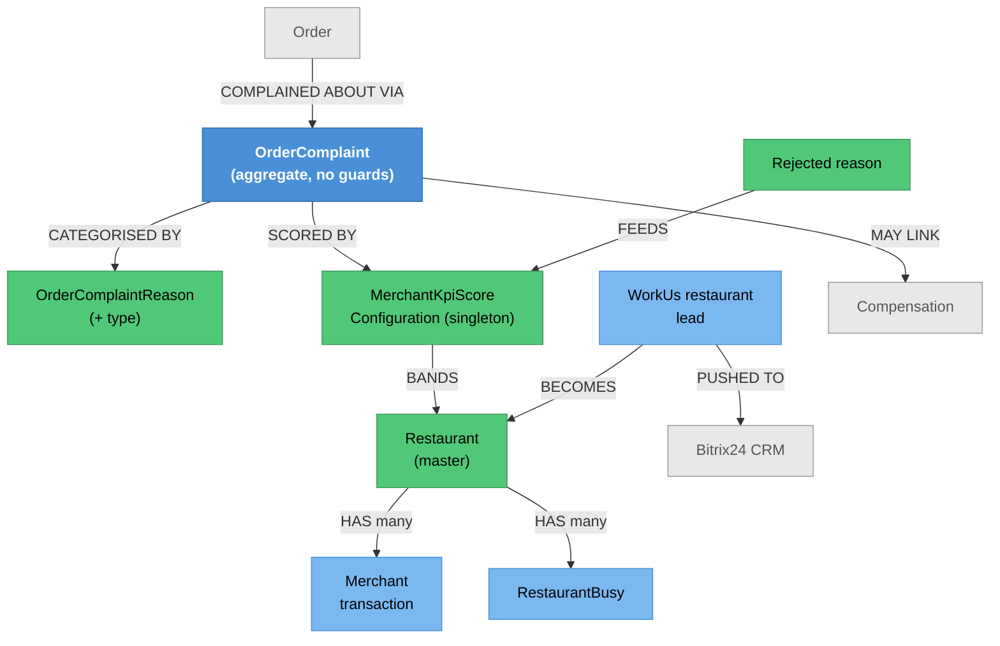

# Merchant Administration — Knowledge Graph

> **Context:** Admin
> **Source Project:** `AdminUi` (7 controllers, incl. a 1,424-line `RestaurantController` with 47
> routes), `Shared/TalabatkLogic/OrderComplaintAggregate`
> **Entities:** `OrderComplaint` + `OrderComplaintReason` + `MerchantKpiScoreConfiguration` (the
> aggregate authored here), [[Restaurant.technical|Restaurant]], `WorkUsRestaurant` leads
> **Register findings open here:** #570, #620, #621

8Orders' side of the merchant relationship: onboarding applicants, editing the restaurant record,
suspending a store, handling customer complaints about it, and scoring its performance. This is also
**the only place a restaurant's full profile can be edited** — the Restaurant Portal cannot do it, which
was confirmed by exhaustive grep of that host's controllers and is worth knowing before anyone plans a
merchant self-service feature.

## The OrderComplaint aggregate — and why it is the weakest of the four

`OrderComplaintAggregate` is counted among the four real DDD aggregates in this codebase, but it does
not behave like the other three:

| | `OrderComplaint` | `TieredDiscount` / `DeliveryAnnouncement` / `DeliveryManNotification` |
|---|---|---|
| Factory returns | plain `OrderComplaint` | `Result<T>` |
| Guards | **none** | 4–11 each |
| What `Create` does | normalises only | validates, then constructs |

`OrderComplaint.Create` (`Shared/TalabatkLogic/OrderComplaintAggregate/OrderComplaint.cs:29-58`)
null-coalesces `ComplaintOn` and `CreatedBy` to empty strings, trims the outgoing-delivery code, and
turns a non-positive `OutGoingDeliveryOrderId` into `null`. It never checks that the order exists, that
the reason id is real, that `IsCompensation` agrees with `CompensationId`, or that `IsOutGoingDelivery`
agrees with the outgoing fields. So **whatever validation exists lives in the calling handler**, and two
callers can disagree — `_conflicts.md` **#620**.

One behaviour method exists and is well-named:
`DetachCompensationLink` (`Shared/TalabatkLogic/OrderComplaintAggregate/OrderComplaint.cs:61-64`) clears
the compensation foreign key when the linked compensation row is removed, e.g. a delete while the
complaint is still in review. That is the correct shape — it is the constructor path that is thin.

## Merchant KPI scoring — a global singleton with Arabic error text

`MerchantKpiScoreConfiguration` turns complaint and delivery behaviour into a merchant score band:

| Field | Meaning |
|---|---|
| `RejectionRateWeight` | How heavily order rejections count |
| `ExtraDeliveriesWeight` | How heavily extra deliveries count |
| `GoodMax`, `MonitorMax`, `HighRiskMax`, `CriticalMin` | The band boundaries: Good → Monitor → High Risk → Critical |

Two structural facts:

1. **It is a singleton by convention** — `public const int SingletonId = 1` with a `CreateDefault()`
   factory (`Shared/TalabatkLogic/OrderComplaintAggregate/MerchantKpiScoreConfiguration.cs:7`, `:19`).
   So the thresholds are **platform-wide**, not per-merchant, despite living in an aggregate whose
   purpose is scoring individual merchants.
2. **Its validation messages are Arabic string literals in the domain layer**
   (`Shared/TalabatkLogic/OrderComplaintAggregate/MerchantKpiScoreConfiguration.cs:41`, `:44`, `:47`) —
   unlike the rest of the domain (English) and unlike chat (localisation keys). `_conflicts.md`
   **#621**.

`Update` does guard: each weight must be zero or greater and each band boundary above zero
(`Shared/TalabatkLogic/OrderComplaintAggregate/MerchantKpiScoreConfiguration.cs:33-47`). So the
configuration is better validated than the complaint it scores.

## Endpoint index

| Controller | Purpose | Notes |
|---|---|---|
| `RestaurantController` | The full restaurant profile — 47 routes, 1,424 lines | `AdminUi/Controllers/RestaurantController/RestaurantController.cs`; the only place `Restaurant.UpdateRestaurant` is reachable |
| `MerchantController` | Merchant transactions and account view | `[Authorize]` at class level (`AdminUi/Controllers/MerchantController/MerchantController.cs:17`); `GetTransactions` (`:28`) and `AddTransaction` (`:40`) — the latter **writes money** |
| `ComplaintsController` | Customer complaints about a store | `AdminUi/Controllers/Complaints/ComplaintsController.cs` |
| `RestaurantBusyController` | Force a store busy/available from Admin | Mirrors the merchant's own busy control |
| `RejectedReasonController` | The reason catalogue for rejected orders | Feeds the rejection-rate part of the KPI score |
| `WorkUsRestaurantController` | Restaurant sign-up applications | Pushed to Bitrix24 — `_integrations.md` row 18 |
| `RestaurantReport/ReportListController` | Merchant report list | 🔴 `_conflicts.md` **#570** — `//[Authorize]` **commented out**, so the controller is anonymous |

## Entity Relationship Diagram



## Status / State

| What | State | Notes |
|---|---|---|
| Complaint | field-driven: `ActionBy` / `ActionDate` are null until acted on (`Shared/TalabatkLogic/OrderComplaintAggregate/OrderComplaint.cs:21-22`) | There is no status enum — "handled" is inferred from `ActionDate` being set |
| Compensation link | `CompensationId` nullable, cleared by `DetachCompensationLink` | The one modelled transition in the aggregate |
| Merchant KPI band | derived from the singleton thresholds | Good → Monitor → High Risk → Critical |
| Restaurant busy | see [[Restaurant Portal/Merchant Account & Access/_knowledge-graph\|Merchant Account & Access]] | Admin can set it too |
| Lead | mirrored from Bitrix into `BitirixLeadStatus` | `_integrations.md` row 18 |

## Entity Index

| Entity | Layer | Type | Responsibility |
|---|---|---|---|
| `OrderComplaint` | Domain — **aggregate root** (without guards) | Transactional | A customer complaint about an order/store |
| `OrderComplaintReason` (+ `…ReasonType`) | Domain — aggregate child | Master | The complaint taxonomy |
| `MerchantKpiScoreConfiguration` | Domain — aggregate child, **singleton** | Config | Weights and band boundaries for merchant scoring |
| `Restaurant` | Domain — legacy POCO | **Master, Hub** | The store; canonical note [[Restaurant.technical\|Restaurant]] |
| Merchant transactions | Domain — legacy POCO | Financial | Settlement movements; see [[Merchant-Accounting-and-Order-Cost\|Merchant Accounting & Order Cost]] |

## Feature Flow (Business Narrative)

```
1. APPLY
   └── WorkUsRestaurant lead -> pushed to Bitrix24 -> status polled back
2. ONBOARD
   └── restaurant record created; full profile editable ONLY here (47 routes)
3. OPERATE
   ├── Admin can force a store busy or available
   └── rejected-order reasons maintained
4. COMPLAIN
   ├── a customer complaint is recorded against the order/store  (no aggregate validation — #620)
   └── it may link to a compensation, and that link can be detached if the compensation is removed
5. SCORE
   └── rejection rate and extra deliveries, weighted by a PLATFORM-WIDE singleton, place the
       merchant in a band: Good / Monitor / High Risk / Critical
6. SETTLE
   └── merchant transactions; AddTransaction writes money from the Admin UI
```

## Key Cross-Cutting Relationships

| From | To | Relationship | Notes |
|---|---|---|---|
| This feature | [[Restaurant Portal/Merchant Account & Access/_knowledge-graph\|Merchant Account & Access]] | Admin owns profile editing, the portal owns day-to-day | `Restaurant.UpdateRestaurant` is unreachable from the portal |
| This feature | [[Restaurant Portal/Merchant Finance & Reporting/_knowledge-graph\|Merchant Finance & Reporting]] | the merchant sees what is settled here | |
| This feature | Bitrix24 | leads out, status back | `_integrations.md` row 18 |
| Rejection reasons | RoboCall | repeated rejections trigger an automated call | `_integrations.md` row 17 |
| KPI score | merchant behaviour | the score band is the commercial lever | Global thresholds (#621) |
| This feature | [[Admin/ERP & Integrations/_knowledge-graph\|ERP & Integrations]] | merchant movements batched to the GL | `_integrations.md` row 20 |

## Change Surface

| Signal | Value | Notes |
|---|---|---|
| Direct dependents (Ring 1) | 7 controllers (one with 47 routes), the merchant portal, Bitrix24, the GL batch | |
| Sides touched | 4/5 | Domain · Application · Data · API host |
| Cross-context integrations | 3 | Bitrix24, RoboCall, ERP |
| Register findings open | 3 (#570, #620, #621) | plus the Admin-wide #617/#618 |
| Hub? | writes to the `Restaurant` hub | |
| Risk flags | a 1,424-line controller with 47 routes; an aggregate with no invariants; global KPI thresholds; an anonymous report-list controller |

## Open Questions

- [ ] Which handler validates a complaint, given the aggregate does not (#620)? If more than one creates
      complaints, do they agree?
- [ ] Should KPI thresholds be per-merchant rather than global? The singleton makes "score this merchant
      differently" impossible today.
- [ ] Does `MerchantController.AddTransaction` carry a `[Permission]`? It writes money, and roughly
      two-thirds of Admin controllers carry none.
- [ ] `RestaurantController` is 1,424 lines with 47 routes — which of them are still used by the Admin
      SPA?
- [ ] Is #570's commented-out `[Authorize]` on the report list deliberate (an internal-only screen) or an
      oversight?
- [ ] How is a complaint marked handled, given there is no status field — is setting `ActionDate` the
      only signal?
