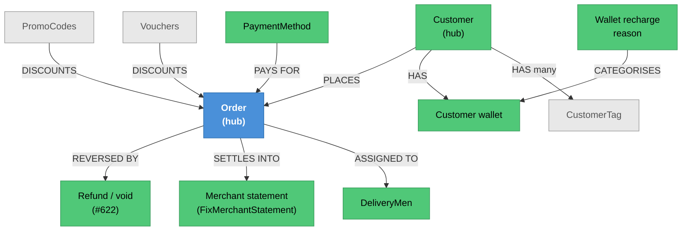

# Order & Customer Administration — Knowledge Graph

> **Context:** Admin
> **Source Project:** `AdminUi` (6 controllers)
> **Entities:** [[Order.technical|Order]] (hub), [[Customer.technical|Customer]] (hub),
> [[PromoCodes.technical|PromoCodes]], [[Vouchers.technical|Vouchers]],
> [[PaymentMethod|PaymentMethod]], wallet recharge reasons
> **Register findings open here:** #622 (new)

The operations desk for live orders and customer accounts: intervening in an order that has gone wrong,
refunding a payment, looking a customer up, and running the promotional instruments — promo codes,
vouchers, payment methods and wallet recharge reasons.

This feature touches **both** of the system's biggest hub entities, `Order` and `Customer`, which is why
its authorisation gaps matter more than the endpoint count suggests.

## Authorisation: a mostly-gated controller with its riskiest actions ungated

`OrderController` carries **25** `[Permission]` attributes, so it is not a controller that ignores the
permission system — which is exactly what makes the exceptions significant:

| Ungated action | What it does | Source |
|---|---|---|
| `Refund` | Dispatches `RefundOnlinePaymentCommand` — **reverses a customer's online payment**; stamps only `info.UserName` for audit | `AdminUi/Controllers/Order/OrderController.cs:169` |
| `FixMerchantStatement` | Rewrites merchant settlement rows | `AdminUi/Controllers/Order/OrderController.cs:365` |
| `SwapDeliveryMan` | Reassigns a live order to another driver | `AdminUi/Controllers/Order/OrderController.cs:295` |
| `UnConfirmOrder` | Moves a confirmed order back | `AdminUi/Controllers/Order/OrderController.cs:435` |
| `GetCustomerOrderHistory` | Customer order history by caller-supplied id | `AdminUi/Controllers/Order/OrderController.cs:536` |
| `CustomerTags` | Customer tags by caller-supplied id | `AdminUi/Controllers/Order/OrderController.cs:560` |
| `AddNewDeliveryComment`, `CalculateOutGoingDeliveryTotals`, `MultiDeliveryFeature`, `GetOrderStatusLookUp`, `SendTawkToNotificationToCustomer`, `SendTawkToNotificationToRestaurant` | operational actions and lookups | `AdminUi/Controllers/Order/OrderController.cs:510`, `:458`, `:143`, `:254`, `:585`, `:604` |

`Refund` sits **between** two gated siblings — `GetOrderByStatus`
(`AdminUi/Controllers/Order/OrderController.cs:121`) and `GetOrderDeliveryRequests`
(`AdminUi/Controllers/Order/OrderController.cs:193`) — so the attribute was applied around it and not to
it. `_conflicts.md` **#622**.

`CustomerController` carries only **8** `[Permission]` attributes across a much larger surface,
including an Excel export path (`GetFromExcel`, `AdminUi/Controllers/CustomerController/CustomerController.cs:102`)
and `GetCustomerForAdmin` (`:169`).

## The refund path — the one action worth reading in full before changing

```
POST api/Order/Refund   (RefundOnlinePaymentCommand)
   ├── UserName stamped from the session — the only audit trail            (:170)
   ├── handler executes either a VOID or a REFUND depending on the gateway state
   └── response.Value == true  means it was executed as a VOID, not a refund   (:177-179)
```

That last detail is documented in the controller's own comment and matters to anyone building on it: a
`true` response is not "refund succeeded", it is "the reversal was a void". The distinction is real money
handling — a void cancels an authorisation, a refund returns captured funds — and the two have different
settlement consequences downstream in [[Money-Path.technical|The Money Path]].

## Endpoint index

| Controller | Purpose | Notes |
|---|---|---|
| `OrderController` | Order oversight and intervention | 25 gated actions, 12 ungated (#622); class-level `[Authorize]` at `AdminUi/Controllers/Order/OrderController.cs:82` |
| `CustomerController` | Customer records, Excel export, inactive counts | Only 8 `[Permission]` attributes |
| `PromoCodeController` | Promo code administration | Rules on [[PromoCodes.technical\|PromoCodes]] |
| `VoucherController` | Voucher administration | Rules on [[Vouchers.technical\|Vouchers]] |
| `PaymentMethodController` | Which payment methods are offered | [[PaymentMethod\|PaymentMethod]] |
| `WalletTransactionRechargeReasonController` | The reason catalogue for wallet top-ups | Feeds customer wallet adjustments |

## Entity Relationship Diagram



## Status / State

This feature does not own a state machine — it **intervenes** in ones owned elsewhere:

| What it changes | Whose state machine | Where documented |
|---|---|---|
| Order status, un-confirm, driver swap | `Order` / `OrderRestaurantDetails` | [[Order-Lifecycle.technical\|Order Lifecycle]] and [[Restaurant Portal/Menu & Order Management/_knowledge-graph\|Menu & Order Management]] |
| Payment reversal (void vs refund) | payment gateway + `Order` payment state | [[Money-Path.technical\|The Money Path]], [[PayMob.technical\|PayMob]] |
| Merchant settlement rows | merchant statement | [[Merchant-Accounting-and-Order-Cost\|Merchant Accounting & Order Cost]] |
| Wallet balance | customer wallet | [[WalletTransaction\|WalletTransaction]] |

That is the feature's defining characteristic: **every write here is an override of a decision another
part of the system already made**, which is why the missing permission gates on those specific actions
are the finding.

## Entity Index

| Entity | Layer | Type | Responsibility |
|---|---|---|---|
| `Order` | Domain — legacy POCO | **Hub** | The order being intervened in |
| `Customer` | Domain — legacy entity | **Hub** | The customer being looked up or adjusted |
| `PromoCodes`, `Vouchers` | Domain — legacy POCO | Transactional | Promotional instruments; canonical notes exist |
| `PaymentMethod` | Domain — legacy POCO | Master | Which methods are offered |
| Wallet recharge reason | Domain — lookup | Master | Categorises a wallet adjustment |
| `CustomerTag` | Domain — legacy POCO | Child | Segmentation labels; folded into [[Customer.technical\|Customer]] |

## Feature Flow (Business Narrative)

```
1. SOMETHING GOES WRONG WITH AN ORDER
   ├── un-confirm it, swap the driver, add a delivery comment
   └── or refund the customer  (void vs refund depending on gateway state)
2. THE MERCHANT'S SETTLEMENT IS WRONG
   └── FixMerchantStatement rewrites the rows
3. A CUSTOMER CALLS
   └── look them up, read their order history and tags, adjust their wallet
4. PROMOTIONS
   └── promo codes, vouchers, payment methods and recharge reasons maintained
5. DOWNSTREAM
   └── every one of the above lands in the GL batch and the merchant/driver ledgers
```

## Key Cross-Cutting Relationships

| From | To | Relationship | Notes |
|---|---|---|---|
| This feature | [[Money-Path.technical\|The Money Path]] | refunds and statement fixes re-enter the money flow | The void/refund distinction matters downstream |
| This feature | [[Customer Ordering/Order & Fulfilment/_knowledge-graph\|Order & Fulfilment]] | overrides order state | |
| This feature | [[Delivery/Delivery Man Operations/_knowledge-graph\|Delivery Man Operations]] | driver swap | |
| This feature | [[Customer Ordering/Discounts & Coupons/_knowledge-graph\|Discounts & Coupons]] | administers the instruments customers redeem | |
| This feature | [[Admin/ERP & Integrations/_knowledge-graph\|ERP & Integrations]] | refunds have their own journal builder | `GlApiService.RefundedOnlinePayments.cs` |

## Change Surface

| Signal | Value | Notes |
|---|---|---|
| Direct dependents (Ring 1) | 6 controllers, both hub entities, the GL batch | |
| Sides touched | 4/5 | Domain · Application · Data · API host |
| Cross-context integrations | 2 | Payment gateway reversal; GL batch |
| Register findings open | 1 new (#622) + the Admin-wide #617/#618 | |
| Hub? | **yes** — writes to both `Order` and `Customer` | |
| Risk flags | every write is an override; a payment reversal with no permission gate; `true` means "void", not "refunded" |

## Open Questions

- [ ] Was `Refund` (#622) meant to carry a `[Permission]`? Its two immediate siblings do.
- [ ] Who may run `FixMerchantStatement`, and is there an audit trail beyond the stamped user name?
- [ ] Does the refund path reconcile with the GL refund journal automatically, or is that manual?
- [ ] `CustomerController` has an Excel export — what customer fields does it include, and is it
      permission-gated?
- [ ] Do promo-code and voucher changes take effect on carts already built?
- [ ] Is there any limit on refund value, or on how many refunds one operator can issue?
