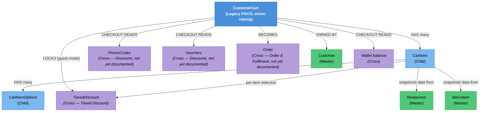

# Cart & Checkout — Knowledge Graph

> **Context:** Customer Ordering
> **Source Project:** `Shared/TalabatkLogic/TalabatkModels` (CustomerCart, CartItem), `Shared/TalabatkApplication/Commands/*CartItem*`, `Shared/TalabatkApplication/Commands/MergeGuestCartIntoCustomerCommand`, `Shared/TalabatkApplication/Commands/CreateOrderFromCartCommand`
> **Last Updated:** 2026-08-02
> **Entities Covered:** 3 domain entities (CustomerCart, CartItem, CartItemOptions) + 1 domain event + checkout gauntlet (13 guards)

---

## Entity Relationship Diagram


## Status / State Notes
No explicit status on `CustomerCart` — it exists with 0+ items, or is cleared. See
[[CustomerCart.technical#Status / State|the entity's Status/State section]].

## Entity Index
| Entity | Layer | Type | Responsibility |
|--------|-------|------|-----------------|
| `CustomerCart` | Domain — Legacy POCO (event-raising) | Root | Owns cart items, running totals, guest-mode discount lock. |
| `CartItem` | Domain — Child | Child | One line: menu item + price + options + computed tax/profit/discount. |
| `CartItemOptions` | Domain — Child | Child | One selected option on a cart item. |

## Feature Flow (Business Narrative)
```
1. ADD/EDIT/REMOVE ITEM
   └── AddNewCartItemCommand(_V1) / EditCartItemCommand / ChangeCartItemQuantityCommand /
       DeleteCartItemCommand — all mutate CustomerCart, which recalculates totals every time
2. PRICES DRIFT
   └── UpdateCartItemPriceCommand re-pulls current menu prices; CustomerCart flags changed lines
       and raises NotifyCustomerForPriceChangingWhenAddingToCartEvent
3. GUEST LOGS IN MID-CART (cross-feature: Guest Mode / Identity & Access)
   └── MergeGuestCartIntoCustomerCommand: guest cart + locked discount + default address REPLACE
       the real account's own cart/discount/default address (not merged)
4. CHECKOUT
   └── CartController.CheckOut_V1 → CreateOrderFromCartCommand runs the 13-guard validation
       gauntlet (see CustomerCart.technical.md Rule 9), then Order.CreateOrderFromCustomerCart
       builds the Order (Order & Fulfilment feature, not yet documented)
```

## Key Cross-Cutting Relationships
| From | To | Relationship | Notes |
|------|----|--------------|-------|
| `CustomerCart` | `TieredDiscount` | `LockedTieredDiscountId` | Guest Mode retention. |
| `CartItem` | `TieredDiscount` | `TieredDiscountId` | Per-line selection, distinct from the cart-level lock (Open Question on precedence). |
| `CustomerCart` | `Order` | Consumed at checkout | Terminal transition; Order's own lifecycle is a separate feature. |
| `CustomerCart` | `PromoCodes` / `Vouchers` | Read at checkout, mutually exclusive | See Rule 9.9 in `CustomerCart.technical.md`. |

## Relationship Legend
| Arrow | Meaning |
|-------|---------|
| `-->|HAS many|` | Owns child collection |
| `-->|LOCKS|` | Cart retains a specific discount across guest→real transition |
| `-->|BECOMES|` | Cart is consumed to create the target entity |
| `-->|CHECKOUT READS|` | Read (not owned) at checkout time only |

<!-- BEGIN generated: endpoint index (insert-endpoints.js) -->

## Endpoint index — generated from the controllers

> Generated by `_system/insert-endpoints.js` from `_feature-map.tsv`; do not edit between the
> sentinels. Every row is anchored to a line, so `verify-citations.js` checks all of it and a
> controller that moves is caught on the next run. "Action gate" lists only attributes on the action
> itself — the class gate above each table still applies unless an action opts out of it.

**1 controller(s), 17 action(s)**; 17 have no action-level gate and rely entirely on the class attribute.

#### `TalabatkAPIs/Controllers/Cart/CartController.cs`

Class gate: JWT bearer — `TalabatkAPIs/Controllers/Cart/CartController.cs:31`

| Route | Verb | Action gate | Anchor |
|---|---|---|---|
| `CustomerCartDetails` | GET | — | `TalabatkAPIs/Controllers/Cart/CartController.cs:53` |
| `GetUpSellingItemsIntoCart` | GET | — | `TalabatkAPIs/Controllers/Cart/CartController.cs:81` |
| `CheckIfRestaurantsSupportOnlinePayment` | GET | — | `TalabatkAPIs/Controllers/Cart/CartController.cs:109` |
| `CartSummary` | GET | — | `TalabatkAPIs/Controllers/Cart/CartController.cs:135` |
| `UpdateCartItemPrices` | POST | — | `TalabatkAPIs/Controllers/Cart/CartController.cs:157` |
| `CalculateCartPromoCodeDiscount` | GET | — | `TalabatkAPIs/Controllers/Cart/CartController.cs:183` |
| `TotalValidateCart` | GET | — | `TalabatkAPIs/Controllers/Cart/CartController.cs:218` |
| `ValidateMartQuantity` | GET | — | `TalabatkAPIs/Controllers/Cart/CartController.cs:243` |
| `CheckOut_V1` | POST | — | `TalabatkAPIs/Controllers/Cart/CartController.cs:267` |
| `AddNewCartItem_V1` | POST | — | `TalabatkAPIs/Controllers/Cart/CartController.cs:314` |
| `EditCartItem` | POST | — | `TalabatkAPIs/Controllers/Cart/CartController.cs:337` |
| `ValidateItemOptions` | POST | — | `TalabatkAPIs/Controllers/Cart/CartController.cs:362` |
| `ChangeCartItemQuantity` | POST | — | `TalabatkAPIs/Controllers/Cart/CartController.cs:387` |
| `DeleteCartITem` | POST | — | `TalabatkAPIs/Controllers/Cart/CartController.cs:416` |
| `ClearCustomerCart` | POST | — | `TalabatkAPIs/Controllers/Cart/CartController.cs:441` |
| `ValidateVoucher` | GET | — | `TalabatkAPIs/Controllers/Cart/CartController.cs:464` |
| `GetMultiStoreCart` | GET | — | `TalabatkAPIs/Controllers/Cart/CartController.cs:486` |

<!-- END generated: endpoint index -->
