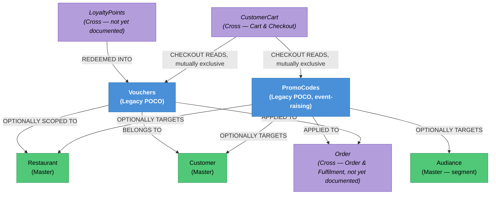

# Discounts & Coupons — Knowledge Graph

> **Context:** Customer Ordering
> **Source Project:** `Shared/TalabatkLogic/TalabatkModels` (PromoCodes, Vouchers), `Shared/TalabatkApplication/Queries/*PromoCode*`, `*Voucher*`
> **Last Updated:** 2026-08-02
> **Entities Covered:** 2 domain entities (PromoCodes, Vouchers) + 1 domain event + resolves the "Coupon" terminology ambiguity `CONTEXT.md` flags as open

---

## Entity Relationship Diagram


## Status / State Notes
| Entity | States | Notes |
|--------|--------|-------|
| PromoCodes | `Available` / `Used` / `Expired` (`VoucherStateEnum`, shared type name with Vouchers) | Also gated by `Active` bool, budget, and usage caps |
| Vouchers | `Available` / `Used` / `Expired` (same enum) | Simpler — single customer, single use, no budget/usage-cap logic of its own |

## Entity Index
| Entity | Layer | Type | Responsibility |
|--------|-------|------|-----------------|
| `PromoCodes` | Domain — Legacy POCO (event-raising) | Root | Manually-entered discount code with targeting, budget, and usage caps. |
| `Vouchers` | Domain — Legacy POCO | Root | Single-use store credit issued from loyalty-point redemption. |

## Feature Flow (Business Narrative)
```
1. PROMO CODE CAMPAIGN SET UP (likely Admin — not verified)
   └── PromoCodes.Instance_V1 validates and creates the campaign
2. CUSTOMER REDEEMS LOYALTY POINTS
   └── Vouchers.Instance computes a discount amount from a points-to-money rate
3. CHECKOUT (cross-feature: Cart & Checkout)
   └── Customer supplies EITHER a Promo Code string OR a Voucher id, never both
       (CreateOrderFromCartCommand.cs:268-289) — validated, then applied to the Order
4. POST-ORDER RE-CHECK
   └── Both mechanisms re-validate their minimum-amount rule against the ACTUAL resulting
       order/merchant subtotal, after Order creation (CreateOrderFromCartCommand.cs:507-545)
```

## Key Cross-Cutting Relationships
| From | To | Relationship | Notes |
|------|----|--------------|-------|
| `Vouchers` | `LoyaltyPoints` | Redemption source | Full `LoyaltyPoints` entity deferred to Batch 5. |
| `PromoCodes` / `Vouchers` | `CustomerCart` | Read at checkout, mutually exclusive | See Cart & Checkout's `_knowledge-graph.md`. |
| `PromoCodes` | `VoucherCreatedEvent` | Misleadingly-named domain event | Raised on **PromoCode** creation — see `PromoCodes.technical.md` Conflicts. |

## Relationship Legend
| Arrow | Meaning |
|-------|---------|
| `-->|REDEEMED INTO|` | Loyalty points are converted into a voucher |
| `-->|OPTIONALLY SCOPED TO / TARGETS|` | Optional allow-list/restriction, empty = unrestricted |
| `-->|CHECKOUT READS|` | Read (not owned) at checkout, mutually exclusive with the sibling mechanism |

<!-- BEGIN generated: endpoint index (insert-endpoints.js) -->

## Endpoint index — generated from the controllers

> Generated by `_system/insert-endpoints.js` from `_feature-map.tsv`; do not edit between the
> sentinels. Every row is anchored to a line, so `verify-citations.js` checks all of it and a
> controller that moves is caught on the next run. "Action gate" lists only attributes on the action
> itself — the class gate above each table still applies unless an action opts out of it.

**3 controller(s), 5 action(s)**; 4 have no action-level gate and rely entirely on the class attribute.

#### `TalabatkAPIs/Controllers/IRecycleRedeems/IRecycleRedeemsController.cs`

Class gate: JWT bearer — `TalabatkAPIs/Controllers/IRecycleRedeems/IRecycleRedeemsController.cs:15`

| Route | Verb | Action gate | Anchor |
|---|---|---|---|
| `AddCustomerWallet` | POST | — | `TalabatkAPIs/Controllers/IRecycleRedeems/IRecycleRedeemsController.cs:34` |

#### `TalabatkAPIs/Controllers/PromoCode/PromoCodeController.cs`

Class gate: JWT bearer — `TalabatkAPIs/Controllers/PromoCode/PromoCodeController.cs:16`

| Route | Verb | Action gate | Anchor |
|---|---|---|---|
| `CalculatePromoCodeDiscountV2` | POST | — | `TalabatkAPIs/Controllers/PromoCode/PromoCodeController.cs:36` |

#### `TalabatkAPIs/Controllers/Vouchers/VouchersController.cs`

Class gate: JWT bearer — `TalabatkAPIs/Controllers/Vouchers/VouchersController.cs:18`

| Route | Verb | Action gate | Anchor |
|---|---|---|---|
| `getMerchantVouchers` | GET | feature flag | `TalabatkAPIs/Controllers/Vouchers/VouchersController.cs:39` |
| `getCartVouchers` | GET | — | `TalabatkAPIs/Controllers/Vouchers/VouchersController.cs:56` |
| `CheckCustomerVouchers` | GET | — | `TalabatkAPIs/Controllers/Vouchers/VouchersController.cs:73` |

<!-- END generated: endpoint index -->
