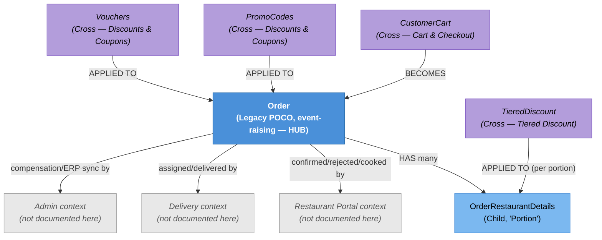

# Order & Fulfilment — Knowledge Graph (Customer Ordering slice only)

> **Context:** Customer Ordering
> **Source Project:** `Shared/TalabatkLogic/TalabatkModels/Order.cs` (customer-facing slice only — see scope note in `Order/Order.technical.md`)
> **Last Updated:** 2026-08-02
> **Entities Covered:** 2 domain entities (Order — partial, OrderRestaurantDetails — partial) + 3 domain events (creation-time only)

---

## Entity Relationship Diagram


## Status / State Notes
See `OrderStatus` enum in `Order/Order.technical.md` Rule 4. This pass documents only the initial
gating (Rule 2) and the customer-visible subset of statuses; the full restaurant/delivery
transition graph is out of scope.

## Entity Index
| Entity | Layer | Type | Responsibility |
|--------|-------|------|-----------------|
| `Order` | Domain — Legacy POCO (event-raising) | **Hub** (partial coverage) | Created from a cart; payment split, initial status gating, cancellation (customer slice only). |
| `OrderRestaurantDetails` | Domain — Child | Child ("Portion") | One restaurant's slice of the order; carries the Daily Pickup Tag. |

## Feature Flow (Business Narrative)
```
1. CHECKOUT SUCCEEDS (cross-feature: Cart & Checkout)
   └── Order.CreateOrderFromCustomerCart builds the Order, applies discounts, splits payment
2. INITIAL GATING
   └── Risk signals (first order / online / Apple Pay / duplicate / multi-restaurant / large cash
       order) decide: Pending (needs review) vs. RestaurantPending (goes straight through)
3. CUSTOMER CAN STILL CANCEL
   └── Blocked once the restaurant has confirmed (CancelOrderCommand)
4. RESTAURANT / DELIVERY / ADMIN TAKE OVER (not documented in this pass)
   └── Confirmation, cooking, delivery-man assignment, delivery, compensation, ERP sync — all
       further mutations on this SAME Order object, from other contexts
```

## Key Cross-Cutting Relationships
| From | To | Relationship | Notes |
|------|----|--------------|-------|
| `CustomerCart` | `Order` | BECOMES | Terminal transition of checkout. |
| `Order` | `OrderRestaurantDetails` | HAS many | One per restaurant in the order. |
| `Order` | Restaurant Portal / Delivery / Admin | Shared entity, cross-context | The single largest cross-context coupling point in the system — see Open Questions in `Order.technical.md`. |

## Relationship Legend
| Arrow | Meaning |
|-------|---------|
| `-->|BECOMES|` | Source entity is consumed to create the target |
| `-->|HAS many|` | Owns child collection |
| `-->|confirmed/rejected/cooked by| etc.` | Cross-context mutation on the same shared entity — not a data relationship, a process boundary |

<!-- BEGIN generated: endpoint index (insert-endpoints.js) -->

## Endpoint index — generated from the controllers

> Generated by `_system/insert-endpoints.js` from `_feature-map.tsv`; do not edit between the
> sentinels. Every row is anchored to a line, so `verify-citations.js` checks all of it and a
> controller that moves is caught on the next run. "Action gate" lists only attributes on the action
> itself — the class gate above each table still applies unless an action opts out of it.

**4 controller(s), 38 action(s)** — 5 carry `[AllowAnonymous]`; 20 have no action-level gate and rely entirely on the class attribute.

#### `TalabatkAPIs/Controllers/AutoCompensation/AutoCompensationRulesController.cs`

Class gate: JWT bearer — `TalabatkAPIs/Controllers/AutoCompensation/AutoCompensationRulesController.cs:13`

| Route | Verb | Action gate | Anchor |
|---|---|---|---|
| `api/auto-compensation/active-rules` | GET | — | `TalabatkAPIs/Controllers/AutoCompensation/AutoCompensationRulesController.cs:29` |

#### `TalabatkAPIs/Controllers/Deliveryintevral/DeliveryIntervalController.cs`

Class gate: JWT bearer — `TalabatkAPIs/Controllers/Deliveryintevral/DeliveryIntervalController.cs:19`

| Route | Verb | Action gate | Anchor |
|---|---|---|---|

#### `TalabatkAPIs/Controllers/Order/OrderController.cs`

Class gate: JWT bearer — `TalabatkAPIs/Controllers/Order/OrderController.cs:60`

| Route | Verb | Action gate | Anchor |
|---|---|---|---|
| `GetConfiguration` | GET | 🔓 **AllowAnonymous** | `TalabatkAPIs/Controllers/Order/OrderController.cs:87` |
| `GetConfiguredTips` | GET | 🔓 **AllowAnonymous** | `TalabatkAPIs/Controllers/Order/OrderController.cs:109` |
| `GetServiceFeesConfiguration` | GET | — | `TalabatkAPIs/Controllers/Order/OrderController.cs:131` |
| `GetPendingOnlinePayment` | GET | role `Customer` | `TalabatkAPIs/Controllers/Order/OrderController.cs:164` |
| `GetOrderbyCustomerIdAndType` | GET | role `Customer` | `TalabatkAPIs/Controllers/Order/OrderController.cs:189` |
| `GetAllOrderByCustomerId` | GET | role `Customer` | `TalabatkAPIs/Controllers/Order/OrderController.cs:218` |
| `GetOrderDetailsById` | GET | role `Customer` | `TalabatkAPIs/Controllers/Order/OrderController.cs:238` |
| `GetLastDeliveredOrder` | GET | role `Customer` | `TalabatkAPIs/Controllers/Order/OrderController.cs:260` |
| `GetDeliveryFeesWithOrderFees` | GET | — | `TalabatkAPIs/Controllers/Order/OrderController.cs:286` |
| `ChangeOrderToCash` | PATCH | — | `TalabatkAPIs/Controllers/Order/OrderController.cs:318` |
| `RegeneratePaymentUrl/{orderId}` | POST | — | `TalabatkAPIs/Controllers/Order/OrderController.cs:345` |
| `CreateNewSession` | POST | — | `TalabatkAPIs/Controllers/Order/OrderController.cs:374` |
| `ChangePaymentOnlineStatus` | PATCH | 🔓 **AllowAnonymous** | `TalabatkAPIs/Controllers/Order/OrderController.cs:408` |
| `CancelPayment` | PATCH | — | `TalabatkAPIs/Controllers/Order/OrderController.cs:434` |
| `PaymentOnline/complete` | GET | 🔓 **AllowAnonymous** | `TalabatkAPIs/Controllers/Order/OrderController.cs:467` |
| `MakeOrder` | POST | — | `TalabatkAPIs/Controllers/Order/OrderController.cs:479` |
| `UpdateOrder` | POST | — | `TalabatkAPIs/Controllers/Order/OrderController.cs:547` |
| `PayMobProcessCallBack` | POST | 🔓 **AllowAnonymous** | `TalabatkAPIs/Controllers/Order/OrderController.cs:637` |
| `TrackingOrder` | GET | — | `TalabatkAPIs/Controllers/Order/OrderController.cs:718` |
| `ValidateDeliveryTime` | POST | — | `TalabatkAPIs/Controllers/Order/OrderController.cs:738` |
| `ValidateCustomerAddress` | POST | — | `TalabatkAPIs/Controllers/Order/OrderController.cs:765` |
| `ValidateOrderAddressChange` | POST | — | `TalabatkAPIs/Controllers/Order/OrderController.cs:791` |
| `UnReviewedOrder` | GET | — | `TalabatkAPIs/Controllers/Order/OrderController.cs:809` |
| `UnReviewedOrderWithCurrentOrder` | GET | — | `TalabatkAPIs/Controllers/Order/OrderController.cs:836` |
| `MarkUnReviewedOrderPopupAsClicked` | POST | role `Customer` | `TalabatkAPIs/Controllers/Order/OrderController.cs:862` |
| `GetUnavailableItems` | GET | feature flag | `TalabatkAPIs/Controllers/Order/OrderController.cs:884` |
| `DeleteRestaurant` | POST | — | `TalabatkAPIs/Controllers/Order/OrderController.cs:903` |
| `Reorder` | POST | feature flag | `TalabatkAPIs/Controllers/Order/OrderController.cs:927` |
| `CallIntentionAPIForApplePay` | POST | — | `TalabatkAPIs/Controllers/Order/OrderController.cs:950` |
| `ChangeAddress` | POST | — | `TalabatkAPIs/Controllers/Order/OrderController.cs:973` |
| `CalculateItemsReplacementTotal` | POST | feature flag | `TalabatkAPIs/Controllers/Order/OrderController.cs:998` |
| `CancelOrder` | POST | — | `TalabatkAPIs/Controllers/Order/OrderController.cs:1019` |
| `GetOrderPaymentDetails` | GET | role `Customer` | `TalabatkAPIs/Controllers/Order/OrderController.cs:1040` |
| `GetAllDeliveryInstructions` | GET | — | `TalabatkAPIs/Controllers/Order/OrderController.cs:1060` |

#### `TalabatkAPIs/Controllers/UnRevisedItemController/UnRevisedItemController.cs`

Class gate: **no auth attribute on the class** — `TalabatkAPIs/Controllers/UnRevisedItemController/UnRevisedItemController.cs:17`

| Route | Verb | Action gate | Anchor |
|---|---|---|---|
| `ItemDeleted` | POST | HMAC-signed | `TalabatkAPIs/Controllers/UnRevisedItemController/UnRevisedItemController.cs:33` |
| `ItemUpdated` | POST | HMAC-signed | `TalabatkAPIs/Controllers/UnRevisedItemController/UnRevisedItemController.cs:48` |
| `ItemCreated` | POST | HMAC-signed | `TalabatkAPIs/Controllers/UnRevisedItemController/UnRevisedItemController.cs:62` |

<!-- END generated: endpoint index -->
