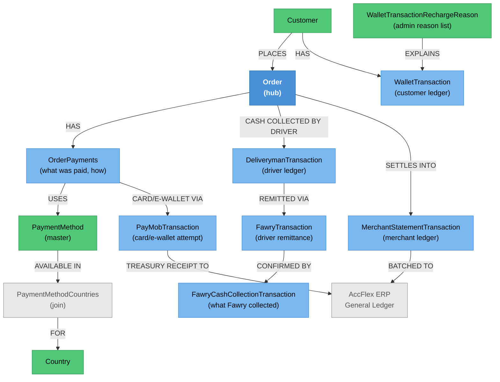

# Payments — Knowledge Graph

> **Context:** Customer Ordering
> **Source Project:** `TalabatkAPIs` (3 controllers, 3 actions + one MVC view), with the substance in
> `Shared/TalabatkApplication` (commands/handlers) and `Shared/TalabatkLogic` (transaction entities)
> **Entities Covered:** [[PaymentMethod|PaymentMethod]], [[WalletTransaction|WalletTransaction]], and
> five payment-rail entities documented inside [[Money-Path.technical|The Money Path]]

The customer-facing API surface of payments is **deliberately tiny** — three endpoints — because the
money does not move through the API host. It moves through gateway callbacks, domain-event handlers
and Hangfire jobs. Anyone tracing a payment problem should start at
[[Money-Path.technical|The Money Path]], which follows a single order's money from checkout to the
merchant's payout and the ERP ledger; this note is the map of the pieces and the entry points.

## The five payment methods, and which are real

`PaymentMethods` (`Shared/TalabatkLogic/Enum/PaymentMethods.cs`) — note the enum has **implicit
numbering** after the first member, so the values are positional and inserting a member renumbers
everything after it:

| Member | Value | Arabic display name | What it means |
|---|---|---|---|
| `Cash` | 1 | كاش | Cash on delivery; the driver collects and later remits |
| `Wallet` | 2 | محفظة | The customer's in-app wallet balance |
| `Online` | 3 | أونلاين | Card payment through PayMob |
| `Orange` | 4 | أورانج | Orange Money |
| `OnlineWallet` | 5 | محفظة الكترونية | Third-party e-wallet through PayMob |

Which of these a customer is actually offered is **per country**, resolved through
`PaymentMethodCountries` — that is why the lookup endpoint takes an address rather than returning a
global list.

> ⚠️ **Naming trap that has already caused a wrong assumption:** Fawry is **not** a customer checkout
> method here, despite having two entities and a controller elsewhere in the repo. It is the
> **driver→platform cash remittance rail**: a driver pays in the cash they collected. The correction is
> documented at length in [[Fawry.technical|Fawry]]. A CR that "adds Fawry to checkout" is adding a new
> method, not wiring an existing one.

## Endpoint index

| Endpoint | Auth | Scoped by | Notes |
|---|---|---|---|
| `GET api/PaymentMethod/GetAllPaymentMethodsByAddress` | JWT bearer | the address's country | Returns the methods available where the customer is ordering — `PaymentMethodController.cs` |
| `GET api/Wallet/GetBalance` | JWT bearer + `Roles = "Customer"` | `sessionInfo.CusomerId` (sic) | Session-scoped; a customer cannot ask for another's balance — `TalabatkAPIs/Controllers/Wallet/WalletController.cs:35-41` |
| `GET api/Wallet/GetMyWelletTransaction` | JWT bearer + `Roles = "Customer"` | `sessionInfo.CusomerId` | Session-scoped wallet history — `TalabatkAPIs/Controllers/Wallet/WalletController.cs:68-73` |
| `GET /PaymentOnline` (MVC view) | **none** | n/a | Not an API: an MVC `Controller` returning `View(model)` for the gateway redirect page — `PaymentOnlineController.cs:15-20`. The only view-serving controller in an otherwise pure-API host |

Both wallet endpoints scope by the session, and the misspelled `CusomerId` property is the real
property name — worth knowing before grepping for `CustomerId`.

## Entity Relationship Diagram



## Status / State

Payments have no single status field; each rail carries its own, which is why reconciliation is hard:

| Rail | Status lives on | Values / mechanism | Source |
|---|---|---|---|
| Card / e-wallet | `PayMobTransaction` | `Pending` + `Success` booleans (not one enum), plus `ExpirationDate`/`UnixTimeStampExpiration`; lifecycle methods `CaptureTransction`, `ChangeStatusOfTransction`, `InitiationFailure`, `MarkFailed` — i.e. **two distinct failure states**: failed to start, and failed after starting | `PayMobTransaction.cs` |
| Driver remittance | `FawryTransaction.FawryStatus` | `FawryPaymentStatus` enum, moved by `UpdateStatus`/`UpdateTransaction` | `FawryTransaction.cs` |
| Cash collection | `FawryCashCollectionTransaction` | no status; existence *is* the state, with `IsRetry` marking a re-attempt | `FawryCashCollectionTransaction.cs` |
| Customer wallet | `WalletTransaction` | append-only ledger; balance is a sum, not a stored field | [[WalletTransaction\|WalletTransaction]] |
| Merchant settlement | `MerchantStatementTransaction` | typed ledger rows (`Order`, `Eight_Order`, `CON`, `Merchant_CON`, `_8Orders_CON`, `Merchant_Payment`, `Merchant_Receivement`, `Merchant_Collection`) | [[Money-Path.technical\|The Money Path]] step list |

Two booleans instead of one status on `PayMobTransaction` means `Pending=false, Success=false` is
reachable and means "finished, unsuccessfully" — while the same pair before initiation means "not
started". Anything reading these must consider both fields together.

## Entity Index

| Entity | Layer | Type | Responsibility |
|---|---|---|---|
| `PaymentMethod` | Domain — legacy POCO | Master | The catalogue of methods; note [[PaymentMethod\|PaymentMethod]] |
| `PaymentMethodCountries` | Domain — child (join) | Child | Per-country availability; documented in [[Money-Path.technical\|The Money Path]] |
| `WalletTransaction` | Domain — child | Child (ledger) | Customer wallet movements; note [[WalletTransaction\|WalletTransaction]] |
| `WalletTransactionRechargeReason` | Domain — legacy POCO | Root (reference) | Reason list for manual wallet credits; in [[Money-Path.technical\|The Money Path]] |
| `PayMobTransaction` | Domain — child | Child | One card/e-wallet attempt; in [[Money-Path.technical\|The Money Path]], gateway mechanics in [[PayMob.technical\|PayMob]] |
| `FawryTransaction`, `FawryCashCollectionTransaction` | Domain — legacy POCO roots | Root | Driver remittance rail; in [[Money-Path.technical\|The Money Path]], mechanics in [[Fawry.technical\|Fawry]] |
| `OrderPayments` | Domain — child of `Order` | Child | What was actually paid; canonical in [[Order.technical\|Order]] |

## Feature Flow (Business Narrative)

```
1. CHOOSING HOW TO PAY
   └── GetAllPaymentMethodsByAddress -> methods allowed in that country (PaymentMethodCountries)
2. PAYING
   ├── Cash        -> nothing moves now; the driver will collect
   ├── Wallet      -> balance is a SUM of WalletTransaction rows, not a stored figure
   └── Online/Orange/OnlineWallet -> PayMobTransaction created, customer redirected
                                     (PaymentOnline MVC view), gateway calls back
3. GATEWAY CALLBACK
   └── PayMobCallBackCommand verifies the HMAC; on mismatch it re-queries the gateway
       rather than trusting the payload  (see PayMob.technical)
4. ORDER COMPLETES
   └── domain-event handlers write the driver and merchant ledger rows
       (see The Money Path, "Data written", steps 1-8)
5. DRIVER REMITS CASH
   └── FawryTransaction -> FawryCashCollectionTransaction confirms what was actually collected
6. PERIODIC
   └── merchant statement lines batch to the AccFlex general ledger; online payments post a
       treasury receipt
```

## Key Cross-Cutting Relationships

| From | To | Relationship | Notes |
|---|---|---|---|
| Payments | [[Order.technical\|Order]] | `OrderPayments` belongs to the order | The order is the unit money is attached to |
| Payments | PayMob (external) | inbound HMAC-signed webhook + outbound inquiry | `_integrations.md`; mechanics in [[PayMob.technical\|PayMob]] |
| Payments | Fawry (external) | driver cash remittance | [[Fawry.technical\|Fawry]] |
| Payments | AccFlex ERP | GL journals + treasury receipts | `_integrations.md` row 20 |
| Payments | [[Delivery/Driver Cash & Compensation/Driver-Cash-Cycle.technical\|Driver Cash Cycle]] | cash the driver owes | `DeliverymanTransaction` is the driver-side ledger |
| Payments | [[Restaurant Portal/Merchant Finance & Reporting/_knowledge-graph\|Merchant Finance & Reporting]] | what the merchant sees | Same statement rows, merchant view |
| Payments | [[Customer Ordering/Discounts & Coupons/_knowledge-graph\|Discounts & Coupons]] | discounts change the amount due | Applied before payment |

## Change Surface

| Signal | Value | Notes |
|---|---|---|
| Direct dependents (Ring 1) | 3 API endpoints, 1 MVC view, PayMob callback command, ~8 domain-event handlers, the GL batch | |
| Sides touched | 4/5 | Domain · Application · Data · API host (no Angular — the customer app is native) |
| Cross-context integrations | 3 | PayMob, Fawry, AccFlex ERP |
| Domain events involved | ≥3 | order delivered, merchant collect money, payment callback |
| Hub? | no — but it hangs off `Order`, which is | |

<!-- BEGIN generated: endpoint index (insert-endpoints.js) -->

## Endpoint index — generated from the controllers

> Generated by `_system/insert-endpoints.js` from `_feature-map.tsv`; do not edit between the
> sentinels. Every row is anchored to a line, so `verify-citations.js` checks all of it and a
> controller that moves is caught on the next run. "Action gate" lists only attributes on the action
> itself — the class gate above each table still applies unless an action opts out of it.

**3 controller(s), 4 action(s)**; 2 have no action-level gate and rely entirely on the class attribute.

#### `TalabatkAPIs/Controllers/MVC/PaymentOnlineController.cs`

Class gate: **no auth attribute on the class** — `TalabatkAPIs/Controllers/MVC/PaymentOnlineController.cs:7`

| Route | Verb | Action gate | Anchor |
|---|---|---|---|
| `Index` | — | — | `TalabatkAPIs/Controllers/MVC/PaymentOnlineController.cs:15` |

#### `TalabatkAPIs/Controllers/PaymentMethod/PaymentMethodController.cs`

Class gate: JWT bearer — `TalabatkAPIs/Controllers/PaymentMethod/PaymentMethodController.cs:19`

| Route | Verb | Action gate | Anchor |
|---|---|---|---|
| `api/PaymentMethod/GetAllPaymentMethodsByAddress` | GET | — | `TalabatkAPIs/Controllers/PaymentMethod/PaymentMethodController.cs:39` |

#### `TalabatkAPIs/Controllers/Wallet/WalletController.cs`

Class gate: JWT bearer — `TalabatkAPIs/Controllers/Wallet/WalletController.cs:15`

| Route | Verb | Action gate | Anchor |
|---|---|---|---|
| `api/Wallet/GetBalance` | GET | role `Customer` | `TalabatkAPIs/Controllers/Wallet/WalletController.cs:35` |
| `api/Wallet/GetMyWelletTransaction` | GET | role `Customer` | `TalabatkAPIs/Controllers/Wallet/WalletController.cs:68` |

<!-- END generated: endpoint index -->

## Open Questions

- [ ] `Orange` (4) and `OnlineWallet` (5): are both live, and do both route through PayMob? The enum
      offers them; no handler was traced in this pass that distinguishes them.
- [ ] `PaymentMethods` uses implicit numbering after `Cash = 1`. Is the enum's numeric value persisted
      anywhere (an `OrderPayments` column, an ERP mapping)? If so, inserting a member silently
      renumbers history.
- [ ] Is the `PaymentOnline` MVC view reachable only via a gateway redirect, or directly? It has no
      `[Authorize]`, which is normal for a redirect landing page but worth confirming.
- [ ] `FawryCashCollectionTransaction.Amount` is a `string` while `FawryTransaction.Amount` is a
      `decimal`. Where is that converted, and what happens to a malformed value?
- [ ] Wallet balance is computed as a sum. Is there any cached/stored balance that could disagree?
