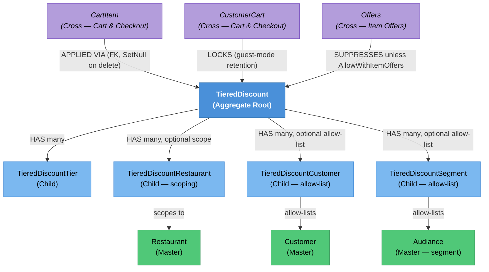

# Tiered Discount — Knowledge Graph

> **Context:** Customer Ordering (consumption) / Admin (management)
> **Source Project:** `Shared/TalabatkLogic/TieredDiscountAggregate`, `Shared/TalabatkApplication/TieredDiscounts`, `Shared/TalabatkData/Mapping/TieredDiscountConfigurations`
> **Last Updated:** 2026-08-02
> **Entities Covered:** 5 domain entities (1 aggregate root + 4 children) + 0 domain events + 1 usage-state counter

---

## Entity Relationship Diagram


## Status / State Notes
### TieredDiscount — usability
No explicit state machine; `IsActive` + the `StartDate`–`EndDate` window jointly determine
usability. See [[TieredDiscount.technical#Status / State|the entity's Status/State section]] for the transition guards.

| Status | Value | Can Transition To |
|--------|-------|--------------------|
| Draft/created inactive | `IsActive=false` | Active (`Activate()`, blocked if already expired) |
| Active | `IsActive=true` | Inactive (`Deactivate()`, always allowed) |
| Expired (derived, not stored) | `EndDate < today` | Cannot re-activate until `EndDate` is pushed forward |

## Entity Index
| Entity | Layer | Type | Responsibility |
|--------|-------|------|-----------------|
| `TieredDiscount` | Domain — Aggregate Root | Aggregate Root | The discount campaign: rules, tiers, eligibility, discount calculation. |
| `TieredDiscountTier` | Domain — Child | Child | One spend threshold + reward within a campaign. |
| `TieredDiscountRestaurant` | Domain — Child | Child (scope) | Optional restriction to specific restaurants. |
| `TieredDiscountCustomer` | Domain — Child | Child (allow-list) | Optional restriction to specific customers. |
| `TieredDiscountSegment` | Domain — Child | Child (allow-list) | Optional restriction to a customer segment (`Audiance`). |

## Feature Flow (Business Narrative)
```
1. CAMPAIGN CREATED (Admin)
   └── Ops staff fills the Tiered Discount form in AdminUi (Angular) → AddTieredDiscountCommand
       → TieredDiscount.Create validates and persists (Backend-Domain + Backend-Data)
2. CUSTOMER BROWSES A RESTAURANT (Customer Ordering)
   └── GetCustomerTieredDiscountQuery finds the best-matching active discount for this
       customer/guest + merchant, respecting date window, offer conflicts, and eligibility
       (segment / direct customer / guest-visible)
3. CART BUILT UP
   └── The "spend X more to get Y% off" progress message is computed against the cart's
       current total for that restaurant (GetNextTier)
4. GUEST LOGS IN MID-CART (cross-feature: Guest Mode)
   └── If a discount was locked to the guest's cart (CustomerCart.LockedTieredDiscountId), it is
       retained after promote/merge — it is NOT re-evaluated against the now-real account
5. ORDER PLACED
   └── CalculateDiscount applies the matched tier's reward to the applicable restaurant subtotal
       (or delivery fee), capped at MaximumDiscountValue; NumberOfTimesUsed increments
6. CAMPAIGN MANAGED (Admin)
   └── Ops can deactivate, reactivate (blocked if expired), edit non-tier fields, or delete
       (no usage guard — see Conflicts) a campaign at any time
```

## Key Cross-Cutting Relationships
| From | To | Relationship | Notes |
|------|----|--------------|-------|
| `CartItem` | `TieredDiscount` | FK, `SetNull` on delete | Historical attribution is lost (not blocked) if the discount is deleted after use — flagged conflict. |
| `CustomerCart` | `TieredDiscount` | `LockedTieredDiscountId` | Guest Mode retention — see [[TieredDiscount.technical|technical note]] Related section. |
| Admin (`AdminUi`) | `TieredDiscount` | Same shared Application/Data code, different host process | Write path; see `_system/_integrations.md`. |

## Relationship Legend
| Arrow | Meaning |
|-------|---------|
| `-->|HAS many|` | Aggregate owns child collection |
| `-->|APPLIED VIA|` | Foreign key reference from an external (cross-feature) entity |
| `-->|LOCKS|` | Cart retains a specific discount across the guest→real-account transition |
| `-->|SUPPRESSES|` | One entity's active state overrides/blocks another's applicability |

<!-- BEGIN generated: endpoint index (insert-endpoints.js) -->

## Endpoint index — generated from the controllers

> Generated by `_system/insert-endpoints.js` from `_feature-map.tsv`; do not edit between the
> sentinels. Every row is anchored to a line, so `verify-citations.js` checks all of it and a
> controller that moves is caught on the next run. "Action gate" lists only attributes on the action
> itself — the class gate above each table still applies unless an action opts out of it.

**1 controller(s), 6 action(s)**.

#### `AdminUi/Controllers/TieredDiscountController/TieredDiscountController.cs`

Class gate: roleless `[Authorize]` — `AdminUi/Controllers/TieredDiscountController/TieredDiscountController.cs:21`

| Route | Verb | Action gate | Anchor |
|---|---|---|---|
| `GetTieredDiscounts` | GET | `Permission(TieredDiscounts)` | `AdminUi/Controllers/TieredDiscountController/TieredDiscountController.cs:39` |
| `GetTieredDiscountById` | GET | `Permission(TieredDiscounts)` | `AdminUi/Controllers/TieredDiscountController/TieredDiscountController.cs:51` |
| `AddTieredDiscount` | POST | `Permission(TieredDiscounts)` | `AdminUi/Controllers/TieredDiscountController/TieredDiscountController.cs:70` |
| `EditTieredDiscount` | POST | `Permission(TieredDiscounts)` | `AdminUi/Controllers/TieredDiscountController/TieredDiscountController.cs:90` |
| `UpdateTieredDiscountActivity` | POST | `Permission(TieredDiscounts)` | `AdminUi/Controllers/TieredDiscountController/TieredDiscountController.cs:110` |
| `DeleteTieredDiscount` | POST | `Permission(TieredDiscounts)` | `AdminUi/Controllers/TieredDiscountController/TieredDiscountController.cs:130` |

<!-- END generated: endpoint index -->
