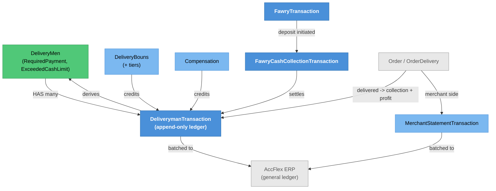

# Driver Cash & Compensation — Knowledge Graph

> **Context:** Delivery
> **Source Project:** `TalabatkDelivery` (`Apis/Fawry/FawryController.cs`), `Shared/TalabatkData`
> (Fawry service), plus the domain entities below
> **Entities:** [[DeliverymanTransaction.technical|DeliverymanTransaction]] (the ledger),
> [[DeliveryBouns.technical|DeliveryBouns]], [[Compensation|Compensation]],
> [[Merchant-Accounting-and-Order-Cost|Merchant Accounting & Order Cost]]
> **The flow note:** [[Driver-Cash-Cycle.technical|The Driver Cash Cycle]] — read that for the
> end-to-end money movement; this note is the **feature-level map** and does not restate it

Everything that makes a driver owe 8Orders money or be owed money by it: cash collected from customers,
deposits made at Fawry points of sale, bonuses earned, and compensation paid for deliveries that went
wrong. The ledger is append-only; the balance is derived.

## Four independent triggers, one balance

The most important structural fact, already established in
[[Driver-Cash-Cycle.technical|the cash-cycle note]] and repeated here because it decides the blast
radius of any change: **there is no single "cash cycle" entry point.** Four unrelated triggers feed the
same per-driver running balance and the same `ExceededCashLimit` gate:

| # | Trigger | Where it starts |
|---|---|---|
| 1 | An order reaches `Delivered` | `OrderDeliveredEvent` → `OrderDeliveredEventHandler`, which branches on the `MultipleDeliveries` flag |
| 2 | A driver deposits cash at a Fawry point of sale | Fawry's servers call back — this feature's controller |
| 3 | A back-office cashier posts a receipt or payment | `AdminUi` ERP-integration screen |
| 4 | Nightly batch for every driver who delivered that day | Hangfire job, runs unconditionally |

A change to how the balance is computed has to be checked against all four. Three of them are outside
this feature.

## The Fawry rail — and the pattern the rest of the codebase should copy

`FawryController` is `[Authorize]` with the JWT bearer scheme at class level
(`TalabatkDelivery/Controllers/Apis/Fawry/FawryController.cs:21`), and then deliberately opens three
actions to Fawry's servers:

| Endpoint | Auth | What it does | Verification |
|---|---|---|---|
| `POST api/Fawry/InitiateFawryTransaction` | JWT bearer | Driver starts a deposit; **`DeliveryManId` comes from the session**, not the request (`:36`) | ✅ correctly scoped |
| `POST api/Fawry/FawryPaymentCallback` | `[AllowAnonymous]` (`:55`) | Fawry confirms a payment | ✅ **SHA-256 signature** over reference/amount/status/method + a configured secure key; mismatch is logged and rejected — `Shared/TalabatkApplication/Commands/FawryPaymentCallbackCommand/FawryPaymentCallbackCommand.cs:63-79` |
| `POST api/Fawry/BillFawryInqiryRequest` | `[AllowAnonymous]` (`:89`) | Fawry asks what a driver owes | ✅ signature-verified — `Shared/TalabatkData/FawryCashCollectionService/FawryCashCollectionService.cs:53-59` |
| `POST api/Fawry/FawryPaymentNotify` | `[AllowAnonymous]` (`:101`) | Fawry notifies a completed collection | ✅ signature-verified, and returns a Fawry-protocol status code rather than an HTTP error — verification at `Shared/TalabatkData/FawryCashCollectionService/FawryCashCollectionService.cs:111`, `Message_Authentication_Error` returned at `:120-124` |

**This is the reference implementation of an anonymous webhook in this codebase.** It is worth naming
explicitly, because several findings elsewhere are precisely the absence of this pattern:

- `_conflicts.md` **#616** — the Centrifugo chat webhook in the *same host* has no verification at all.
- `_conflicts.md` **#42** — an `[AllowAnonymous]` file-upload endpoint in the Restaurant Portal.
- `_conflicts.md` **#375** — an `[AllowAnonymous]` financial batch trigger in `AdminUi`.

So "anonymous" is not the problem in any of those; *unverified* is. The team already knows how to do
this correctly.

Two details worth carrying into any change here:

1. The notify path resolves the driver by matching `FawryProfileId` against the incoming billing
   account (`Shared/TalabatkData/FawryCashCollectionService/FawryCashCollectionService.cs:127-129`).
   When there is no match it returns `Billing_Account_NotExisted`
   (`Shared/TalabatkData/FawryCashCollectionService/FawryCashCollectionService.cs:138-141`) — so an
   unmapped driver fails cleanly rather than silently.
2. Every step logs with structured fields (transaction id, billing account, amount, retry flag) before
   verification (`Shared/TalabatkData/FawryCashCollectionService/FawryCashCollectionService.cs:97-102`).
   That is useful for reconciliation and, unlike the credential logging in #611, harmless.

## Entity Relationship Diagram



## Status / State

The ledger has no status field — it is **append-only**, and the driver's position is derived from it:

```
DeliverymanTransaction rows (credit / debit, typed)
        │
        └── summed ──> DeliveryMen.RequiredPayment
                            │
                            └── compared against the city's cash limit ──> ExceededCashLimit
                                        │
                                        └── when exceeded, the driver stops receiving new orders
```

`ExceededCashLimit` is the operational consequence that makes this feature matter day to day: a driver
carrying too much undeposited cash is taken out of rotation. Recalculation happens on delivery
(`OrderDeliveredEventHandler`) — see [[Money-Path.technical|The Money Path]] step 8.

## Entity Index

| Entity | Layer | Type | Responsibility |
|---|---|---|---|
| `DeliverymanTransaction` | Domain — legacy entity | **Ledger** | One typed credit/debit per event; canonical note [[DeliverymanTransaction.technical\|DeliverymanTransaction]] |
| `DeliveryBouns` (+ tier spec) | Domain — legacy entity | Transactional | Bonus schemes; canonical note [[DeliveryBouns.technical\|DeliveryBouns]] |
| `Compensation` | Domain — legacy entity, event-raising | Transactional | Payments for deliveries that went wrong; [[Compensation\|Compensation]] |
| `FawryTransaction`, `FawryCashCollectionTransaction` | Domain — legacy POCO | Transactional | The deposit rail; folded into [[Money-Path.technical\|The Money Path]] |
| `MerchantStatementTransaction` | Domain — legacy POCO | Child | The merchant's mirror of the same orders; [[Merchant-Accounting-and-Order-Cost\|Merchant Accounting & Order Cost]] |
| [[DeliveryMen.technical\|DeliveryMen]] | Domain | Hub | Holds the derived `RequiredPayment` / `ExceededCashLimit` |

## Feature Flow (Business Narrative)

```
1. DRIVER DELIVERS A CASH ORDER
   └── ledger: order collection (debit) + delivery profit (credit); driver balance recalculated
2. BALANCE RISES
   └── when it passes the city's limit, ExceededCashLimit stops new assignments
3. DRIVER DEPOSITS AT A FAWRY POINT OF SALE
   ├── app: InitiateFawryTransaction (driver id from the session) -> reference number
   ├── Fawry: inquiry webhook -> what does this driver owe?   [signature-verified]
   └── Fawry: payment callback / notify -> deposit recorded    [signature-verified]
4. LEDGER CREDITED
   └── balance falls; the driver returns to rotation
5. BONUSES AND COMPENSATION
   └── further credits, on their own schedules
6. NIGHTLY + BACK OFFICE
   ├── a Hangfire job runs for every driver who delivered
   └── a cashier can post receipts or payments directly
7. GL HAND-OFF
   └── the same movements are batched to AccFlex ERP
```

## Key Cross-Cutting Relationships

| From | To | Relationship | Notes |
|---|---|---|---|
| [[Delivery/Delivery Man Operations/_knowledge-graph\|Delivery Man Operations]] | this feature | delivery completion writes the ledger | Trigger 1 |
| This feature | Fawry (external) | deposit rail | Signature-verified both ways |
| This feature | Admin ERP screens | cashier receipts/payments | Trigger 3 |
| This feature | AccFlex ERP | GL batch | `_integrations.md` row 20 |
| This feature | [[Money-Path.technical\|The Money Path]] | the customer-to-merchant half of the same orders | Steps 3, 6, 8 |
| `ExceededCashLimit` | order assignment | a driver over the limit stops being offered orders | The operational teeth of this feature |

## Change Surface

| Signal | Value | Notes |
|---|---|---|
| Direct dependents (Ring 1) | driver app, Fawry, Admin ERP screens, the nightly job, order assignment | |
| Sides touched | 4/5 | Domain · Application · Data · API host |
| Cross-context integrations | 3 | Fawry, AccFlex ERP, Admin |
| Register findings open | 0 new here; the ERP cluster (#293-296, #418) sits on the GL side | |
| Hub? | no — but it writes to the `DeliveryMen` hub | |
| Risk flags | four independent triggers on one balance; money movements are append-only, so a wrong row must be corrected by another row, never edited |

## Open Questions

- [ ] Which of the four triggers is authoritative if two disagree? Nothing reconciles them against each
      other.
- [ ] Is the nightly job idempotent if it runs twice in one day? It runs "unconditionally".
- [ ] Where is the city cash limit configured, and who can change it? It gates driver availability.
- [ ] Do bonus and compensation credits pass through the same `ExceededCashLimit` recalculation, or only
      order deliveries?
- [ ] `InitiateFawryTransaction` takes an `Amount` from the request — is it validated against what the
      driver actually owes, or can a driver declare any amount?
