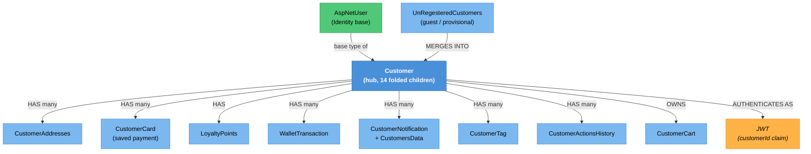

# Customer Identity — Knowledge Graph

> **Context:** Identity & Access
> **Source Project:** `Talabatk.IDS` — `Controllers/CustomerController.cs` (10 actions), commands under
> `Talabatk.IDS/Application/Commands/`
> **Entities:** [[Customer.technical|Customer]] (hub, 14 folded child entities),
> [[CustomerAddresses|CustomerAddresses]]
> **Register findings open here:** 3 (#443, #611, and the guest-mode ADR interaction below)

The customer account lifecycle: register, prove the phone number, sign in, change or reset the
password. Read alongside [[Identity & Access/Delivery Man Identity/_knowledge-graph|Delivery Man
Identity]] — the two features implement the same operations in the same host, and **this is the one
that does it correctly.** The comparison is the most useful thing in either note.

## Same operation, two implementations — the comparison table

| Operation | Customer (this feature) | Delivery man | Consequence |
|---|---|---|---|
| Reset password | Verifies the code: `VerifyChangePhoneNumberTokenAsync(user, command.Code, user.PhoneNumber)` and refuses on failure — `ResetPasswordCommand.cs:41-46` | Never reads `Code`; mints its own token; the override ignores it | 🔴 driver accounts are takeable — `_conflicts.md` #509 |
| Password policy | `ValidatePassword(command.NewPassword)` — `ResetPasswordCommand.cs:48` | Not called; the override hashes whatever it is given | driver passwords are unconstrained |
| Endpoint auth | `[Authorize(AuthenticationSchemes = JwtBearerDefaults…)]` on `Register`, `ResendActivationCode`, `ActivateUser`, `ActivateUserV2`, `ForgotPassword`, `ResetPassword` | `[AllowAnonymous]` on 7 of 9 actions | the customer flow requires a client token; the driver flow does not |
| Change password | Separate authenticated action requiring `Roles = "Customer"`, taking the customer id **from the token claim** rather than the body — `Talabatk.IDS/Controllers/CustomerController.cs:213-221` | No equivalent | correct pattern |

Both share `ResetPasswordDto`. One implementation validates its `Code` field; the other declares it and
ignores it.

## What this feature gets wrong on its own

> ⚠️ **CONFLICT — `[Authorize]` commented out, not removed, on two actions**
> `RegisterV2` (`Talabatk.IDS/Controllers/CustomerController.cs:80-83`) and `SendOTP` (`:166-170`) each carry a commented-out
> `//[Authorize(AuthenticationSchemes = JwtBearerDefaults.AuthenticationScheme)]` immediately followed
> by `[AllowAnonymous]`. The old attribute left in place as a comment is what makes the downgrade
> unambiguous rather than accidental — someone turned authentication off deliberately and left the
> evidence. Whether that was correct depends on whether a pre-auth client token is available to a
> customer who has not yet registered; if it is, these two should match their V1 siblings.
> `_conflicts.md` **#443** records this shape, naming this controller alongside `AdsController`.

> ⚠️ **CONFIRMED — customer passwords are written to the log in cleartext, twice**
> Every action in this controller opens with `logger.LogInformation(<dto>.ToString())` — it is the
> controller's convention. Two of those DTOs carry credentials:
> - `:208` logs `ResetPasswordDto.ToString()`, which interpolates `NewPassword` under the label
>   `phone:` (the mislabelling #510 describes).
> - `:218` logs `ChangePasswordDto.ToString()`, which returns
>   `"OldPassword : {OldPassword} NewPassword : {NewPassword}"` — **both** passwords, correctly
>   labelled (`ChangePasswordDto.cs:11`).
>
> The labelling difference matters operationally: a log-scrubbing rule keyed on the word "password"
> catches the second and misses the first; a rule keyed on the DTO name catches neither.
> `_conflicts.md` **#611**.

## Endpoint index

| Endpoint | Auth | What it does | Verdict |
|---|---|---|---|
| `POST api/Customer/Register` | JWT bearer | V1 registration | ✅ requires a client token |
| `POST api/Customer/RegisterV2` | **`[AllowAnonymous]`** (`[Authorize]` commented out) | V2 registration via `RegisterCustomerV2Command` | 🔴 `_conflicts.md` #443 — `:80-83` |
| `POST api/Customer/CompleteRegistration` | `[AllowAnonymous]` | Finishes a partial registration | ⚠️ anonymous by design? — `:96-101` |
| `GET api/Customer/ResendActivationCode` | JWT bearer | Re-sends the OTP | ✅ — `:115-118`; note `:117` logs the phone |
| `POST api/Customer/ActivateUser` | JWT bearer | Confirms the phone (V1) | ✅ — `:131-134` |
| `POST api/Customer/ActivateUserV2` | JWT bearer | Confirms the phone (V2) | ✅ — `:147-150` |
| `POST api/Customer/SendOTP` | **`[AllowAnonymous]`** (`[Authorize]` commented out) | Sends an OTP to any phone | 🔴 #443 — `:166-170`; SMS-cost and enumeration surface |
| `GET api/Customer/ForgotPassword` | JWT bearer | Starts a reset | ✅ — `:188-191` |
| `POST api/Customer/ResetPassword` | JWT bearer | Resets after verifying the code | ✅ logic; 🔴 logs the password — #611 — `:203-210` |
| `POST api/Customer/ChangePassword` | JWT bearer + `Roles = "Customer"` | Changes the password for **the caller** — id read from the `customerId` claim, not the body | ✅ the correct shape; 🔴 logs both passwords — #611 — `:213-221` |

`ChangePassword` is the only action in either identity feature that takes its subject from the token
instead of the request. It is the pattern the rest of both features should follow.

## Entity Relationship Diagram



## Status / State

No status enum; account state is field-driven on `Customer`, the same shape as the driver side:

```
registered ──> activation code issued ──> ActivateUser(V1|V2) ──> phone confirmed ──> can sign in
     │                                                                   │
     │ ResendActivationCode (new code replaces the old)                   ├──> ForgotPassword ──> code
     │                                                                   │        └──> ResetPassword (code VERIFIED)
     └── guest / provisional customer ──> merges on registration          └──> ChangePassword (old password required)
```

Guest mode is a documented architectural decision, not an accident: see
`TalabatkAPIs/docs/adr/0001-guest-mode-provisional-customer.md`. `UnRegesteredCustomers` is the
provisional record; the merge into a real `Customer` is where cart and address continuity is preserved
— traced in [[Cart-and-Checkout-Validation.technical|Cart & Checkout Validation]].

## Entity Index

| Entity | Layer | Type | Responsibility |
|---|---|---|---|
| `Customer` | Domain — legacy entity, event-raising | **Hub** | The customer record; 14 child entities fold into [[Customer.technical\|its technical note]] |
| `CustomerAddresses` | Domain — legacy POCO | Child | Delivery addresses; own note [[CustomerAddresses\|CustomerAddresses]] |
| `AspNetUser` | Domain — Identity base | Master | Credentials and phone confirmation |
| `UnRegesteredCustomers` | Domain — legacy POCO | Root | The guest/provisional customer that merges on registration |
| `CustomerCart` | Domain — legacy POCO | Root | Owned by the customer, documented under [[CustomerCart.technical\|Cart & Checkout]] |

## Feature Flow (Business Narrative)

```
1. GUEST BROWSES
   └── a provisional customer may exist before any registration (ADR 0001)
2. REGISTER
   ├── Register (V1, authenticated client) or RegisterV2 (anonymous — #443)
   └── activation code issued
3. ACTIVATE
   └── ActivateUser / ActivateUserV2 -> phone confirmed; any guest state merges in
4. SIGN IN
   └── IdentityServer issues a JWT carrying a `customerId` claim
5. FORGOT PASSWORD
   └── ForgotPassword -> code -> ResetPassword, which VERIFIES the code (:41-46)
       and validates the new password (:48)
6. CHANGE PASSWORD
   └── ChangePassword — old password required, subject taken from the token claim
```

## Key Cross-Cutting Relationships

| From | To | Relationship | Notes |
|---|---|---|---|
| Identity & Access | every context | issues the JWT each host validates | `_integrations.md` row 3; four duplicated `IdentityProvider.cs` copies |
| This feature | [[Customer Ordering/Customer Account/_knowledge-graph\|Customer Account]] | identity vs. profile | The account record lives here; preferences and profile screens are Customer Ordering |
| This feature | [[Customer Ordering/Cart & Checkout/_knowledge-graph\|Cart & Checkout]] | guest merge | Registration must not lose a guest's cart — ADR 0001 |
| This feature | [[Money-Path.technical\|The Money Path]] | wallet and loyalty balances hang off `Customer` | |
| This feature | [[Identity & Access/Delivery Man Identity/_knowledge-graph\|Delivery Man Identity]] | the same operations, done wrong there | The comparison table above is the reference for fixing #509 |

## Change Surface

| Signal | Value | Notes |
|---|---|---|
| Direct dependents (Ring 1) | 1 controller (10 actions), 14 folded child entities, the customer mobile app | |
| Sides touched | 3/5 | API host · Backend-Application · Backend-Domain |
| Cross-context integrations | 2 | JWT to every context; FCM to the customer app |
| Register findings open | 3 | #443, #611, plus #510's DTO shared with this controller |
| Hub? | **yes** | `Customer` is referenced by 14 model types |
| Risk flags | password paths, credential logging, guest-merge correctness (ADR 0001) |

## Open Questions

- [ ] Is a pre-auth client token available to an unregistered customer? That single fact decides
      whether `RegisterV2` and `SendOTP` being anonymous (#443) is a downgrade or a necessity.
- [ ] Is `SendOTP` rate-limited? Anonymous, sends SMS, accepts any phone number.
- [ ] `CompleteRegistration` is anonymous and completes a partial registration — what binds it to the
      registration it completes? If only a phone number, it is an account-hijack candidate; not traced.
- [ ] What distinguishes V1 from V2 registration and activation, and is V1 still called? Four actions
      for two operations.
- [ ] Does `ValidatePassword` (`ResetPasswordCommand.cs:48`) run on `ChangePassword` too, or only on
      reset?
