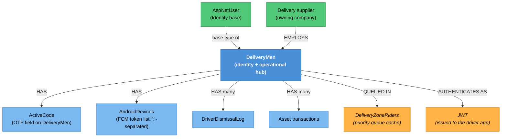

# Delivery Man Identity — Knowledge Graph

> **Context:** Identity & Access
> **Source Project:** `Talabatk.IDS` (3 controllers, 24 actions) + `DeliveryManManager/DeliveryUserManager.cs`
> **Entity:** [[DeliveryMen.technical|DeliveryMen]] (canonical note; this feature owns the *identity*
> lifecycle — registration, activation, password, dismissal — not the operational side)
> **Register findings open here:** 14, including **#509, the most severe finding in the register**

Driver accounts are created, activated, password-reset, edited, dismissed and re-hired here. The
customer equivalent of this feature does the same job **correctly**, in the same host, a few folders
away — which is what makes this feature's failures diagnosable rather than mysterious: there is a
working reference implementation to compare against, and it is cited throughout.

## The password-reset chain — read this before changing anything in this feature

Three separate defects compose into one unauthenticated account takeover. They are documented together
because fixing any one of them alone leaves the account takeover intact.

**Defect 1 — the action never reads the code it demands.**
`ResetPassword` (`Talabatk.IDS/Controllers/DeliveryMenController.cs:239-265`) is `[AllowAnonymous]` on
a controller with no class-level `[Authorize]`. It validates only `Phone` and `NewPassword`
(`:245-248`) — while its own DTO declares a third field, `Code`
(`Talabatk.IDS/Application/Commands/ResetPasswordCommand/ResetPasswordDto.cs:5-8`), which the action
never touches.

**Defect 2 — the server mints the token it is supposed to verify.**
Rather than accepting a token the user proved they received, the action calls
`GenerateChangePhoneNumberTokenAsync` (`:256`) and passes the result straight into
`ResetPasswordAsync` (`:257`). The override
(`Talabatk.IDS/DeliveryManManager/DeliveryUserManager.cs:61-66`) does something worse than return a
token: it calls `user.RegenerateActivationCode()` and persists it. So merely *attempting* a reset
**overwrites the driver's current activation code**, invalidating any legitimate OTP in flight.

**Defect 3 — the reset ignores the token entirely.**
`DeliveryUserManager.ResetPasswordAsync` (`:69-73`) overrides the ASP.NET Identity method and drops
the `token` parameter on the floor: it hashes the new password and saves. Even a correct token check
upstream would not be enforced here.

Net effect: **`POST api/DeliveryMen/ResetPassword` with a phone number and a new password takes over
that driver's account.** `_conflicts.md` **#509**.

> ⚠️ **CONFLICT — the same operation is implemented correctly for customers, in this same host**
> The customer path calls `VerifyChangePhoneNumberTokenAsync(user, command.Code, user.PhoneNumber)`
> and refuses on failure (`Talabatk.IDS/Application/Commands/ResetPasswordCommand/ResetPasswordCommand.cs:41-46`)
> — i.e. it *verifies* the token the driver path *mints*. It then runs `ValidatePassword` on the new
> password (`:48`), which the driver path also skips. Same operation, same `ResetPasswordDto` type, two
> implementations: one safe, one not. The safe one is the pattern to copy.

> ⚠️ **CONFLICT — the correct check exists ten lines above and is not wired to the reset**
> `CheckResetPasswordCode` (`Talabatk.IDS/Controllers/DeliveryMenController.cs:213-234`) does verify the code. Nothing forces a
> caller to have passed through it before calling `ResetPassword`; there is no server-side state
> linking the two. `_conflicts.md` #509.

**Defect 4 — the new password is written to the log.** `:244` calls
`logger.LogInformation(model.ToString())`, and `ResetPasswordDto.ToString()`
(`ResetPasswordDto.cs:10-17`) interpolates `NewPassword` **under the label `phone:`** — so the log line
reads like a phone number and is in fact a plaintext password. Anyone with log access harvests
credentials, and the mislabelling means a log-scrubbing rule written for passwords would not catch it.
`_conflicts.md` #510.

## Endpoint index

`DeliveryMenController` has **no class-level `[Authorize]`**; every action's admission is decided
individually, and seven of nine are anonymous.

| Endpoint | Auth | What it does | Verdict |
|---|---|---|---|
| `POST api/DeliveryMen/Register` | `[AllowAnonymous]` | Driver self-registration | Expected for a signup endpoint; note `:66` logs the whole DTO |
| `GET api/DeliveryMen/ResendActivationCode` | `[AllowAnonymous]` | Re-sends the OTP for a phone | Enumeration/SMS-cost surface; `:98` logs the phone |
| `GET api/DeliveryMen/SimulateSendNewConfirmedOrderNotification` | `[AllowAnonymous]` | Reads any driver's `AndroidDevices` FCM tokens, pushes a fake "new order" to them, **and returns the tokens** | 🔴 `_conflicts.md` **#609** — `:115-143` |
| `POST api/DeliveryMen/ActivateUser` | `[AllowAnonymous]` | Confirms the phone; sets `PhoneNumberConfirmed` directly | 🟡 `_conflicts.md` **#38** — bypasses the manager — `:148-179` |
| `GET api/DeliveryMen/ForgotPassword` | `[AllowAnonymous]` | Starts the reset; `:187` logs the phone | Expected, but see the chain above |
| `POST api/DeliveryMen/CheckResetPasswordCode` | `[AllowAnonymous]` | **Correctly** validates the code | ✅ — and unwired from the reset |
| `POST api/DeliveryMen/ResetPassword` | `[AllowAnonymous]` | Resets any driver's password given a phone | 🔴 **#509** account takeover · **#510** password logged — `:239-265` |
| `GET api/DeliveryMen/GetDeliverymenQueues` | `[AllowAnonymous]` | Dumps every delivery-zone rider queue from cache | 🔴 `_conflicts.md` **#610** — `:268-279` |
| `POST api/DeliveryMen/EditDeliveryman` | JWT bearer | Forwards `UpdateDeliveryManCommand` to MediatR | ⚠️ no role gate; command bound wholly from the body — `:282-289` |
| `GET`/`POST …/DeliveryManController/EditDeliveryMan` | `[Authorize]`, no roles | Admin-side driver editing | 🔴 `_idor-instances.md` **#23** — `DeliveryManid` unconstrained by caller |
| `GET …/DeliveryManController/GetAssetsTransactions` | `[Authorize]`, no roles | A driver's asset transactions | 🔴 `_idor-instances.md` **#24** — DTO carries no caller field |
| `GET`/`POST …/DeliveryManController/Dismiss` · `ReHire` · `DismissalPreview` · `DismissalLog` | `[Authorize]`, no roles | Dismissal lifecycle | ⚠️ roleless; dismissal is a high-impact operation |
| `…/DeliveryManTestController/*` (7 actions) | `[Authorize(AuthenticationSchemes = "Bearer")]` | A **test** controller in production: add, edit, list all drivers, dismiss, re-hire, dismissal log | 🔴 `_conflicts.md` **#444**; `EditDeliveryMan` resets any driver's password by id — **#573** |

Three controllers manage one concept, with overlapping actions and three different authorisation
styles. `DeliveryManTestController`'s `EditDeliveryMan` and `DeliveryManController`'s `EditDeliveryMan`
and `DeliveryMenController`'s `EditDeliveryman` are three spellings of one operation.

## Entity Relationship Diagram



## Status / State — the driver account lifecycle

There is no status enum. Account state is inferred from fields on `DeliveryMen`, which is why it is
easy to get wrong:

```
registered ──> ActiveCode issued ──> ActivateUser ──> PhoneNumberConfirmed = true ──> can sign in
                     │                                        │
                     │ ResendActivationCode (new code)         ├──> Dismiss ──> dismissed (DriverDismissalLog)
                     │                                         │                    │
                     └── any ResetPassword ATTEMPT silently     │                    └──> ReHire ──> active again
                         REGENERATES ActiveCode, invalidating   │
                         a legitimate OTP in flight             └──> ban/unban (Admin context)
```

The dashed path is the operationally surprising one: a reset attempt by *anyone* — including an
attacker probing phone numbers — invalidates the driver's pending activation code
(`DeliveryUserManager.cs:61-66`). Support tickets of the form "my code stopped working" can have this
as their cause.

`DismissalOperationType` and `DismissalOperationStatus` enums are declared inside
`Shared/TalabatkLogic/TalabatkModels/DriverDismissalLog.cs` rather than in `TalabatkLogic/Enum/` —
recorded in `_inbox/pathA-A-models-batch04-final.md` as one of four enums the "all enums parsed" claim
missed.

## Entity Index

| Entity | Layer | Type | Responsibility |
|---|---|---|---|
| `DeliveryMen` | Domain — legacy entity, event-raising | **Hub** | The driver: identity, credentials, devices, cash limits. Canonical note [[DeliveryMen.technical\|DeliveryMen]] |
| `AspNetUser` | Domain — Identity base | Master | Provides `PasswordHash`, `PhoneNumberConfirmed`; `DeliveryUserManager` is the `UserManager<DeliveryMen>` over it |
| `DriverDismissalLog` | Domain — legacy POCO | Child | Dismissal/re-hire history; carries two locally-declared enums |
| `DeliveryZoneRiders` (cache) | Infrastructure | — | Priority queue of available riders per zone; exposed by #610 |

## Feature Flow (Business Narrative)

```
1. SIGN UP
   └── Register (anonymous) -> driver record + ActiveCode -> OTP sent
2. ACTIVATE
   └── ActivateUser (anonymous) -> PhoneNumberConfirmed = true
       (sets the flag directly rather than through the manager — #38)
3. SIGN IN
   └── Talabatk.IDS issues a JWT the delivery host and API hosts validate
       (four near-duplicate IdentityProvider.cs copies — see _integrations.md row 3)
4. FORGOT PASSWORD
   ├── ForgotPassword -> code issued
   ├── CheckResetPasswordCode -> code verified   <-- correct, and unwired
   └── ResetPassword -> password changed WITHOUT the code   <-- #509
5. ADMIN MAINTENANCE
   └── edit, dismiss, re-hire, asset transactions — across three controllers,
       one of which is a test controller (#444, #573)
```

## Key Cross-Cutting Relationships

| From | To | Relationship | Notes |
|---|---|---|---|
| Identity & Access | every context | issues the JWT each host validates | `_integrations.md` row 3; **no shared validation implementation** — four copies of `IdentityProvider.cs` |
| This feature | [[Delivery/Delivery Man Operations/_knowledge-graph\|Delivery Man Operations]] | identity vs. operations | Shifts, assignment and location live there; the account lives here |
| This feature | [[Delivery/Driver Cash & Compensation/Driver-Cash-Cycle.technical\|Driver Cash Cycle]] | `RequiredPayment` / `ExceededCashLimit` | Recomputed on delivery; a dismissal must reckon with an outstanding balance |
| This feature | [[Admin/Delivery Administration/_knowledge-graph\|Delivery Administration]] | the admin surface | Bans, unban reasons, wallet, bonuses |
| This feature | Firebase Cloud Messaging | driver push | `AndroidDevices` holds the tokens #609 discloses |
| Customer equivalent | [[Identity & Access/Customer Identity/_knowledge-graph\|Customer Identity]] | the correct reference implementation | `ResetPasswordCommand.cs:41` |

## Change Surface

| Signal | Value | Notes |
|---|---|---|
| Direct dependents (Ring 1) | 3 controllers (24 actions), `DeliveryUserManager`, the driver app | |
| Sides touched | 3/5 | API host · Backend-Application · Backend-Domain |
| Cross-context integrations | 3 | JWT to every context, FCM to the driver app, Admin |
| Register findings open | 14 | #38, #46, #375, #386, #403, #412, #444, #509, #510, #573, #609, #610, IDOR #23, #24 |
| Hub? | **yes** | `DeliveryMen` is referenced by 7+ model types |
| Risk flags | password reset, `[AllowAnonymous]` density (7 of 9 actions), a test controller in production, three controllers for one concept |

## Open Questions

- [ ] Is `DeliveryManTestController` routed in production, or excluded by configuration? #444 says it is
      reachable; if a gateway blocks it, that mitigation exists nowhere in code.
- [ ] Does anything rate-limit `ResendActivationCode` or `ForgotPassword`? Both are anonymous and both
      send SMS, so both are cost and enumeration surfaces.
- [ ] `EditDeliveryman` (`:282-289`) binds `UpdateDeliveryManCommand` wholly from the body with no role
      gate. Does the handler check that the caller may edit that driver? Not traced.
- [ ] Why does `ActivateUser` set `PhoneNumberConfirmed` directly instead of via the manager (#38)? If
      the manager has side effects, skipping it may leave state inconsistent.
- [ ] Are driver passwords subject to any policy? `ResetPasswordAsync` hashes whatever it is given
      without calling the Identity password validators.
