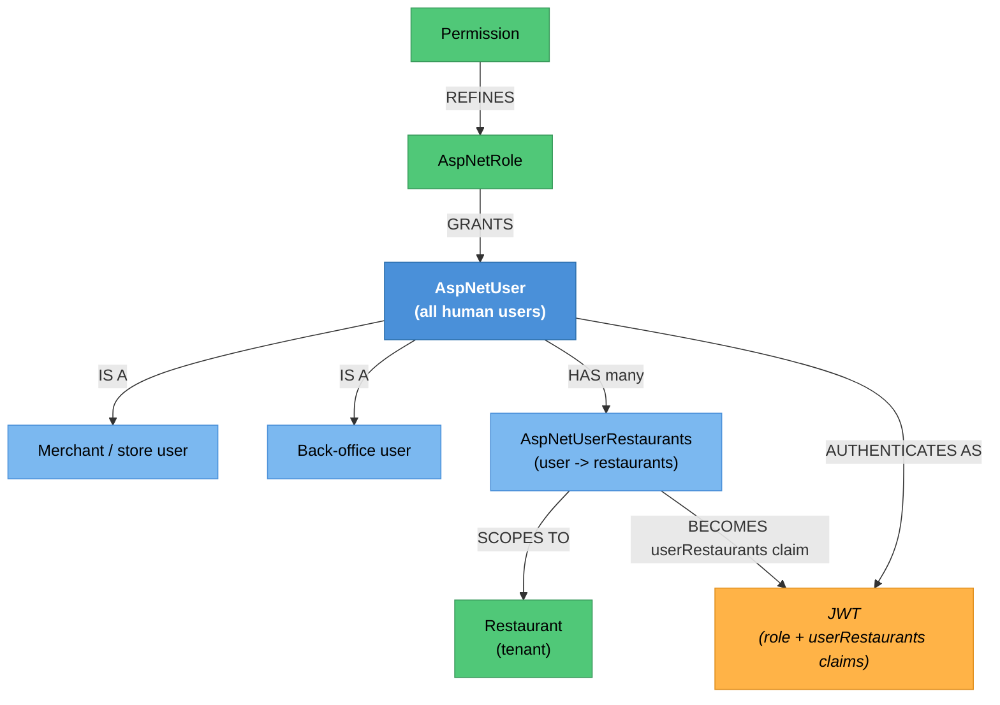

# Restaurant & Admin User Identity — Knowledge Graph

> **Context:** Identity & Access
> **Source Project:** `Talabatk.IDS` — `Controllers/RestaurantUserController/` (API, 9 routes) and
> `Controllers/UsersController/` (Razor back-office, 7 actions)
> **Entities:** [[Permission.technical|Permission]], `AspNetUser`, `AspNetRole`,
> `AspNetUserRestaurants`
> **Register findings open here:** #604 (the unscoped delete this feature *receives*), #611 (third
> credential-log instance)

Merchant staff and 8Orders back-office users. Two very different surfaces share the feature because
they administer the same `AspNetUser` table: a **JSON API** the Restaurant Portal calls, and a
**server-rendered Razor UI** that 8Orders staff use directly.

## The third password-reset implementation — and why that matters for #509

This host contains **three** independent implementations of "reset a forgotten password", one per user
type. Two verify the code. One does not:

| User type | Verifies the code? | Where | Verdict |
|---|---|---|---|
| Customer | ✅ `VerifyChangePhoneNumberTokenAsync(user, command.Code, …)` | `Talabatk.IDS/Application/Commands/ResetPasswordCommand/ResetPasswordCommand.cs:41` | correct |
| **Merchant user** | ✅ `VerifyChangePhoneNumberTokenAsync(user, command.Code, …)` | `ResetPasswordForRestaurantUserCommand.cs:51-55` | correct |
| Delivery man | 🔴 **no** — the `Code` is never read | see [[Identity & Access/Delivery Man Identity/_knowledge-graph\|Delivery Man Identity]] | `_conflicts.md` #509 |

That changes how #509 should be read: it is not "the reset flow is weak", it is **one of three
implementations is missing the check its two siblings perform**. The merchant controller even forwards
`model.Code` into its command (`RestaurantUserController.cs:126`) — the driver controller has the same
field available and drops it.

All three, however, log the password: `RestaurantUserController.cs:123` opens `ResetPassword` with
`logger.LogInformation(model.ToString())` on the same `ResetPasswordDto` — the third instance of
`_conflicts.md` **#611**.

## Endpoint index — the merchant API

| Endpoint | Auth | What it does | Notes |
|---|---|---|---|
| `POST api/RestaurantUser/ChangePassword` | JWT, roles `restaurant, RestaurantAdmin` | Changes the caller's password | `:52-55` |
| `POST api/RestaurantUser/AddNewUser` | JWT, role `RestaurantAdmin` | Creates a sub-user under a restaurant | `:68-71` |
| `GET api/RestaurantUser/ForgotPassword` | **`[AllowAnonymous]`** | Issues a reset code by phone | `:98-101` — anonymous by necessity, but an SMS-cost and enumeration surface |
| `POST api/RestaurantUser/ResetPassword` | **`[AllowAnonymous]`** | Resets after **verifying** the code | ✅ logic; 🔴 logs the password — #611 — `:121-124` |
| `POST api/RestaurantUser/ActivateUser` | **`[AllowAnonymous]`** | Confirms the phone | `:138-143` |
| `GET api/RestaurantUser/ResendActivationCode` | **`[AllowAnonymous]`** | Re-sends the code | `:157-160` |
| `POST api/RestaurantUser/AddNewStoreUser` | JWT, role `MerchantAdmin` | Creates a store user | `:179-182` |
| `POST api/RestaurantUser/EditMultipleStoreUser` | JWT, role `MerchantAdmin` | Bulk edit of store users | `:278-280` |
| `POST api/RestaurantUser/DeleteStoreUser` | JWT, role `MerchantAdmin` | Deletes a store user | 🔴 **the receiving end of `_conflicts.md` #604** — `:313-315` |

> ⚠️ **CONFLICT — #604's other half lives here**
> The Restaurant Portal proxies `DeleteStoreUser` to this endpoint with the caller's token and body
> (`TalabatkRestaurants/Controllers/StoreUsers/StoreUsersController.cs:163`). This side gates on role
> `MerchantAdmin` (`:315`) and then resolves the target **by user id alone** —
> `DeleteUserCommand`'s handler matches `x.Id == command.UserId` with no restaurant in the predicate,
> and `DeleteStoreUserDto` carries nothing but `UserId`. So neither hop checks tenancy: **any
> MerchantAdmin can delete any store user in the system.** Both halves are needed to see it, which is
> why it stood — the portal note says "proxied unscoped" and this note says "gated by role"; only
> together do they say "unscoped end to end".

## Endpoint index — the back-office Razor UI

`UsersController` is `[Authorize]` at class level (`UsersController.cs:19`) with **no roles**, and no
`[Permission]` attributes:

| Action | What it does | Notes |
|---|---|---|
| `AllUsers(searchTerm, page)` | Lists and searches every user | `:31` |
| `EditUser(int UserId)` / `EditUser(EditUserViewModel)` | Loads and saves any user | `:62`, `:72` |
| `AddNewUser()` / `AddUser(GetAddNewUserViewModel)` | Creates a back-office user | `:114`, `:124` |
| `DeleteUser(int UserId)` | Deletes any user | `:167` |

Any authenticated principal that reaches this host can therefore list, edit, create and delete users,
because the only gate is "be authenticated". Roles are checked nowhere in the file. This is the same
shape as the roleless-`[Authorize]` cluster recorded across `AdminUi` (#560, #567, #568, #569) but on
the identity host itself, where the blast radius is larger.

## Entity Relationship Diagram



`AspNetUserRestaurants` is the join that becomes the `userRestaurants` claim the whole Restaurant Portal
scopes on — see [[Restaurant Portal/Merchant Account & Access/_knowledge-graph|Merchant Account &
Access]]. A change to how that join is written here changes tenancy for every merchant screen.

## Status / State

Field-driven, same as the other identity features: created → activation code issued → phone confirmed
→ can sign in. The merchant path adds one wrinkle: a **sub-user** is created by a `RestaurantAdmin`
(`:68-71`) or a **store user** by a `MerchantAdmin` (`:179-182`), so an account can exist before its
owner ever proves a phone number — activation happens afterwards, anonymously (`:138-143`).

```
RestaurantAdmin/MerchantAdmin creates the account
   └── activation code issued
         └── ActivateUser (anonymous) -> phone confirmed -> can sign in
               ├── ChangePassword (authenticated, own account)
               └── ForgotPassword -> ResetPassword (anonymous, code VERIFIED)
   └── DeleteStoreUser (MerchantAdmin, no tenancy check — #604)
```

## Entity Index

| Entity | Layer | Type | Responsibility |
|---|---|---|---|
| `AspNetUser` | Domain — Identity | Master | Every human user: customer, driver, merchant, admin |
| `AspNetRole` | Domain — Identity | Master | The role names every gate in the system reads |
| `AspNetUserRestaurants` | Domain — join | Child | Which restaurants a merchant user may act on; source of the `userRestaurants` claim |
| `Permission` | Domain — legacy entity | Master | Finer-grained permissions; canonical note [[Permission.technical\|Permission]] |
| `Application` | Domain — legacy POCO | Lookup | OAuth client registration, documented in [[Identity & Access/Authentication & Tokens/_knowledge-graph\|Authentication & Tokens]] |

## Feature Flow (Business Narrative)

```
1. A restaurant admin adds a colleague as a portal user (API, role-gated)
2. The colleague receives an activation code and confirms their phone (anonymous)
3. They sign in through the single login form, receiving role + userRestaurants claims
4. They may change their own password; if they forget it, the reset VERIFIES the code
5. 8Orders back-office staff are managed through a separate Razor UI on the same host,
   gated only by "is authenticated"
6. Removing a store user goes through the portal, is proxied here, and is scoped by NEITHER hop (#604)
```

## Key Cross-Cutting Relationships

| From | To | Relationship | Notes |
|---|---|---|---|
| This feature | [[Restaurant Portal/Merchant Account & Access/_knowledge-graph\|Merchant Account & Access]] | mints the tenancy claims that feature enforces | `AspNetUserRestaurants` → `userRestaurants` |
| Restaurant Portal | this feature | proxies `DeleteStoreUser` | #604, unscoped on both hops |
| This feature | [[Identity & Access/Authentication & Tokens/_knowledge-graph\|Authentication & Tokens]] | sign-in and the client/role gates | Merchant roles are refused on the admin SPA there |
| This feature | [[Admin/Admin Back-Office/_knowledge-graph\|Admin Back-Office]] | back-office users and permissions | The Razor UI here overlaps Admin's own user administration |
| This feature | [[Identity & Access/Delivery Man Identity/_knowledge-graph\|Delivery Man Identity]] | the third reset implementation | Two of three verify the code; that one does not |

## Change Surface

| Signal | Value | Notes |
|---|---|---|
| Direct dependents (Ring 1) | Restaurant Portal (all features), back-office user administration | |
| Sides touched | 3/5 | API host · Backend-Application · Backend-Data |
| Cross-context integrations | 2 | Restaurant Portal proxy; token claims to every context |
| Register findings open | 2 (#604 receiving end, #611 third instance) + the roleless Razor UI noted above | |
| Hub? | **yes** — `AspNetUser` underlies every user type | |
| Risk flags | tenancy claims are minted here; a Razor UI with no role checks; password paths |

## Open Questions

- [ ] Should the Razor `UsersController` carry role or `[Permission]` gates? As written, any
      authenticated principal on this host can delete any user. Is the host network-restricted?
- [ ] Does `ResetPasswordForRestaurantUserCommand` validate the new password against the policy, as the
      customer path does with `ValidatePassword`? Not found in that command.
- [ ] Who may create a `MerchantAdmin`? `AddNewStoreUser` requires one, so the first must come from
      elsewhere — probably the Razor UI, which has no role gate.
- [ ] Is `AspNetUserRestaurants` written anywhere other than these endpoints? It decides tenancy for the
      whole portal.
- [ ] Are merchant `ForgotPassword` / `ResendActivationCode` rate-limited? Both anonymous, both send SMS.
