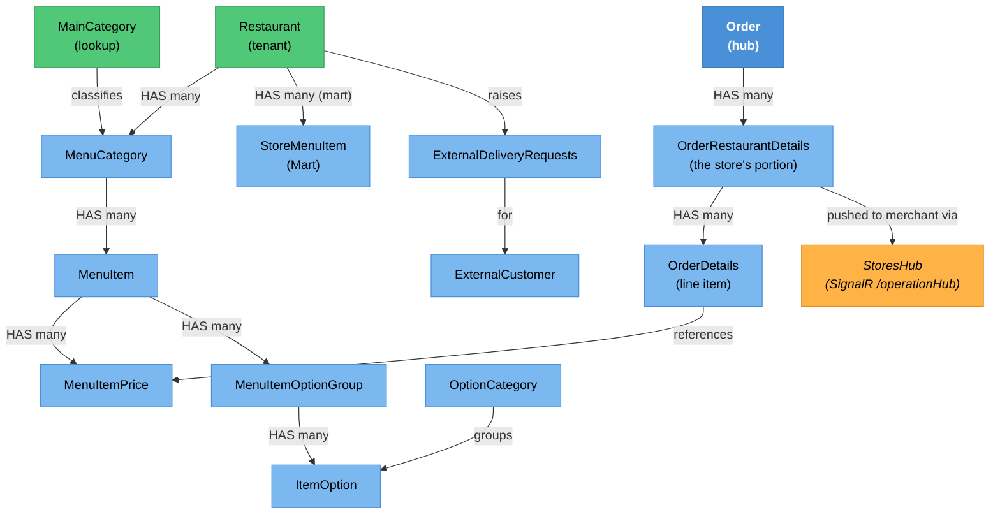

# Menu & Order Management — Knowledge Graph

> **Context:** Restaurant Portal
> **Source Project:** `TalabatkRestaurants` (14 controllers, ~150 actions), `Shared/TalabatkApplication`
> (commands/queries), `Shared/TalabatkLogic` (status enums), Angular SPA under `ClientApp/`
> **Entities Covered:** the merchant-side view of `MenuItem`, `MenuItemPrice`, menu structure,
> options/option groups, `Order` / `OrderRestaurantDetails` / `OrderDetails`, `StoreMenuItem` (Mart),
> and `ExternalDeliveryRequests` — each canonical elsewhere and linked below
> **Register findings open here:** 35

This is the working surface of the merchant's day: build the menu, receive orders, cook them, hand
them over, and reject or replace what cannot be made. It is also the largest feature in the repo by
endpoint count, and the one where **versioned endpoint pairs** (`X` and `XV2`) matter most — the V2
variants systematically weakened the tenant boundary, which is documented below as its own table
because it is a pattern, not a set of coincidences.

## Entity Relationship Diagram



## Status / State — the merchant's half of the order lifecycle

Two enums describe the same journey from different sides, and **their numbering is unrelated** — a
frequent source of confusion when reading queries that join both.

`RestaurantOrderStatus` (`Shared/TalabatkLogic/Enum/RestaurantOrderStatus.cs`) — the store's portion:

| Status | Value | Reached by | Can transition to |
|---|---|---|---|
| `New` | 100 | order placed by the customer | `Pending`, `RestaurantView`, `Canceled` |
| `Pending` | 110 | awaiting merchant attention | `RestaurantView`, `Rejected`, `Canceled` |
| `RestaurantView` | 120 | merchant opened the order | `Confirmed`, `ItemAvailability`, `Rejected` |
| `Confirmed` | 130 | `ConfirmOrder` / `ConfirmOrderV2` | `Cooking`, `ItemsUnderReplacement` |
| `ItemAvailability` | 140 | some items unavailable | `ItemsUnderReplacement`, `Rejected` |
| `Cooking` | 150 | `StartCooking` / `StartCookingV2` | `ReadyToPickUp` |
| `ReadyToPickUp` | 160 | `ReadyToPickupOrder(V2)` | `PickedUp` |
| `PickedUp` | 170 | driver collected it | terminal for the merchant |
| `Canceled` | 180 | customer/admin cancellation | terminal |
| `Rejected` | 190 | `RejectRestaurantOrderOverall(V2)` | terminal |
| `ItemsUnderReplacement` | 200 | `NotifyCustomerToReplaceItems` | `Confirmed`, `Rejected` |

`OrderStatus` (`Shared/TalabatkLogic/Enum/OrderStatus.cs`) — the whole order, including delivery:
`Pending`(1) · `Confirmed`(2) · `Rejected`(3) · `OnWay`(4) · `Delivered`(5) ·
`AssignDeliveryManDate`(6) · `DeliveryManViewed`(8) · `ReadytoPickup`(10) · `RestaurantRejected`(11) ·
`RestaurantPending`(12) · `RestaurantView`(13) · `RestaurantNotAvilableItems`(14) ·
`RestaurantStartCooking`(30). Note `7` and `9` are absent, and that this enum carries **its own**
restaurant-facing values (11–14, 30) that duplicate `RestaurantOrderStatus` semantics at different
numbers. Any change to one must be checked against the other.

```
merchant view of one order
  New(100) ──> RestaurantView(120) ──> Confirmed(130) ──> Cooking(150) ──> ReadyToPickUp(160) ──> PickedUp(170)
                    │                       │
                    ├──> ItemAvailability(140) ──> ItemsUnderReplacement(200) ──┘ (back to Confirmed)
                    └──> Rejected(190)                    └──> Rejected(190)
  any state ──> Canceled(180)   (customer/admin initiated, not a merchant action)
```

## The V1/V2 scoping regression — a pattern, not eight coincidences

Every versioned pair in `OrdersController` follows the same shape: **V1 takes the restaurant from the
session, V2 takes it from the caller.** Whatever motivated V2 (multi-branch UI, most likely) it moved
the tenant decision from the server to the client for eight endpoints:

| V1 (session-scoped) | V2 (caller-supplied) | What the caller controls | Finding |
|---|---|---|---|
| `StartCooking` | `StartCookingV2` | `restaurantId` | `_conflicts.md` #585 |
| `GetOrderDetails` | `GetOrderDetailsV2` | `restaurantId`; response carries a customer-data flag | #586 |
| `ConfirmOrder` | `ConfirmOrderV2` | `restaurantId` | #587 |
| `ReadyToPickupOrder` | `ReadyToPickupOrderV2` | `restaurantId` | #588 |
| `RejectSomeItemsRestaurant` | `RejectSomeItemsRestaurantV2` | `RestaurantId` in the DTO | #589 |
| `RejectRestaurantOrderOverall` | `RejectRestaurantOrderOverallV2` | `RestaurantId` in the DTO | #590 |
| — | `GetRestaurantCookingOrdersV2` | `restaurantIds` list bypasses the session fallback when non-empty | `_idor-instances.md` #13 |
| — | `RestaurantOrdersDailySummaryV2` | `restaurantIds` list | `_idor-instances.md` #31 |

Two further shapes in the same controller:

- **Unscoped list reads** (`_conflicts.md` #591): `[FromQuery] List<int> restaurantIds` used directly,
  no fallback, no membership test.
- **Session as a default, not a constraint** (#592): the session list fills in only when the caller's
  list is empty — so sending one id overrides the boundary. `GetOrdersByRestaurantIds` is the
  documented instance (`_idor-instances.md` #14), and **10+ sibling actions in the same file scope
  correctly** via `sessionInfo`, which is what makes this an omission rather than a design.

`RejectRestaurantOrderOverallV2` is also the only action in the controller that logs its failures
(`_logger.LogWarning`, `OrdersController.cs:924-926`); its many siblings return the error silently.

## Destructive and unscoped ids in the menu-management controllers

These matter more than read IDORs because they **write**:

| Endpoint | Effect if the id is not yours | Finding |
|---|---|---|
| `MenuItemOptionGroupController.Delete` | deletes another store's option group — handler has zero restaurant filter | `_conflicts.md` #595 |
| `MenuItemOptionGroupController.GetById` | reads another store's option group | #594 |
| `MenuItemOptionGroupController.DeleteItem` / `ToggleItemStatus` / `DuplicateItem` | mutates another store's option-group items | #596 |
| `MenuItemOptionGroupController.Create` / `List` / `GetOptionGroupsTree` | session used as default only | #597 |
| `CategoryItemsPricesController.ChangeAvalibilty` | toggles another store's item availability | #598 |
| `MenuItemsController.GetMerchantMenuItemsWithCategory` | session as default only | #599 |
| `ItemPriceController.DeleteMenuItemPrice` | **deletes** another store's price row | #600 |
| `ItemPriceController.GetItemPriceId` / `Edit` / `Insert` / `ChangeMerchantMenuItemAvalibilty` | unscoped ids | #601 |
| `ItemOptionController` — 7 actions incl. `EditItemOptions`, `Delete` | unscoped ids | #602 |
| `ItemOptionController.GetCategoryNamesByRestaurantIdV2` | another store's category names — while `:101-103` (the V1) is scoped | `_idor-instances.md` #16 |
| `CategoryController.GetMenuCategoriesToTransfer` | resolves **any** `menuItemId` to its owning restaurant and returns that restaurant's category list | `_idor-instances.md` #15 |

> ⚠️ **CONFLICT — one path validates, its twin does not (menu category creation)**
> `CategoryController.InsertMenuCategory` (`:195-230`) uses the incoming `dto.RestaurantId` directly,
> falling back to `sessionInfo.RestaurantId` only when it is zero — **no ownership check**.
> `CategoryController.Add` (`:234-280`), a second near-identical creation endpoint, routes through
> `GetCurrentRestarunt(dto.RestaurantId)`, which **does** enforce that non-admin roles may only create
> categories for a restaurant in their own `UserRestaurants`. Two endpoints, one operation, opposite
> answers. Same shape as `_conflicts.md` #17/#19/#20 but at the authorisation level.

> ⚠️ **CONFLICT — external-delivery siblings disagree the same way**
> `ExternalDeliveryRequestsController.ExternalCustomers` explicitly rejects ids outside the caller's
> `UserRestaurants` ("Unauthorised restaurant IDs", `:317-322` using `Except(sessionInfoRestaurantIds)`),
> while its sibling `GetRequests` (`:49-64`) takes a raw `resturantIds` CSV and uses it directly —
> leaking cross-tenant customer **name, phone and address** (`_idor-instances.md` #4). A second
> instance, `GetExternalCustomerDetails` by `ExternalCustomerId`, is `_idor-instances.md` #10, and
> `_conflicts.md` #458 records a **destructive** cross-tenant write in the same area alongside PII
> masking that is decorative only.

## No-authorisation surfaces in this feature

| Surface | State | Why it matters | Finding |
|---|---|---|---|
| `RestaurantNotificationController` — all 10 routes | **no `[Authorize]` anywhere** | This is the *working* real-time relay (see the `StoresHub` bug below). Anyone who finds these routes can push fake `NewOrder`, `RejectOrder`, `DelayOrder`, `StartCooking` (which broadcasts to `Clients.All`) events to any restaurant's dashboard, or pull an order's report image via `ReportDetails` by guessing ids | `_conflicts.md` #41 |
| `ExportImportExcelController.UploadChunk` / `UploadFiles` (`:504-539`) | `[AllowAnonymous]` | Writes client-supplied content to the configured `ImagePathUpload` disk path with the client's filename | #42 |
| `StoreMenuItemsController.UpdateItemStock` (`:241-255`) | `[AllowAnonymous]` | Alters Mart stock quantities (`EditMartItemQuantityCommand`) — plausibly an ERP webhook that cannot carry a user token, but unauthenticated as written | #42 |
| `StoreMenuItemsController.GetInCompatibleItems` | `[AllowAnonymous]` | Read-only reconciliation report | #42 |
| `ServerTimeController.GetCurrentServerTime` | none | Harmless clock read; noted so "no auth" is not mistaken for a finding | — |
| Six controllers with an **inert** `[Authorize]` | attribute present, no authentication scheme resolves it | `_conflicts.md` #446 — an attribute that reads as protection and provides none | #446 |

> ⚠️ **CONFIRMED BUG — `StoresHub` calls the wrong client method on 2 of its 3 pushes**
> `StoresHub.SendAutoConfirmOrder` (`StoresHub.cs:95-99`) and `SendCancelReservationRestaurant`
> (`:102-106`) both invoke `Clients.Groups(restaurantIdList).StartCookingForHoldOrder()` — not their
> own namesake method. Only `StartCookingForHoldOrder` (`:88-92`) is correct.
> **Why the feature still works:** `RestaurantNotificationController.cs:69-83` is a separate relay that
> calls `hubContext.Clients.Group(...).SendAutoConfirmOrder(...)` and `.SendCancelReservationRestaurant(...)`
> directly, bypassing the hub's broken methods. Those two methods are effectively dead from a connected
> client's perspective — reachable only by a caller that invokes them on the hub directly.
> `_conflicts.md` #33.

## Feature-flag mechanisms — four, in one system

Recorded because a CR that "turns a feature on" has to know which one it is dealing with:

1. `IFeatureManager.IsFeatureEnabledAsync` — `FeatureMangementController.cs:24` (this host).
2. MediatR `GetFeatureFlagQuery` — `FeatureMangamentController` (same host, different folder; the
   duplication is `_conflicts.md` #35, and the same file is byte-similar across hosts — #39, #48).
3. Esquio as a **declarative action filter** — `[FeatureFilter(Name = Features.StoresOptionsCategoryState)]`
   on `OptionCategoryController.OptionsCategoryFeature` (`:51-56`), `_conflicts.md` #44.
4. Esquio over **raw HTTP** to an external service — `Talabatk.IDS/FeaturesController.cs`,
   `_conflicts.md` #39.

## Endpoint groups (14 controllers)

| Controller | Actions | Role gate | Purpose |
|---|---|---|---|
| `MenuItemsController` | 22 | 7 roles incl. self-service `restaurant` | Items, availability, move/copy; **four overlapping availability-toggle routes** (`ChangeMerchantMenuItemAvalibilty`, `UpdateMerchantMenuItemAvalibiltyAndPrice`, `ChangeItemAvailability`, `UpdateMenuItemActiveStatus`) |
| `CategoryController` | 11 | 7 roles | Menu categories; two creation endpoints with different checks |
| `ItemPriceController` | 7 | 7 roles | Price rows and size/unit lookups |
| `ItemOptionController` | 9 | 7 roles | Item options and cascading lookups |
| `OptionCategoryController` | 7 | 7 roles | Option categories; one Esquio-gated action |
| `MenuItemOptionGroupController` | 11 | 7 roles | Option groups and their items |
| `OptionsController` | 8 | 7 roles | Options, items-marked-as-options |
| `CategoryItemsPricesController` | 2 | 7 roles | Combined category/item/price view + availability toggle |
| `OrdersController` | 37 | `Merchant`, `MerchantAdmin`, `RestaurantAdmin`, `restaurant` | The order lifecycle, V1 and V2 |
| `StoreMenuItemsController` | 18 | 7 roles + 3 `[AllowAnonymous]` | Mart catalogue, ERP stock sync, Excel edit |
| `ExternalDeliveryRequestsController` | 16 | 4 merchant roles | Merchant-originated deliveries, external customers, Excel import |
| `RestaurantNotificationController` | 10 | **none** | The real-time relay into `StoresHub` |
| `LanguagesController` | 1 | `[Authorize]` | Language lookup |
| `ServerTimeController` | 1 | none | Server clock for the SPA |

## Key Cross-Cutting Relationships

| From | To | Relationship | Notes |
|---|---|---|---|
| Customer Ordering | Restaurant Portal | new-order push | `ApiClientHandler.SendNewOrderForRestaurant` → `RestaurantNotificationController` → `StoresHub` (`/operationHub`); `_integrations.md` rows 1–2 |
| Restaurant Portal | Admin | order/review/chat relay | `_integrations.md` row 2 |
| This feature | Mart / AccFlex ERP | stock quantity sync | `_integrations.md` row 19, incl. the `Features.ValidateQuantitiesLocally` gate |
| This feature | [[Restaurant Portal/Merchant Account & Access/_knowledge-graph\|Merchant Account & Access]] | consumes the session/claims boundary | Every scoping verdict above depends on it |
| This feature | [[Customer Ordering/Restaurant & Menu Discovery/_knowledge-graph\|Restaurant & Menu Discovery]] | the same menu, read by customers | Writes here change what customers see |
| `OrderDetails` rejection paths | [[OrderDetails.technical\|OrderDetails]] | `RejectOrderByAvailability` / `RejectSomeItemsOrderByAvailability` | Controller entry points at `OrdersController.cs:811-879` |
| `ExternalDeliveryRequests` | [[Delivery-Requests-and-Suppliers\|Delivery Requests & Suppliers]] | merchant-raised delivery jobs | |

## Change Surface

| Signal | Value | Notes |
|---|---|---|
| Direct dependents (Ring 1) | 14 controllers, ~150 actions, `StoresHub`, the Angular SPA | |
| Sides touched | 5/5 | Domain · Application · Data · API host · Frontend |
| Cross-context integrations | 4 | Customer Ordering (in), Admin (out), Mart/ERP (both), FCM to merchant devices |
| Register findings open | 35 | incl. 8 V2 scoping regressions and 5 destructive IDORs |
| Hub? | **yes** | `Order` and the menu tree are the two hubs of the whole system |

## Related

- [[Merchant-Menu-and-Orders.technical|Merchant Menu & Orders — technical]] (the entity detail)
- [[Customer Ordering/Restaurant & Menu Discovery/_knowledge-graph|Restaurant & Menu Discovery]] (browsing slice)
- [[Delivery-Requests-and-Suppliers|ExternalDeliveryRequests]]
- [[Restaurant Portal/Merchant Finance & Reporting/_knowledge-graph|Merchant Finance & Reporting]] (the money view of the same orders)

## Open Questions

- [ ] Is `RestaurantNotificationController`'s missing authorisation mitigated at the network layer
      (internal-only, gateway allowlist)? Not visible in code, and it decides whether #41 is critical
      or merely wrong.
- [ ] Are `UpdateItemStock` and `UploadChunk` deliberately anonymous integration endpoints? If yes they
      need a shared secret; the ERP webhook in `_integrations.md` row 19 **is** HMAC-signed, which
      suggests the pattern exists and was not applied here.
- [ ] Which of the four availability-toggle routes is the Angular client actually using? Three may be
      dead, and dead write endpoints with unscoped ids are still reachable.
- [ ] Why does V2 take `restaurantId` from the caller? If the driver was multi-branch support, pattern
      B from [[Restaurant Portal/Merchant Finance & Reporting/_knowledge-graph|Merchant Finance & Reporting]]
      (handler-side intersection with `UserRestaurants`) already solves it correctly.
- [ ] `Restaurant.UpdateRestaurant` is unreachable from this host (exhaustive grep of the controllers
      folder) — full profile editing exists only in `AdminUi`. Intended, or a portal gap?
- [ ] `OrderStatus` 7 and 9 are unused. Retired, or reserved?
