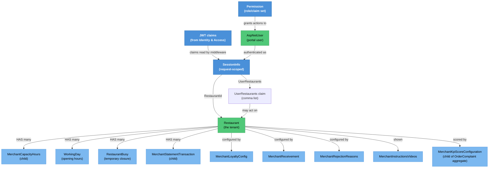

# Merchant Account & Access — Knowledge Graph

> **Context:** Restaurant Portal
> **Source Project:** `TalabatkRestaurants` (API host + Angular SPA), `Shared/TalabatkApplication`
> **Entities Covered:** 7 merchant-side entities (all folded into
> [[Merchant-Menu-and-Orders.technical|Merchant Menu & Orders — technical]]) + the session/claims
> mechanism that scopes every one of them

This feature is not a screen. It is **the tenant boundary of the whole Restaurant Portal**: who the
caller is, which restaurants they may act on, and which of the portal's other features are allowed
to trust that answer. Every finding in the `#580–#608` cluster is a place where this boundary is not
applied, which is why it is documented before the features that depend on it.

## The tenant boundary, exactly as implemented

There is no framework-level tenant filter. Scoping is **per action, by hand**, from a request-scoped
`SessionInfo` object that a middleware fills from JWT claims:

| `SessionInfo` field | Claim read | Fallback when the claim is absent | Source |
|---|---|---|---|
| `UserId` | `sub` | `"0"` | `TalabatkRestaurants/Helpers/Middlewares/SessionHandlerMiddleware.cs:25` |
| `CityId` | `cityId` | `"0"` | `TalabatkRestaurants/Helpers/Middlewares/SessionHandlerMiddleware.cs:26` |
| `Role` | `role` | `""` | `TalabatkRestaurants/Helpers/Middlewares/SessionHandlerMiddleware.cs:27` |
| `RestaurantId` | `RestaurantId` | `"0"` | `TalabatkRestaurants/Helpers/Middlewares/SessionHandlerMiddleware.cs:28,42` |
| `UserName` | `name` | `""` | `TalabatkRestaurants/Helpers/Middlewares/SessionHandlerMiddleware.cs:29` |
| `CanSeeCustomerData` | `canSeeCustomerData` | `"false"` | `TalabatkRestaurants/Helpers/Middlewares/SessionHandlerMiddleware.cs:30` |
| `FullControl` | `fullControl` | `"false"` | `TalabatkRestaurants/Helpers/Middlewares/SessionHandlerMiddleware.cs:31` |
| `UserRestaurants` | `userRestaurants` — a **comma-separated list** | left as `""` | `TalabatkRestaurants/Helpers/Middlewares/SessionHandlerMiddleware.cs:33-35,45-47` |

Two consequences that matter for every CR in this context:

1. **`RestaurantId` vs. `UserRestaurants` are different questions.** `RestaurantId` is the one store
   the token was minted for; `UserRestaurants` is every store the user may act on (a merchant admin
   with several branches). An action that scopes by the wrong one is either too narrow (a branch's
   data goes missing) or too wide. The portal uses both, sometimes in the same controller:
   `StoreUsersController.cs:55` falls back from the list to the single id, while
   `StoreUsersController.cs:76` and `:94` parse the list with **no empty check** — an empty claim
   makes `"".Split(",")` yield `[""]` and `int.Parse` throw, so the endpoint 500s rather than
   returning empty. Same shape at `TalabatkRestaurants/Controllers/Restaurants/RestaurantsController.cs:502` and `:517` (`ping`, `pingV2`).
2. **The middleware never rejects anything.** It defaults every claim, so an unauthenticated request
   reaching a non-`[Authorize]` action gets a valid-looking session for restaurant `0`, user `0`,
   role `""`. Authorisation is entirely the action attribute's job.

## Entity Relationship Diagram



## Endpoint index — and whether each one is scoped

The whole point of this table: an endpoint that reads an id from the caller instead of from the
session is a cross-tenant hole, and this is the complete list for this feature's four controllers.

| Endpoint | Auth | Scoped by | Verdict | Source |
|---|---|---|---|---|
| `GET api/StoreUsers/GetStoreUsers` | `MerchantAdmin, RestaurantAdmin` | `UserRestaurants` → falls back to `RestaurantId` | ✅ scoped | `StoreUsersController.cs:52-55` |
| `GET api/StoreUsers/GetStoreUserInfo` | `[Authorize]` | `UserRestaurants` + `sessionInfo.UserId` | ✅ scoped (throws on empty claim) | `StoreUsersController.cs:74-80` |
| `GET api/StoreUsers/GetStoreUserById` | `MerchantAdmin,RestaurantAdmin` | `UserRestaurants`, else `RestaurantId` | ✅ scoped | `StoreUsersController.cs:92-98` |
| `POST api/StoreUsers/AddNewStoreUser` | `MerchantAdmin,RestaurantAdmin` | overwrites `dto.RestaurantId` from session | ✅ scoped | `StoreUsersController.cs:112-114` |
| `POST api/StoreUsers/AddMultipleStoreUser` | `MerchantAdmin,RestaurantAdmin` | overwrites `dto.RestaurantId` | ✅ scoped | `StoreUsersController.cs:124-126` |
| `POST api/StoreUsers/UpdateStoreUser` | `MerchantAdmin,RestaurantAdmin` | overwrites `dto.RestaurantId` | ✅ scoped | `StoreUsersController.cs:137-139` |
| `POST api/StoreUsers/UpdateMultipleStoreUser` | `MerchantAdmin,RestaurantAdmin` | overwrites `dto.ResturantId` | ✅ scoped | `StoreUsersController.cs:149-151` |
| `POST api/StoreUsers/DeleteStoreUser` | `MerchantAdmin,RestaurantAdmin` | **nothing** — dto forwarded to IDS as received | 🔴 `_conflicts.md` **#604** | `StoreUsersController.cs:163-166` |
| `GET api/UserPermissions/GetUserPermissions` | `[Authorize]`, **no roles** | **nothing** — `userId` from the query string; the injected session is never read | 🔴 `_conflicts.md` **#605** | `UserPermissionsController.cs:34-38` |
| `GET api/Restaurant/WorkingDays` | `[Authorize]`, no roles | **nothing** — `restaurantId` from the query string | 🔴 `_conflicts.md` **#606** | `TalabatkRestaurants/Controllers/Restaurants/RestaurantsController.cs:110-114` |
| `POST api/Restaurant/MangeWorkingDays` | `[Authorize]`, no roles | **nothing** — `RestaruantId` from the request body | 🔴 `_conflicts.md` **#607** (write) | `TalabatkRestaurants/Controllers/Restaurants/RestaurantsController.cs:132-134` |
| `GET api/Restaurant/GetRestaurantReviewsByIds` | `MerchantAdmin,RestaurantAdmin` | **nothing** — `restaurantIds` list from the query string | 🔴 `_conflicts.md` **#608** (leaks customer names) | `TalabatkRestaurants/Controllers/Restaurants/RestaurantsController.cs:173-178` |
| `GET api/Restaurant/GetRestaurantBusyByIds` | 4 merchant roles | **nothing** — `restaurantIds` list from the query string | 🔴 `_idor-instances.md` **#11** | `TalabatkRestaurants/Controllers/Restaurants/RestaurantsController.cs:279-281` |
| `GET api/Restaurant/GetRestaurantReviews` | `MerchantAdmin,RestaurantAdmin` | `sessionInfo.RestaurantId` | ✅ scoped | `TalabatkRestaurants/Controllers/Restaurants/RestaurantsController.cs:57` |
| `GET api/Restaurant/GetRestaurantLogHistory` | `[Authorize]` | `sessionInfo.UserId` + `LanguageId` | ✅ scoped | `TalabatkRestaurants/Controllers/Restaurants/RestaurantsController.cs:87-92` |
| `GET api/Restaurant/QuickItemReplacementVisibility` | `[Authorize]` | `sessionInfo.RestaurantId` | ✅ scoped | `TalabatkRestaurants/Controllers/Restaurants/RestaurantsController.cs:154` |
| `GET api/Restaurant/UserRestaurants` | `[Authorize]` | `sessionInfo.UserId` | ✅ scoped | `TalabatkRestaurants/Controllers/Restaurants/RestaurantsController.cs:191` |
| `GET api/Restaurant/GetAvailabilityResraurantForUser` | `MerchantAdmin,RestaurantAdmin` | `sessionInfo.UserId` | ✅ scoped | `TalabatkRestaurants/Controllers/Restaurants/RestaurantsController.cs:220` |
| `GET api/Restaurant/GetRestaurantBusy` | 4 merchant roles | `sessionInfo.RestaurantId` | ✅ scoped | `TalabatkRestaurants/Controllers/Restaurants/RestaurantsController.cs:259` |
| `POST api/Restaurant/EndRestaurantBusy` | 4 merchant roles | `sessionInfo.UserName` (audit only) | ⚠️ audit-only — the target id comes from the request | `TalabatkRestaurants/Controllers/Restaurants/RestaurantsController.cs:298-300` |
| `POST api/Restaurant/SaveBusyTime` | 4 merchant roles | `sessionInfo.RestaurantId` + `UserName` | ✅ scoped | `TalabatkRestaurants/Controllers/Restaurants/RestaurantsController.cs:326-327` |
| `POST api/Restaurant/SaveRestaurantBusyTime` | 4 merchant roles | `sessionInfo.UserName` only | ⚠️ audit-only — target restaurant from the request | `TalabatkRestaurants/Controllers/Restaurants/RestaurantsController.cs:356` |
| `GET api/Restaurant/PaymentFilterLookUp` | 4 merchant roles | — (lookup data) | ✅ n/a | `TalabatkRestaurants/Controllers/Restaurants/RestaurantsController.cs:380` |
| `GET api/Restaurant/GetRestaurantUserInfo` | 4 merchant roles | `sessionInfo.UserId` | ✅ scoped | `TalabatkRestaurants/Controllers/Restaurants/RestaurantsController.cs:409` |
| `POST api/Restaurant/AddDeviceIds` · `RemoveDeviceIds` | `[Authorize]` | `sessionInfo.UserId` | ✅ scoped | `TalabatkRestaurants/Controllers/Restaurants/RestaurantsController.cs:436,463` |
| `GET api/Restaurant/GetStoresVideos` | 4 merchant roles | — | ⚠️ unverified scoping | `TalabatkRestaurants/Controllers/Restaurants/RestaurantsController.cs:482` |
| `POST api/Restaurant/ping` · `pingV2` | 4 merchant roles | `UserRestaurants` (unguarded `Split`) | ✅ scoped, throws on empty claim | `TalabatkRestaurants/Controllers/Restaurants/RestaurantsController.cs:502,517` |
| `GET api/FeatureMangement/GetFeatureStatus` | **none** | n/a | ⚠️ unauthenticated feature-flag probe; duplicate of `FeatureMangamentController` — `_conflicts.md` **#35** | `FeatureMangementController.cs:24-28` |

> ⚠️ **CONFLICT — two feature-flag endpoints, one host**
> `TalabatkRestaurants` ships both `FeatureMangement/FeatureMangementController.cs` (this feature)
> and `FeatureMangamentController/FeatureMangamentController.cs` (mapped to
> [[Restaurant Portal/Ops & Infra/_knowledge-graph|Ops & Infra]]). Same purpose, different spelling,
> neither authenticated. Recorded as `_conflicts.md` #35; the duplication is in the *names*, so a
> reader looking for "the" feature-flag endpoint finds the wrong one half the time.

## Status / State

This feature has no status field of its own. The state that matters is the **session**, and it exists
only for the duration of one request:

```
request arrives
   └── UseAuthentication  -> ClaimsPrincipal (or anonymous)
        └── UseSessionInfoHandlerMiddleware (TalabatkRestaurants/Startup.cs:222)
             └── SessionInfo populated from claims, defaults substituted for anything missing
                  └── action attribute decides admission ([Authorize(Roles=...)] or nothing)
                       └── action decides SCOPE, by hand, per action
```

The third arrow is the whole risk surface: admission and scope are decided in two different places,
and only admission is declarative.

## Entity Index

| Entity | Layer | Type | Responsibility |
|---|---|---|---|
| `MerchantCapacityHours` | Domain — legacy POCO | Child | Per-hour order-capacity ceiling for a store; the portal's throttle on how many orders an hour may bring |
| `MerchantInstructionsVideos` | Domain — legacy POCO | Root (config) | Training/how-to videos surfaced to merchant users (`GetStoresVideos`) |
| `MerchantLoyaltyConfig` | Domain — legacy POCO | Root (config) | Per-merchant loyalty-points participation and rates |
| `MerchantReceivement` | Domain — legacy POCO | Root (config) | How the merchant receives orders (device/channel configuration) |
| `MerchantRejectionReasons` | Domain — legacy POCO | Root (config) | The reason list a merchant may pick from when rejecting an order |
| `MerchantStatementTransaction` | Domain — legacy POCO | Child | One line on a merchant's account statement; the settlement detail behind [[Restaurant Portal/Merchant Finance & Reporting/_knowledge-graph\|Merchant Finance & Reporting]] |
| `MerchantKpiScoreConfiguration` | Domain — `OrderComplaintAggregate` | Child | Thresholds that turn complaint volume into a merchant KPI score |
| `WorkingDay` | Domain — legacy POCO | Child | One opening window; written by `MangeWorkingDays` (see #607) |
| `AspNetUser`, `Permission` | Domain / Identity | Master | The portal user and their permission set — owned by [[Identity & Access/_context\|Identity & Access]], consumed here |

All seven merchant entities are documented in detail in
[[Merchant-Menu-and-Orders.technical|Merchant Menu & Orders — technical]]; this note owns the access
mechanism, not their fields.

## Feature Flow (Business Narrative)

```
1. SIGN IN (Identity & Access issues the token)
   └── claims include RestaurantId and userRestaurants — the tenant boundary is minted here
2. EVERY REQUEST
   └── middleware turns claims into SessionInfo; missing claims become 0/""/false, never a rejection
3. ADMISSION
   └── [Authorize(Roles=...)] decides whether a merchant role may call the action at all
4. SCOPE
   └── the action itself must narrow to sessionInfo.RestaurantId or UserRestaurants
       — 6 of this feature's endpoints do not (see the endpoint index)
5. STORE-USER ADMINISTRATION
   └── a MerchantAdmin/RestaurantAdmin creates, edits and deletes portal users for their own store;
       every write except DeleteStoreUser overwrites the incoming RestaurantId from the session
6. DELETE, THE ODD ONE OUT
   └── DeleteStoreUser is proxied to Talabatk.IDS over a fresh HttpClient with the caller's token
       and the caller's dto, unmodified
```

## Key Cross-Cutting Relationships

| From | To | Relationship | Notes |
|---|---|---|---|
| Identity & Access | Restaurant Portal | issues `RestaurantId` / `userRestaurants` claims | The tenant boundary is defined by a token this context does not mint |
| Restaurant Portal | Identity & Access | `DeleteStoreUser` → `api/RestaurantUser/DeleteStoreUser` | Plain `HttpClient` proxy with the caller's bearer token, `StoreUsersController.cs:165-178` |
| This feature | every other Restaurant Portal feature | supplies the scoping contract | Menu, Orders and Finance all assume `SessionInfo` was applied |
| `MerchantStatementTransaction` | Merchant Finance & Reporting | settlement lines | See that feature's notes |

> ⚠️ **Technical debt, not a conflict:** `StoreUsersController.SendHttpRequestAsync`
> (`StoreUsersController.cs:170-172`) constructs `new HttpClient()` per call rather than using
> `IHttpClientFactory`. Under load this exhausts sockets (`TIME_WAIT` accumulation). Flagged here
> because two endpoints in this feature take that path.

## Relationship Legend

| Arrow | Meaning |
|---|---|
| `-->|HAS many|` | Parent owns a child collection |
| `-->|configured by|` | Per-merchant configuration row |
| `-->|claims read by middleware|` | Token claim becomes request-scoped state |

## Open Questions

- [ ] `GetStoresVideos` (`TalabatkRestaurants/Controllers/Restaurants/RestaurantsController.cs:482`) — is the video list global or per-store? The
      action takes no id and reads no session field; scoping is therefore unverified.
- [ ] `EndRestaurantBusy` and `SaveRestaurantBusyTime` use the session only for the audit name. Is
      the target restaurant id validated inside their handlers? Not traced in this pass.
- [ ] Does any merchant role legitimately need to read *another* store's reviews or busy history
      (`GetRestaurantReviewsByIds`, `GetRestaurantBusyByIds`)? The Angular client's call pattern would
      answer whether the ids it sends are always the caller's own — if so, these are latent holes
      rather than exploited ones.
- [ ] `FullControl` and `CanSeeCustomerData` claims are read into the session
      (`TalabatkRestaurants/Helpers/Middlewares/SessionHandlerMiddleware.cs:30-31`) but no endpoint in this feature reads them. Which feature
      consumes them?
