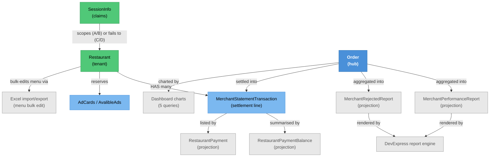

# Merchant Finance & Reporting — Knowledge Graph

> **Context:** Restaurant Portal
> **Source Project:** `TalabatkRestaurants` (8 controllers), `Shared/TalabatkApplication` (report
> queries), DevExpress reporting engine
> **Entities Covered:** none of its own — it reads
> [[Merchant-Menu-and-Orders.technical|merchant entities]], `MerchantStatementTransaction`,
> `RestaurantPayment*` projections and `Order`; its subject matter is **money out and performance**

Everything a merchant is told about their own money and performance comes through here: balance and
settlement history, sales and rejection reports, the five dashboard charts, bulk menu import/export,
and ad-slot reservations. It is also the feature with the **densest concentration of authorisation
findings in the repo** — 12 register rows — because almost every endpoint takes a restaurant id as a
parameter, and only some of them check it.

## The three scoping patterns — this is the feature's central technical fact

The portal does not have one way of enforcing "your data only". It has three, and which one an
endpoint uses decides whether it is safe:

| Pattern | How it works | Verdict | Example |
|---|---|---|---|
| **A — session as the value** | The action ignores any caller-supplied id and uses `sessionInfo.RestaurantId` | Safe | `TalabatkRestaurants/Controllers/RestaurantPayment/RestaurantPaymentController.cs:38,64,92` |
| **B — session as a constraint in the handler** | The action forwards the caller's id **and** `sessionInfo.UserRestaurants`; the *handler* intersects them and returns an empty page if the id is not in the list | Safe, and logs the attempt | `GetRestaurantMenuItemActivityQuery.cs:59-74` |
| **C — session as a default** | The caller's id is used when supplied, and the session value fills in only when it is absent | **Unsafe** — supplying the parameter overrides the boundary | `TalabatkRestaurants/Controllers/Reports/ReportController.cs:112` (`_conflicts.md` #584) |
| **D — no session at all** | The caller's id goes straight through | **Unsafe** | `TalabatkRestaurants/Controllers/Reports/ReportController.cs:90,131`, `MerchantDashboardController.cs:34` (#582, #583, #593) |

Pattern B is the newest and the only one that both allows multi-branch access *and* enforces it. Two
notes on its behaviour, because they matter to anyone testing it:

1. It fails **closed but silently** — an unauthorised id yields `DataList = []`, `TotalCount = 0`,
   not a 403 (`GetRestaurantMenuItemActivityQuery.cs:62-74`). A caller cannot distinguish "no rows"
   from "not your restaurant"; a monitoring rule looking for 403s will never fire.
2. Its fallback is `UserRestaurants ?? [UserRestaurantId]`
   (`GetRestaurantMenuItemActivityQuery.cs:59-60`) — a **null** claim falls back to the single store,
   but an **empty-string** claim splits into `[""]`, which contains nothing, so every request returns
   empty. Null and empty behave differently.

## Endpoint index — money and reports, with the scoping verdict

| Endpoint | Auth | Pattern | Verdict | Source |
|---|---|---|---|---|
| `GET api/RestaurantPayment/GetRestaurantBalance` | `MerchantAdmin,RestaurantAdmin` | A | ✅ | `TalabatkRestaurants/Controllers/RestaurantPayment/RestaurantPaymentController.cs:35-38` |
| `GET api/RestaurantPayment/GetAllPaymentsByRestaurantId` | same | A | ✅ (name misleads — the id comes from the session, not the caller) | `TalabatkRestaurants/Controllers/RestaurantPayment/RestaurantPaymentController.cs:56-64` |
| `GET api/RestaurantPayment/AllOrdersbyRestaurantId` | same | A | ✅ | `TalabatkRestaurants/Controllers/RestaurantPayment/RestaurantPaymentController.cs:84-92` |
| `GET api/Report/GetMerchantPerformanceReport` | `MerchantAdmin,RestaurantAdmin` | A (`CityId` + `RestaurantId` from session) | ✅ | `TalabatkRestaurants/Controllers/Reports/ReportController.cs:51-65` |
| `GET api/Report/GetTransactions` | `MerchantAdmin,RestaurantAdmin` | — | 🔴 **#638** — binds the whole query from the query string and sends it unmodified, so `MerchantId` is caller-chosen and another merchant's full statement ledger is readable | `TalabatkRestaurants/Controllers/Reports/ReportController.cs:77` |
| `GET api/Report/MerchantDailyReportDetails` | plain `[Authorize]`, **no roles** | D | 🔴 `_conflicts.md` **#582** — `resturantId` unchecked | `TalabatkRestaurants/Controllers/Reports/ReportController.cs:90,99` |
| `GET api/Report/MerchantTotalReport` | `MerchantAdmin,RestaurantAdmin` | C | 🔴 `_conflicts.md` **#584** — session is the default, not the limit | `TalabatkRestaurants/Controllers/Reports/ReportController.cs:110-120` |
| `GET api/Report/GetFinancialSummary` | `MerchantAdmin,RestaurantAdmin` | D | 🔴 `_conflicts.md` **#583** — caller's `restaurantIds` passed into the DevExpress report parameter | `TalabatkRestaurants/Controllers/Reports/ReportController.cs:131,146` |
| `GET api/Report/GetRestaurantMenuItemActivityReport` | `MerchantAdmin,RestaurantAdmin` | B | ✅ enforced in handler | `TalabatkRestaurants/Controllers/Reports/ReportController.cs:185-199`; `GetRestaurantMenuItemActivityQuery.cs:59-74` |
| `GET api/Report/GetRestaurantRejectedOrdersReport` | `MerchantAdmin,RestaurantAdmin` | B | ✅ enforced in handler | `TalabatkRestaurants/Controllers/Reports/ReportController.cs:214-240` |
| `GET api/Report/GetResturantSalesItemReport` | `MerchantAdmin,RestaurantAdmin` | B | ✅ enforced in handler | `TalabatkRestaurants/Controllers/Reports/ReportController.cs:260-284` |
| `GET api/Report/GetItemsTurnoverRateReport` | `MerchantAdmin,RestaurantAdmin` | — | ✅ **scopes correctly** — passes `UserRestaurantId = sessionInfo.RestaurantId` **and** `UserAccessibleRestaurants = sessionInfo.UserRestaurants` alongside the caller's `restaurantIds`, so the handler can enforce the caller's scope. The newest code in the file, and the pattern the two rows above it should follow | `TalabatkRestaurants/Controllers/Reports/ReportController.cs:335`-336 |
| `GET …/MerchantDashboard/*` (5 chart actions) | `admin,MerchantAdmin,RestaurantAdmin` | D | 🔴 `_conflicts.md` **#593** — whole query incl. `RestaurantIds` bound from the query string, no session reference in the file | `MerchantDashboardController.cs:34` |
| `GET api/Ads/GetReservedAds` | `MerchantAdmin,RestaurantAdmin` | A | ✅ the correct sibling | `AdsController.cs` (see #603 row) |
| `POST api/Ads/Reserve` | `MerchantAdmin,RestaurantAdmin` | D | 🔴 `_conflicts.md` **#603** — `RestaurantId` from the body; a merchant can reserve ad slots as another | `TalabatkRestaurants/Controllers/Ads/AdsController.cs:113` |
| `GET api/Ads/GetAdCards` | `MerchantAdmin,RestaurantAdmin` | — | ⚠️ may return literal `null` array entries — `_conflicts.md` **#437** | `GetAdCardsForMerchantQuery.cs:44-63` |
| `POST …/ExportImportExcel/UploadChunk` | **`[AllowAnonymous]`** | none | 🔴 `_conflicts.md` **#42** — unauthenticated write of client-supplied file content to a server disk path | `ExportImportExcelController.cs` |
| `GET …/ExportImportExcel/Export` and menu import actions | `admin,Accountants,MerchantAdmin,DataEntry,RestaurantAdmin,restaurant` | D | 🔴 `_idor-instances.md` **#9** — `restaurantIdFromAdmin` / `restaurantId` unchecked; any `restaurant`-role user exports any store's full menu | `ExportImportExcelController.cs:52-60,105-112` |
| `POST …/CustomReportDesignerController/GetDesignerModel` | **none** | n/a | 🔴 `_conflicts.md` **#580/#571** shape — DevExpress designer/viewer with no `[Authorize]` and no reporting authorization callback | `TalabatkRestaurants/Controllers/CustomReportDesignerController .cs` (note the space in the filename) |
| `GET …/RestaurnatReport/ReportListController.List` | `[Authorize]` | — | ⚠️ report list; the Admin twin has its `[Authorize]` commented out — `_conflicts.md` **#570** | `RestaurnatReport/ReportListController.cs` |
| `TalabatkRestaurants/Controllers/ReportController.cs` | **none** | n/a | 🟡 `_conflicts.md` **#580** — DevExpress Web Document Viewer, anonymous | `TalabatkRestaurants/Controllers/Reports/ReportController.cs:14` |

Two filename oddities that cost search time and are recorded so nobody re-derives them:
`Controllers/CustomReportDesignerController .cs` and `Controllers/HealthController/HealthController .cs`
both contain a **space before `.cs`**. `git ls-files` shows them; a naive glob may not.

## Entity Relationship Diagram



## Status / State

No status field of its own. The state that governs this feature is **the reporting date range plus
the tenant list**, and its only durable artefacts are the settlement rows
(`MerchantStatementTransaction`) produced elsewhere — see
[[Delivery/Driver Cash & Compensation/Merchant-Accounting-and-Order-Cost|Merchant Accounting & Order Cost]]
for how an order becomes a settlement line, and `_integrations.md` row 20 for how those lines reach
the AccFlex general ledger.

## Entity Index

| Entity | Layer | Type | Responsibility |
|---|---|---|---|
| `MerchantStatementTransaction` | Domain — legacy POCO | Child | One settlement line for a store; documented in [[Merchant-Menu-and-Orders.technical\|Merchant Menu & Orders]] |
| `RestaurantPayment`, `RestaurantPaymentBalance` | Data — projection | Excluded from entity notes | Stored-procedure result shapes, classified `projection` in `_entity-classes.tsv` with that reason |
| `MerchantPerformanceReport`, `MerchantRejectedReport`, `MerchantAcceptanceReport` | Data — projection | Excluded | Same |
| `AvalibleAds` | Data — keyless view | Excluded | Registered `.HasNoKey().ToView(null)` in `TalabatkContext.cs` |
| `Order` | Domain — legacy POCO | Hub | The source of every figure here; canonical note [[Order.technical\|Order]] |

## Feature Flow (Business Narrative)

```
1. ORDER COMPLETES (Customer Ordering)
   └── order value, commission and delivery cost are settled into merchant statement lines
2. MERCHANT OPENS "MY MONEY"
   └── balance (session-scoped) + payment history + order list
3. MERCHANT OPENS A REPORT
   └── one of three scoping patterns decides whether they see their own store or any store
4. DASHBOARD
   └── five chart endpoints aggregate unavailability, preparation time, avoidable wait,
       customer cancellation and rejection rate — all bound from the query string (#593)
5. BULK MENU EDIT
   └── Excel export -> edit -> preview -> confirm, with an anonymous chunked-upload endpoint (#42)
6. ADS
   └── merchant browses ad cards and reserves a slot (#603 lets them reserve as another store)
7. GL HAND-OFF (Admin)
   └── the same settlement lines are batched to AccFlex ERP — see _integrations.md row 20
```

## Key Cross-Cutting Relationships

| From | To | Relationship | Notes |
|---|---|---|---|
| This feature | [[Restaurant Portal/Merchant Account & Access/_knowledge-graph\|Merchant Account & Access]] | consumes the tenant boundary | Patterns A/B rely on the claims that feature documents |
| `Order` (Customer Ordering) | reports here | every figure derives from orders | Cross-context read, no write back |
| This feature | Admin → AccFlex ERP | settlement lines feed the GL batch | `_integrations.md` row 20 |
| DevExpress engine | reports | rendering + designer surface | Registered with **no authorization callback** — `_conflicts.md` #571/#580 |
| Excel import | menu entities | bulk writes to items/prices/options | Same entities the [[Restaurant Portal/Menu & Order Management/_knowledge-graph\|Menu & Order Management]] feature owns |

## Change Surface

| Signal | Value | Notes |
|---|---|---|
| Direct dependents (Ring 1) | 8 controllers, 3 report queries, 1 DevExpress registration | |
| Sides touched | 3/5 | API host · Backend-Application · Frontend (Angular report pages) |
| Cross-context integrations | 2 | AccFlex GL batch (row 20); Order data from Customer Ordering |
| Register findings open here | 12 | #42, #437, #443, #570, #571, #580, #582, #583, #584, #593, #603, IDOR #9 |
| Hub? | no | but it reads the `Order` hub |

## Open Questions

- [ ] `GetTransactions` (`TalabatkRestaurants/Controllers/Reports/ReportController.cs:73`) and `GetItemsTurnoverRateReport` (`:297`) were not
      traced to their handlers in this pass — scoping pattern unknown, so treat as unverified.
- [ ] Is `UploadChunk`'s `[AllowAnonymous]` (#42) an intentional ERP/webhook entry point? The disk
      path is configured, which suggests a deliberate integration nobody documented.
- [ ] Pattern B returns an empty page instead of 403. Is any client relying on "empty" to mean
      "no data"? If so, a fix to return 403 is a breaking change for that client.
- [ ] Do the five dashboard charts have a handler-side check like pattern B, or none at all? #593
      says no session reference in the controller; the handlers were not opened.
- [ ] `AdsController`'s commented-out `[Authorize]` (#443) is in `TalabatkAPIs`, not here — confirm
      whether the Restaurant Portal `AdsController` shares that history.
